# AI Full Stack Engineer Roadmap

## 🚀 Master AI Systems from Foundations to Production

You want to build the skills that companies pay top dollar for: the ability to take an AI model from research to serving millions of users. This roadmap gets you there in 6 phases, starting from Python foundations and ending with Kubernetes-scale systems.

**For intermediate Python developers** who are tired of tutorials and ready to build real systems. **Every phase produces a hireable portfolio project.**

---

## 📊 Roadmap at a Glance

| Phase | Name | Duration | Key Skills | Outcome |
|-------|------|----------|-----------|---------|
| 0 | **Foundation Warmup** | 3-4 weeks | Python, FastAPI, SQL + NoSQL, Linux, Networking | REST API with PostgreSQL + Redis cache |
| 1 | **AI Systems** | 6-8 weeks | LLM APIs, Embeddings, RAG, Agents, Fine-tuning, Evaluation | Production RAG chatbot with eval pipeline |
| 2 | **Docker & Cloud** | 3-4 weeks | Docker, AWS (EC2/S3/ECS), Secrets, Monitoring | Containerized AI service on AWS |
| 3 | **MLOps Tooling** | 3-4 weeks | MLflow, DVC, W&B, CI/CD | Reproducible training pipeline with tracking |
| 4 | **Scaling & K8s** | 4-5 weeks | Kubernetes, Service mesh, Observability | AI services auto-scaling on EKS |
| 5 | **Portfolio & Jobs** | 2-3 weeks | GitHub, Resume, System Design, Interviews | 3-project portfolio + job offers |

**Total time commitment: 21-29 weeks of intensive work (5-7 hours/day, 5 days/week).**

---

## 🧠 Study Philosophy: How This Roadmap Works

### 1. **Build Before Reading**
Code first, theory second. You'll read documentation when you *need* it, not memorize it first. This accelerates learning by 3-4x because your brain retention peaks when you're solving immediate problems.

### 2. **Production Realism**
Every concept includes what breaks at scale. When you learn FastAPI, you don't just build a toy API. You build one with proper rate limiting, error handling, structured logging, and async patterns that won't melt when traffic spikes. This prevents the painful "rewrite from scratch" moment at your first job.

### 3. **Weak Math Welcomed**
Every technical concept carries a plain-English analogy. Embeddings aren't mysterious—they're "a way to turn words into arrows in space so similar words point in similar directions." You don't need calculus to understand transformer attention. We explain the intuition first; math is optional.

### 4. **Portfolio First**
Every single phase produces a completed, deployable project. By phase 5, you'll have a GitHub portfolio that lands interviews. No "learning projects that don't count." Every one of these is something you can show an engineering manager.

---

## 📖 How to Use This Roadmap

1. **Read the phase overview first** — 10-15 minutes to understand the big picture
2. **Work through tutorials in suggested order** — They build on each other
3. **Build the milestone project** — This locks in learning. Don't skip this
4. **Add it to your GitHub portfolio** — With a clear README explaining architectural decisions
5. **Join the community Slack** — Share your milestone projects, get code reviews, debug together
6. **Move to the next phase** — Literally build on top of your previous project

**Critical rule:** Don't jump phases. Phase 2 (Docker) assumes you've built the Phase 1 RAG chatbot. Phase 4 (Kubernetes) assumes you've containerized Phase 2. This scaffolding matters.

---

## ✅ Prerequisites Checklist

Before starting, you **must** have:

- [ ] **Fluent Python** (can write decorators, async/await, type hints without Googling)
- [ ] **Git fundamentals** (can clone, commit, push; understand branching)
- [ ] **Terminal comfort** (can navigate directories, run shell commands, edit with vim/nano)
- [ ] **Basic SQL** (can write `SELECT`, `JOIN`, `WHERE` queries)
- [ ] **HTTP concepts** (understand GET/POST, status codes, headers)
- [ ] **16GB RAM minimum** (recommended: 32GB if doing GPU work locally)
- [ ] **One of:** Mac Silicon/Intel, Linux, or WSL2 on Windows

**Don't have these?** Spend 1-2 weeks on a Python bootcamp first. This roadmap is not for absolute beginners.

---

## ⏱️ Time Commitment per Phase

These are realistic, including breaks and debugging:

| Phase | Hours/Week | Total Hours | Notes |
|-------|-----------|-----------|-------|
| Phase 0 | 20-25 | 80-100 | Heaviest on fundamentals, lighter on concepts |
| Phase 1 | 25-30 | 150-240 | API complexity peaks; expect 30+ hours on fine-tuning |
| Phase 2 | 15-20 | 60-80 | Straightforward once Phase 0 patterns sink in |
| Phase 3 | 15-20 | 60-80 | MLOps tooling is intuitive; experimentation takes time |
| Phase 4 | 20-25 | 80-125 | Kubernetes steep learning curve; debugging is hard |
| Phase 5 | 10-15 | 20-45 | Mostly writing + interview prep (not coding) |

**If you do 40 hours/week, you'll finish in 5-6 months. If you do weekends only (~10 hours/week), expect 9-12 months.**

---

## 🎯 Quick Start

Ready to go? Open the **[Setup Guide →](setup.md)** to set up your development environment. Takes ~1 hour, and you'll have every tool you need for all 6 phases.

After setup, jump into **Phase 0 Overview**.

---

## 🗓️ The Full Learning Path

```mermaid
flowchart TD
    Start([🚀 Start Here]) --> Setup["⚙️ Setup Environment<br/>1 hour"]
    Setup --> Phase0["📚 Phase 0: Foundations<br/>3-4 weeks<br/>Python, FastAPI, SQL, Linux"]
    Phase0 --> P0M["🏗️ Milestone: REST API<br/>+ PostgreSQL + Redis"]
    P0M --> Phase1["🤖 Phase 1: AI Systems<br/>6-8 weeks<br/>LLM APIs, RAG, Agents, Fine-Tuning"]
    Phase1 --> P1M["🏗️ Milestone: RAG Chatbot<br/>+ Evaluator"]
    P1M --> Phase2["🐳 Phase 2: Docker & Cloud<br/>3-4 weeks<br/>Docker, AWS, ECS"]
    Phase2 --> P2M["🏗️ Milestone: Deployed Service<br/>on AWS"]
    P2M --> Phase3["📊 Phase 3: MLOps<br/>3-4 weeks<br/>MLflow, DVC, W&B, CI/CD"]
    Phase3 --> P3M["🏗️ Milestone: Training Pipeline<br/>with Tracking"]
    P3M --> Phase4["☸️ Phase 4: Kubernetes<br/>4-5 weeks<br/>K8s, Scaling, Observability"]
    Phase4 --> P4M["🏗️ Milestone: Auto-scaling<br/>AI Service"]
    P4M --> Phase5["💼 Phase 5: Job Ready<br/>2-3 weeks<br/>Portfolio, Resume, Interviews"]
    Phase5 --> P5M["🎓 Final Milestone: 3-project<br/>Portfolio + Offers"]
    P5M --> End(["🎉 Ready for Job"])
    
    style Start fill:#4CAF50,color:#fff
    style End fill:#4CAF50,color:#fff
    style P0M fill:#2196F3,color:#fff
    style P1M fill:#2196F3,color:#fff
    style P2M fill:#2196F3,color:#fff
    style P3M fill:#2196F3,color:#fff
    style P4M fill:#2196F3,color:#fff
    style P5M fill:#FF9800,color:#fff
```

---

## 🔑 Key Principles

!!! tip "Build Reproducibly"
    Every project uses the same structure: `pyproject.toml`, Poetry for dependencies, Docker for consistency. When you're hiring someone later, you'll recognize these patterns. When you're interviewing, you'll confidently explain your choices.

!!! warning "Security is Day One"
    You'll use `.env` files for secrets from Phase 0. Environment variables, not hardcoded values. This isn't optional—it's how real systems work. Bad security habits formed early are *extremely* hard to break.

!!! note "Measure Everything"
    By Phase 3, you're logging, tracking experiments, and monitoring metrics. Not because it's fun—because it's the only way to know if your system actually works. Bad metrics mean bad decisions.

!!! success "Embrace Failure"
    You'll break things. A lot. Your first RAG pipeline will have terrible latency. Your first Kubernetes deployment won't scale. This is the point. Real learning happens when you debug why something failed, not when you follow a tutorial perfectly.

!!! danger "Don't Skip Phases"
    You cannot learn Kubernetes without understanding Docker. You cannot optimize cost without understanding clouds. This sequence is rigid for a reason. Skipping to "the fun stuff" leaves enormous gaps that bite you in interviews.

!!! example "Community > Solo"
    Find others doing this roadmap. Join the Slack. Share your milestone projects. Get code reviews. The best engineers got here by learning with others, not solo grinding. You're building a professional network simultaneously.

---

## Why This Roadmap Works

**Real companies need real problems solved:**
- Phase 0 founders don't hire developers who can't build APIs
- Phase 1 founders don't hire developers who can't orchestrate LLM workflows
- Phase 2 is where your code actually leaves your laptop
- Phase 3 is where you stop losing data and redoing experiments
- Phase 4 is where you go from hobby projects to systems that scale
- Phase 5 is where you get paid handsomely for all of the above

This roadmap teaches exactly those problems.

**Each phase builds on previous work.** Your Phase 1 RAG chatbot runs on your Phase 0 API. Your Phase 2 Docker container wraps your Phase 1 system. Your Phase 3 MLflow tracking monitors your Phase 2 training runs. Your Phase 4 Kubernetes cluster auto-scales your Phase 2 services. Your Phase 5 portfolio showcases Phases 0-4.

This is how real projects grow. Not disconnected tutorials. Real, evolving systems.

---

## Let's Begin

🚀 **[Open the Setup Guide Now →](setup.md)**

It takes ~1 hour. After that, you'll have Python, Docker, AWS CLI, Kubernetes tools, and VS Code all configured. Then you're ready for Phase 0.

Welcome to the journey. You're about to become an AI Full Stack Engineer.
