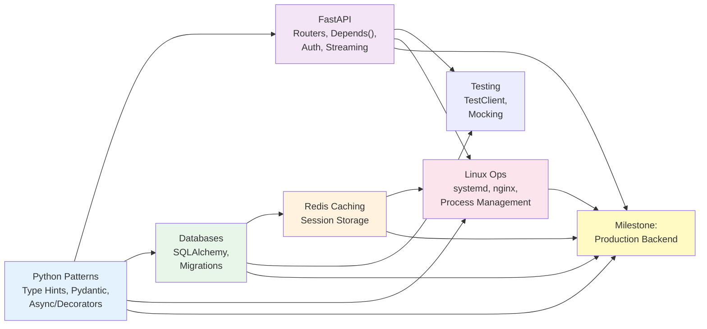

# Phase 0: Foundation Warmup — Overview

Phase 0 is not optional. This is where you fill the gaps between "can write Python" and "can ship AI systems that don't melt in production."

You'll spend 3-4 weeks here. It feels slow. That's intentional. The engineers who skip to Phase 1 (LLMs) hit a wall at deployment and waste months fixing foundation problems.

---

## What Phase 0 Covers

This phase has five interlocking topics:

1. **[Python Mastery](python.md)** — Type hints, Pydantic, async/await, decorators, testing patterns. Not Python basics; production patterns.

2. **[FastAPI Deep Dive](fastapi.md)** — Building AI-ready APIs. Dependency injection, streaming responses, authentication, rate limiting, proper error handling.

3. **[Databases (SQL + NoSQL + Redis)](databases.md)** — PostgreSQL with pgvector for embeddings, SQLAlchemy async ORM, Alembic migrations, MongoDB for unstructured data, Redis for caching and session storage.

4. **[Linux & Networking](linux.md)** — System administration for AI engineers. Running services, monitoring, SSH, nginx, understanding what breaks in production.

5. **[Phase 0 Milestone](milestone.md)** — Capstone project: build a production-ready FastAPI backend with PostgreSQL, Redis, full auth, and Docker all running correctly.

---

## Skills Map: What You'll Be Able to Do

After Phase 0, you can:

- [ ] Write type-hinted Python with Pydantic that catches bugs before deployment
- [ ] Build FastAPI services with proper dependency injection, auth, and rate limiting
- [ ] Design PostgreSQL schemas for AI data (documents, chunks, embeddings)
- [ ] Query embeddings from pgvector with hybrid search (text + semantic)
- [ ] Cache responses in Redis with TTL and semantic keys
- [ ] Write async Python that handles concurrent requests without deadlocks
- [ ] Deploy a containerized FastAPI app on a Linux server
- [ ] Monitor running services, kill hung processes, check resource usage
- [ ] Reverse proxy with nginx and handle SSL certificates
- [ ] Write tests that actually run in CI/CD
- [ ] Debug a failing deployment using logs, systemd status, and curl
- [ ] Explain architectural decisions to a hiring manager

These aren't toy skills. These are what $150k+ engineers know.

---

## Time Estimate

**3-4 weeks of intensive work** (40-50 hours).

- Python patterns: 8-10 hours
- FastAPI: 10-12 hours
- Databases: 8-10 hours
- Linux/Networking: 6-8 hours
- Milestone project: 20-25 hours (most of the time)

**If you only do evenings (10-15 hours/week):** 4-6 weeks.

**If you try to rush:** You'll regret it in Phase 1 when your async code deadlocks or your API crashes under load.

---

## Phase 0 Topic Dependencies

Each topic depends on the previous ones. You can't properly understand FastAPI without solid Python async patterns. You can't debug database issues without Linux knowledge. The milestone project pulls it all together.

---

## Phase 0 Topics

- **[1. Python Mastery](python.md)** — 8-10 hours
- **[2. FastAPI Deep Dive](fastapi.md)** — 10-12 hours
- **[3. Databases](databases.md)** — 8-10 hours
- **[4. Linux & Networking](linux.md)** — 6-8 hours

---

## Capstone Project: Phase 0 Milestone

**[Phase 0 Milestone Project →](milestone.md)**

You'll build a production-ready FastAPI backend that serves as the foundation for your entire 6-phase journey.

What you'll deploy:
- FastAPI service with proper auth (API key + JWT)
- PostgreSQL with pgvector for future embeddings
- Redis for caching and session storage
- Background task processing with Celery
- Comprehensive test suite
- Docker + docker-compose for local development
- Proper error handling, logging, and monitoring
- Rate limiting and request validation

By the end, you'll have a portfolio piece that looks like real production code. Because it is.

---

## Why Phase 0 Isn't Optional

### The Skip Phase 0 Problem

Every few months, a developer says: "I already know Python. Let me jump to Phase 1 (LLMs)."

By week two of Phase 1, they:
- Write async code that deadlocks because they don't understand asyncio.Semaphore
- Build an API that crashes under concurrent requests
- Store 1M embeddings in PostgreSQL without realizing they need pgvector
- Try to cache LLM responses without understanding Redis
- Deploy on AWS and have no idea how to monitor it
- Wonder why their code works locally but fails in production

Then they waste 4-6 weeks fixing foundation issues they could have learned properly in Phase 0.

**Real conversation** (happened at a startup):

> **Hire Manager:** "Why does your RAG system hang every morning?"
> 
> **Engineer:** "I... don't know. It works in my notebook."
> 
> **Manager:** "Check the database query count. Your code makes 10M queries."
> 
> **Engineer:** "How do I even see that?"
> 
> (Manager doesn't hire them.)

The engineer skipped database fundamentals. Rookie mistake that costs jobs.

---

## What Success Looks Like

A successful Phase 0 engineer:

1. **Can explain their code choices.** "I use Redis with a 1-hour TTL for caching because LLM responses are expensive and our inference latency is 2 seconds unacceptable for interactive users. Here's the config."

2. **Deployed something.** Not just code. A running service accessible at a URL.

3. **Fixed a production issue.** "Our API was returning 500 errors. I checked the logs, found the async session wasn't being closed properly, fixed it with an async context manager."

4. **Has a real GitHub repo.** With a LICENSE, README, proper structure, actual tests that run in CI.

5. **Can code-review someone else's FastAPI service.** And spot issues: "You're not using dependency injection. Every endpoint is creating a new DB session. That'll kill performance."

If you can't do these things, you're not ready for Phase 1.

---

## Hard Truths About Phase 0

- You will write code that feels slow and verbose. That's maturity, not weakness.
- You will spend more time on setup and configuration than on actual AI logic. This is real work.
- You will debug issues that have nothing to do with AI (why is my PostgreSQL connection pooling weird?). This is normal.
- You will be frustrated that you're not building chatbots yet. That frustration expires in one week. The skills last for decades.

---

## Next: Start with Python Mastery

→ **[Python Mastery (2500 words) →](python.md)**

Or jump to a specific topic:
- [FastAPI Deep Dive](fastapi.md)
- [Databases](databases.md)
- [Linux & Networking](linux.md)

But really, start with Python. Everything else depends on it.
