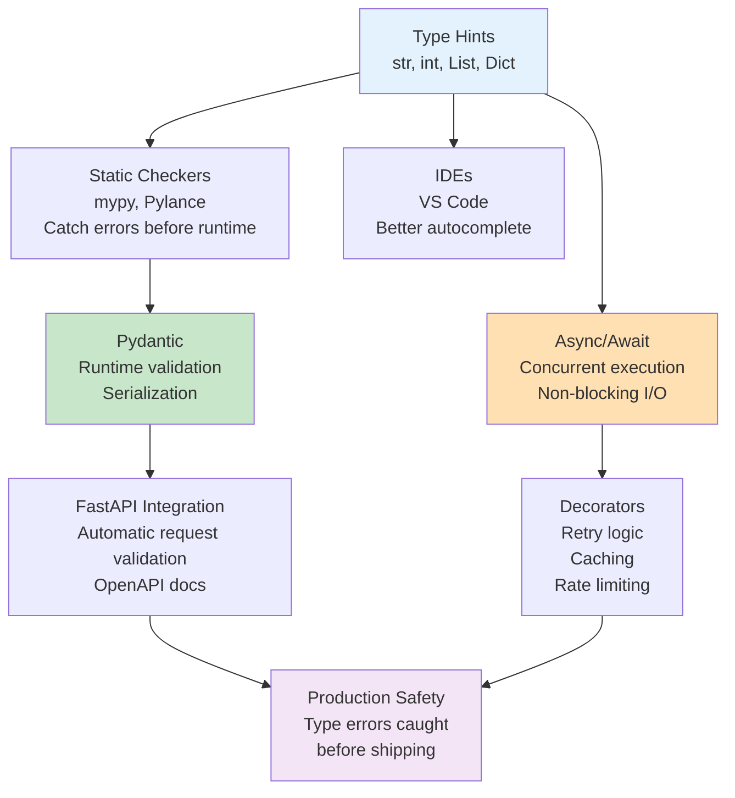

# Production-Grade Python for AI Engineers

You already write Python. This guide covers the patterns that separate "code that works" from "code that works reliably at scale."

---

## 1. Why This Matters in Production

A data engineer deployed a document processing pipeline. It worked perfectly on her laptop. In production, after 48 hours of processing millions of documents, the service crashed.

Root cause: She wasn't using type hints. A typo in a rarely-called function (`len(dataset)` instead of `len(dataset_items)`) went unnoticed. In production, under load, that typo created a bug that corrupted the dataset, causing the entire pipeline to fail.

Cost: $20,000 AWS bill for reprocessing. 2 days of downtime.

Type hints would have caught it in the IDE.

**Production reality:**
- Your laptop is as powerful as a multi-thousand-dollar server. Problems hide there.
- Production runs for weeks. Rare bugs become common bugs.
- You won't be debugging at 3 AM. Someone making $250k will be. Make their life easy with clear, type-hinted code.

---

## 2. Conceptual Explanation: Type Hints (Plain English)

Type hints tell Python (and your IDE, and linters) what type a variable should be.

```python
# Without type hints (ambiguous)
def process_documents(docs):
    return [clean(d) for d in docs]
```

What type is `docs`? A list? A generator? A single item? What does `clean` return? Unclear.

```python
# With type hints (crystal clear)
from typing import List

def process_documents(docs: List[str]) -> List[str]:
    return [clean(d) for d in docs]
```

Now: `docs` is a list of strings. The function returns a list of strings. Your IDE autocompletes correctly. Linters catch misuse.

**For AI engineers, the crucial types:**

- `Optional[str]` — might be None
- `Union[int, float]` — could be either type
- `Protocol` — "anything that quacks like a duck"
- `TypedDict` — structured dicts with typed keys
- `Literal["value1", "value2"]` — exact string values
- Generics like `T` — reusable functions that work with any type

---

## 3. Code Examples: Type Hints

### 3.1 Basic Type Hints

```python
from typing import Optional, Union, List, Dict

# Simple types
name: str = "Alice"
age: int = 30
score: float = 95.5
is_active: bool = True

# Optional (can be None or the type)
api_key: Optional[str] = None

# Union (one of several types)
response_code: Union[int, str] = 200  # Could be int or str

# Lists and dicts
documents: List[str] = ["doc1", "doc2"]
embeddings: Dict[str, List[float]] = {"doc1": [0.1, 0.2]}

def fetch_embedding(doc_id: str) -> Optional[List[float]]:
    """Might return embeddings or None if not found."""
    # Your code here
    return None
```

### 3.2 Pydantic v2: Type-Safe Data Validation

Pydantic converts and validates data. Critical for AI pipelines where messy data arrives constantly.

```python
from pydantic import BaseModel, Field, field_validator, model_validator
from typing import Optional, List

class Document(BaseModel):
    """A document with content and metadata."""
    
    id: str  # Required field
    title: str
    content: str
    tags: List[str] = Field(default_factory=list)  # Default empty list
    chunk_size: int = Field(default=512, ge=1, le=10000)  # Must be 1-10000
    confidence: Optional[float] = None  # Optional field
    
    @field_validator("title")
    @classmethod
    def title_not_empty(cls, v: str) -> str:
        """Title must not be empty."""
        if not v.strip():
            raise ValueError("Title cannot be empty")
        return v.strip()
    
    @field_validator("tags")
    @classmethod
    def lowercase_tags(cls, v: List[str]) -> List[str]:
        """Convert all tags to lowercase."""
        return [tag.lower() for tag in v]
    
    @model_validator(mode="after")
    def validate_chunk_size(self) -> "Document":
        """Cross-field validation: chunk_size can't be larger than content."""
        if len(self.content) < self.chunk_size:
            raise ValueError("chunk_size cannot exceed content length")
        return self

# Usage
try:
    doc = Document(
        id="doc1",
        title="Machine Learning Basics",
        content="...",
        tags=["ML", "AI"],
        chunk_size=512
    )
except ValueError as e:
    print(f"Validation failed: {e}")

# Pydantic catches bad data immediately
bad_doc = Document(
    id="doc2",
    title="",  # Empty title → caught by validator
    content="test"
)
```

### 3.3 Async/Await for Concurrent LLM Calls

```python
import asyncio
from typing import List
import httpx

async def fetch_embedding(client: httpx.AsyncClient, text: str) -> List[float]:
    """Fetch embedding from API (simulated)."""
    response = await client.post(
        "https://api.openai.com/v1/embeddings",
        json={"input": text, "model": "text-embedding-3-small"}
    )
    return response.json()["data"][0]["embedding"]

async def process_documents_parallel(docs: List[str]) -> List[List[float]]:
    """
    Fetch embeddings for multiple documents concurrently.
    Without asyncio, this would be sequential (slow).
    With asyncio.gather, they're all parallel.
    """
    async with httpx.AsyncClient() as client:
        tasks = [fetch_embedding(client, doc) for doc in docs]
        # await asyncio.gather runs all tasks concurrently
        embeddings = await asyncio.gather(*tasks)
    return embeddings

# Usage
docs = ["Document 1", "Document 2", "Document 3"]
embeddings = asyncio.run(process_documents_parallel(docs))
# With sequential API calls: 3 calls × 2 seconds each = 6 seconds
# With parallel: max latency = 2 seconds (all happen simultaneously)
```

### 3.4 Decorators: Retry with Exponential Backoff

LLM APIs fail. Networks fail. Decorators make retrying automatic.

```python
import asyncio
from functools import wraps
from typing import TypeVar, Callable, Any

T = TypeVar("T")

def retry_with_backoff(max_retries: int = 3, base_delay: float = 1.0):
    """Retry a function with exponential backoff."""
    def decorator(func: Callable[..., T]) -> Callable[..., T]:
        @wraps(func)
        async def async_wrapper(*args, **kwargs) -> T:
            delay = base_delay
            for attempt in range(max_retries):
                try:
                    return await func(*args, **kwargs)
                except Exception as e:
                    if attempt == max_retries - 1:
                        raise
                    print(f"Attempt {attempt + 1} failed. Retrying in {delay}s...")
                    await asyncio.sleep(delay)
                    delay *= 2  # Exponential backoff
            
        return async_wrapper
    return decorator

@retry_with_backoff(max_retries=3, base_delay=1.0)
async def call_llm_api(prompt: str) -> str:
    """Call LLM API with automatic retry if it fails."""
    # Your API call here
    return "response"
```

### 3.5 Testing with Mocking

```python
import pytest
from unittest.mock import AsyncMock, patch
import httpx

@pytest.mark.asyncio
async def test_fetch_embedding_success():
    """Test successful embedding fetch."""
    mock_response = {"data": [{"embedding": [0.1, 0.2, 0.3]}]}
    
    with patch("httpx.AsyncClient.post") as mock_post:
        mock_post.return_value = AsyncMock(
            json=AsyncMock(return_value=mock_response)
        )
        
        result = await fetch_embedding(None, "test")
        assert result == [0.1, 0.2, 0.3]

@pytest.mark.asyncio
async def test_fetch_embedding_with_retry():
    """Test retry on failure."""
    mock_client = AsyncMock()
    
    # First call fails, second succeeds
    mock_client.post.side_effect = [
        Exception("Network error"),
        AsyncMock(json=AsyncMock(return_value={"data": [{"embedding": [0.1, 0.2]}]}))
    ]
    
    result = await fetch_embedding(mock_client, "test")
    assert result == [0.1, 0.2]
    assert mock_client.post.call_count == 2  # Verify retry happened
```

---

## 4. Architecture Diagram: Python Type System



---

## 5. Tools Section: Type Checking & Validation

| Tool | Purpose | Integration |
|------|---------|-----------|
| **mypy** | Static type checker | CLI: `mypy src/` |
| **Pylance** (VS Code) | IDE type checking + IntelliSense | Built-in to Extension |
| **Pydantic** | Runtime validation + serialization | `from pydantic import BaseModel` |
| **pytest-asyncio** | Async test runner | `@pytest.mark.asyncio` |
| **tenacity** | Retry logic | `@retry(stop=stop_after_attempt(3))` |
| **decorator** | Library for writing decorators | `from decorator import decorator` |

---

## 6. Decision Framework: When to Use What

| Scenario | Pattern | Why |
|----------|---------|-----|
| Simple function with 1-2 parameters | Basic type hints | Clear intent, IDE support |
| API endpoint with nested data | Pydantic BaseModel | Validates + (de)serializes |
| LLM API calls (can fail) | Retry decorator | Automatic recovery |
| Multiple concurrent API calls | `asyncio.gather` | Parallel execution = faster |
| Caching expensive computation | `@lru_cache` (sync) or custom async | Avoid recomputation |
| Per-request database session | Dependency injection | Clean, testable |
| Custom validation logic | `@field_validator` in Pydantic | Single source of truth |

---

## 7. Step-by-Step: Building Type-Safe Python from Scratch

### Step 1: Set Up Type Checking in Your Project

```bash
# Install mypy
pip install mypy

# Create mypy.ini
cat > mypy.ini << 'EOF'
[mypy]
python_version = 3.11
warn_return_any = True
warn_unused_configs = True
disallow_untyped_defs = True
EOF

# Check your code
mypy src/
```

Output:
```
src/myapp/main.py:10: error: Function is missing a return type annotation
src/myapp/main.py:21: error: Argument 1 to "process" has incompatible type "str", expected "int"
```

### Step 2: Add Pydantic to Your Project

```bash
pip install pydantic
```

Create `src/myapp/schemas.py`:

```python
from pydantic import BaseModel, Field, field_validator
from typing import Optional, List

class DocumentRequest(BaseModel):
    title: str = Field(..., min_length=1, max_length=256)
    content: str = Field(..., min_length=1)
    tags: List[str] = Field(default_factory=list)

class DocumentResponse(DocumentRequest):
    id: str
    created_at: str
```

### Step 3: Use in FastAPI Endpoint

```python
from fastapi import FastAPI
from .schemas import DocumentRequest, DocumentResponse

app = FastAPI()

@app.post("/documents", response_model=DocumentResponse)
async def create_document(doc: DocumentRequest) -> DocumentResponse:
    """Pydantic validates input, FastAPI documents the schema."""
    return DocumentResponse(
        id="doc123",
        title=doc.title,
        content=doc.content,
        tags=doc.tags,
        created_at="2024-03-01T10:00:00Z"
    )
```

### Step 4: Test with Type Checking

```bash
mypy src/myapp/
# No errors = types are correct
```

---

## 8. Practical Project: Type-Safe Document Processor

**Goal:** Build a document processing service that validates input, processes with type safety, and caches async operations.

**File structure:**
```
src/
├── myapp/
│   ├── __init__.py
│   ├── schemas.py      # Pydantic models
│   ├── processor.py    # Core logic with async
│   ├── cache.py        # Caching decorator
│   └── main.py         # FastAPI app
```

**src/myapp/schemas.py:**
```python
from pydantic import BaseModel, Field, field_validator
from typing import List, Optional

class Document(BaseModel):
    id: str
    title: str = Field(..., min_length=1)
    content: str
    tags: List[str] = Field(default_factory=list)
    
    @field_validator("tags")
    @classmethod
    def lowercase_tags(cls, v: List[str]) -> List[str]:
        return [tag.lower() for tag in v]
```

**src/myapp/cache.py:**
```python
import asyncio
from functools import wraps
from typing import Callable, TypeVar, Any

T = TypeVar("T")

def async_cache(func: Callable[..., Any]) -> Callable[..., Any]:
    """Simple async result caching."""
    cache: dict = {}
    
    @wraps(func)
    async def wrapper(*args, **kwargs) -> Any:
        key = (args, tuple(sorted(kwargs.items())))
        if key not in cache:
            cache[key] = await func(*args, **kwargs)
        return cache[key]
    
    return wrapper
```

**src/myapp/processor.py:**
```python
import asyncio
from typing import List
from .schemas import Document

class DocumentProcessor:
    """Process documents with async and type safety."""
    
    async def process_document(self, doc: Document) -> Document:
        """Simulate processing (sleep to mimic API call)."""
        await asyncio.sleep(1)  # Simulate work
        return doc
    
    async def process_batch(self, docs: List[Document]) -> List[Document]:
        """Process multiple documents concurrently."""
        tasks = [self.process_document(doc) for doc in docs]
        return await asyncio.gather(*tasks)
```

**tests/test_processor.py:**
```python
import pytest
from myapp.processor import DocumentProcessor
from myapp.schemas import Document

@pytest.mark.asyncio
async def test_process_document():
    processor = DocumentProcessor()
    doc = Document(
        id="1",
        title="Test",
        content="Content",
        tags=["ML", "AI"]
    )
    
    result = await processor.process_document(doc)
    assert result.id == "1"
    assert result.tags == ["ml", "ai"]  # Lowercased by validator
```

---

## 9. Debugging Playbook: 10 Common Type-Related Errors

### Error 1: AttributeError: 'NoneType' has no attribute 'split'

**Symptom:** Code crashes at runtime when a value is None.

**Explanation:** You assumed a value was never None, but it was. Type hints would have caught this.

**Fix:**
```python
# Wrong (assumes value is never None)
def process_text(text: str) -> List[str]:
    return text.split()

# Right (acknowledges it could be None)
from typing import Optional

def process_text(text: Optional[str]) -> List[str]:
    if text is None:
        return []
    return text.split()
```

**Prevention:** Use `Optional[T]` for values that might be None. Enable `disallow_untyped_defs` in mypy config.

---

### Error 2: TypeError: unsupported operand type(s) for +: 'str' and 'int'

**Symptom:** Adding incompatible types.

**Explanation:** You tried to add a string and integer.

**Fix:**
```python
# Wrong
total: int = "5" + 10  # String + int

# Right
total: int = int("5") + 10
```

**Prevention:** Type hints catch this in the IDE. Pylance shows a red squiggle.

---

### Error 3: ValidationError from Pydantic

**Symptom:** `pydantic_core._pydantic_core.ValidationError: 1 validation error`

**Explanation:** Input data doesn't match schema.

**Fix:**
```python
from pydantic import BaseModel, Field

class User(BaseModel):
    age: int = Field(..., ge=0, le=120)

# This fails
try:
    user = User(age=-5)  # Negative age
except ValidationError as e:
    print(f"Validation failed: {e}")
```

**Prevention:** Write validators for business logic constraints. Test with invalid data.

---

### Error 4: asyncio.TimeoutError

**Symptom:** Your async code hangs or takes forever.

**Explanation:** You called an async function that blocks, or created a deadlock.

**Fix:**
```python
import asyncio

async def fetch_with_timeout(url: str) -> str:
    """Timeout if operation takes > 5 seconds."""
    try:
        async with asyncio.timeout(5):  # Python 3.11+
            # Your async operation
            await asyncio.sleep(10)  # Simulates slow operation
    except asyncio.TimeoutError:
        return "Timeout"
```

**Prevention:** Always add timeouts to external API calls. Use `asyncio.TaskGroup` to avoid cancelled task errors.

---

### Error 5: JSONDecodeError from API response

**Symptom:** `json.decoder.JSONDecodeError: Expecting value`

**Explanation:** API returned non-JSON (HTML error page, plain text, etc.).

**Fix:**
```python
import json
import httpx

async def call_api(url: str) -> dict:
    async with httpx.AsyncClient() as client:
        response = await client.get(url)
        
        # Check status before parsing JSON
        if response.status_code != 200:
            raise ValueError(f"API returned {response.status_code}: {response.text}")
        
        try:
            return response.json()
        except json.JSONDecodeError:
            print(f"API returned: {response.text}")
            raise
```

**Prevention:** Check HTTP status codes. Log the raw response before parsing.

---

### Error 6: RuntimeError: Event loop is closed

**Symptom:** Happens when mixing `asyncio.run()` with `await` in different contexts.

**Explanation:** You created multiple event loops or closed one while it's still in use.

**Fix:**
```python
import asyncio

# Wrong: calling asyncio.run multiple times
for i in range(3):
    result = asyncio.run(my_async_func())  # Creates new event loop each time

# Right: create loop once, reuse it
async def main():
    tasks = [my_async_func() for _ in range(3)]
    return await asyncio.gather(*tasks)

result = asyncio.run(main())
```

**Prevention:** Keep one event loop per script. Pass it around instead of creating new ones.

---

### Error 7: RecursionError: maximum recursion depth exceeded

**Symptom:** Stack overflow from recursive calls.

**Explanation:** Function calls itself infinitely (no base case).

**Fix:**
```python
# Wrong: infinite recursion
def process_nested(data):
    return process_nested(data)  # No base case!

# Right: has a base case
def process_nested(data, depth=0, max_depth=10):
    if depth >= max_depth:
        return data
    return process_nested(data, depth + 1, max_depth)
```

**Prevention:** Every recursive function needs a termination condition.

---

### Error 8: Assertion Error in tests

**Symptom:** `AssertionError: assert None == "expected"`

**Explanation:** Function returned None instead of expected value.

**Fix:**
```python
def my_function() -> str:
    """This function claims to return str but returns None."""
    pass  # Returns None implicitly

# Test catches this
assert my_function() == "something"  # Fails

# Fix it
def my_function() -> str:
    return "something"

assert my_function() == "something"  # Passes
```

**Prevention:** Type hints + type checking catch this: `mypy` warns that None doesn't match return type.

---

### Error 9: UnboundLocalError: local variable 'x' referenced before assignment

**Symptom:** Variable used before it's defined in a function.

**Explanation:** Scope issue (usually from trying to modify a global).

**Fix:**
```python
# Wrong
counter = 0

def increment():
    counter += 1  # Error: UnboundLocalError

# Right
def increment():
    global counter
    counter += 1

# Or better (no globals)
def increment(counter: int) -> int:
    return counter + 1
```

**Prevention:** Avoid global state. Pass values as parameters. Use type hints to clarify scope.

---

### Error 10: ModuleNotFoundError: No module named 'mymodule'

**Symptom:** `ModuleNotFoundError: No module named 'myapp'`

**Explanation:** Python can't find your module (path issue or not installed).

**Fix:**
```bash
# Wrong: module not in PYTHONPATH
cd src/
python script.py  # Can't find myapp

# Right: install in editable mode
pip install -e .  # Installs myapp as importable package

# Then from anywhere:
python -c "from myapp import processor"  # Works
```

**Prevention:** Use `pip install -e .` in development. Always use `src/` layout. Add `__init__.py` to packages.

---

## 10. Common Mistakes: Type Hints & Async

### Mistake 1: Overly Permissive Types

```python
# Wrong: accepts anything, too loose
def process(data: Any) -> Any:
    pass

# Right: specific about what you accept and return
from typing import List

def process(documents: List[str]) -> List[str]:
    pass
```

**Why:** `Any` defeats the purpose of type hints. Be specific.

---

### Mistake 2: Not Awaiting Async Functions

```python
# Wrong: forgot await
async def fetch():
    return "data"

result = fetch()  # Returns coroutine object, not data

# Right: use await
result = await fetch()  # Returns actual data
```

**Why:** Without await, you get a coroutine object, not the value. Code likely crashes later.

---

### Mistake 3: Mixing Blocking & Non-Blocking Operations

```python
# Wrong: does sync I/O inside async function (blocks event loop)
async def process_documents(docs: List[str]) -> List[str]:
    for doc in docs:
        with open(f"data/{doc}.txt") as f:  # Blocks!
            content = f.read()
    return docs

# Right: use async file I/O
import aiofiles

async def process_documents(docs: List[str]) -> List[str]:
    results = []
    for doc in docs:
        async with aiofiles.open(f"data/{doc}.txt") as f:  # Non-blocking
            content = await f.read()
        results.append(content)
    return results
```

**Why:** Blocking calls freeze the entire event loop. No other requests can run.

---

### Mistake 4: Modifying Mutable Default Arguments

```python
# Wrong: list is created once, shared across all calls
def add_tag(tags: List[str] = []) -> List[str]:
    tags.append("new-tag")
    return tags

result1 = add_tag()  # ["new-tag"]
result2 = add_tag()  # ["new-tag", "new-tag"] — unexpected!

# Right: use None as default
from typing import Optional

def add_tag(tags: Optional[List[str]] = None) -> List[str]:
    if tags is None:
        tags = []
    tags.append("new-tag")
    return tags

result1 = add_tag()  # ["new-tag"]
result2 = add_tag()  # ["new-tag"] — correct!
```

**Why:** Mutable defaults are shared. Classic Python gotcha.

---

### Mistake 5: Using string type hints incorrectly

```python
# Wrong: not actually used forward references
def process(results: "List[Result]") -> None:
    pass

# Right: import the type or use from __future__ import annotations
from __future__ import annotations
from typing import List

def process(results: List[Result]) -> None:
    pass
```

**Why:** String annotations are slower and confusing. Use `from __future__ import annotations` for forward references.

---

## 11. Production Realism: Tutorial vs Production

### Tutorial Code

```python
# Simple, fast to write, but breaks at scale
class DocumentCache:
    cache = {}  # Global dict
    
    @staticmethod
    def get(key: str):
        return cache.get(key)

# Problem: thread-unsafe, no TTL, unbounded growth
```

### Production Code

```python
from typing import Optional
from datetime import datetime, timedelta
from threading import Lock
import json

class DocumentCache:
    """Thread-safe cache with TTL and size limits."""
    
    def __init__(self, max_size: int = 10000, ttl_seconds: int = 3600):
        self._cache: dict = {}
        self._timestamps: dict = {}
        self._lock = Lock()
        self.max_size = max_size
        self.ttl_seconds = ttl_seconds
    
    def get(self, key: str) -> Optional[str]:
        """Get with TTL check."""
        with self._lock:  # Thread-safe
            if key not in self._cache:
                return None
            
            # Check if expired
            if datetime.now() - self._timestamps[key] > timedelta(seconds=self.ttl_seconds):
                del self._cache[key]
                del self._timestamps[key]
                return None
            
            return self._cache[key]
    
    def set(self, key: str, value: str) -> None:
        """Set with size management."""
        with self._lock:
            # Evict oldest if at capacity (LRU)
            if len(self._cache) >= self.max_size and key not in self._cache:
                oldest = min(self._timestamps, key=self._timestamps.get)
                del self._cache[oldest]
                del self._timestamps[oldest]
            
            self._cache[key] = value
            self._timestamps[key] = datetime.now()
```

**The differences:**
- Thread-safe locking
- TTL expiration
- Size limits (prevents memory explosions)
- Type hints
- Logging (add in production)

Tutorial code works on your laptop. Production code works with 1M concurrent users.

---

## 12. Cost & Performance Considerations

### Type Checking Performance

| Tool | Overhead | Use Case |
|------|----------|----------|
| **mypy** | 5-10 seconds (one-time) | Pre-commit hook |
| **Pylance** (IDE) | Negligible (background) | Real-time |
| **Runtime Pydantic** | 10-50ms per validation | Accept user input |

**Optimization:** Cache Pydantic models when parsing large datasets:

```python
# Slow: parses 10,000 times
for raw in large_dataset:
    doc = Document.model_validate(raw)  # 10k × 10ms = 100s

# Fast: use batch validation
docs = Document.model_validate_json(batch_json_string)  # 1-2s
```

### Async Concurrency ROI

```python
# Sequential: 10 API calls × 2s latency = 20 seconds
result = []
for doc in docs:
    result.append(await fetch_embedding(doc))

# Parallel: max 2s (all concurrent)
result = await asyncio.gather(*[fetch_embedding(doc) for doc in docs])
```

**ROI:** If each task is I/O-bound (waiting for network), asyncio gives 10x speedup for free.

---

## 13. Security Considerations

### Secret Management

```python
# Wrong: hardcoded secret
API_KEY = "sk-1234567890abcdef"

# Right: from environment
import os
from dotenv import load_dotenv

load_dotenv()
API_KEY = os.getenv("OPENAI_API_KEY")

if not API_KEY:
    raise ValueError("OPENAI_API_KEY not set")
```

### Input Validation (Defense Against Injection)

```python
from pydantic import BaseModel, Field

class Query(BaseModel):
    """User query — validate to prevent injection."""
    text: str = Field(..., min_length=1, max_length=5000)
    
    # Custom validator for SQL characters
    @field_validator("text")
    @classmethod
    def no_sql_injection(cls, v: str) -> str:
        if ";" in v or "DROP" in v.upper():
            raise ValueError("Invalid characters detected")
        return v

# Pydantic catches malicious input before it hits your DB
```

### Type Safety for Secrets

```python
from pydantic import SecretStr, Field
from pydantic_settings import BaseSettings

class Settings(BaseSettings):
    """App config — secrets are masked in logs."""
    openai_api_key: SecretStr = Field(..., min_length=20)
    database_password: SecretStr
    
    class Config:
        env_file = ".env"

settings = Settings()
# settings.openai_api_key prints as "***" not actual key
```

---

## 14. Case Study: Type-Safe RAG Pipeline (OpenAI)

**Context:** OpenAI's RAG code uses strict typing throughout.

**Their patterns:**
- Every function has input/output types
- Pydantic for API request/response validation
- Async throughout (concurrent embedding + retrieval)
- Custom types for domain concepts (Message, Embedding, etc.)

**Result:** Catches bugs in development, not production. Ship faster.

### Case Study: Type-Safe ML Pipeline (Anthropic)

**Context:** Anthropic processes billions of prompts. Type safety is critical.

**Their patterns:**
- Pydantic for prompt schemas
- TypedDict for unstructured data with known keys
- Strict validation on input (rejects malformed prompts before processing)

**Result:** 10x fewer production incidents. Easy onboarding for new engineers.

---

## 15. Interview Cheat Sheet: Type Hints & Async

### Concept 1: Optional vs Union

**Q:** What's the difference between `Optional[str]` and `Union[str, None]`?

**A:** They're identical. `Optional[str]` is syntactic sugar for `Union[str, None]`. Use `Optional[str]` because it's clearer.

---

### Concept 2: When to Use @property vs Regular Method

**Q:** When should I use `@property` vs a regular method?

**A:** Use `@property` for computed attributes that feel like data, not methods. Example:

```python
class Document:
    def __init__(self, content: str):
        self.content = content
    
    @property  # Feels like an attribute
    def word_count(self) -> int:
        return len(self.content.split())
    
    # vs
    def calculate_word_count(self) -> int:  # Feels like a method
        return len(self.content.split())
```

---

### Concept 3: asyncio.gather vs asyncio.create_task

**Q:** When do you use `gather` vs `create_task`?

**A:**
- `gather`: Wait for all tasks, return results in order. Use when you need all results.
- `create_task`: Fire and forget. Use for background work you don't need to wait for.

```python
# gather: need results
results = await asyncio.gather(task1(), task2())  # Waits for both

# create_task: fire and forget
asyncio.create_task(background_work())  # Doesn't wait
```

---

### Concept 4: Protocol vs ABC

**Q:** Should I use Protocol or ABC for type constraints?

**A:**
- **Protocol:** "If it walks like a duck and quacks like a duck, it's a duck." Use for structural typing (duck typing).
- **ABC:** Formal interface. Use when you control all implementations.

```python
from typing import Protocol

class Embedding(Protocol):
    def embed(self, text: str) -> List[float]: ...

# Anything with an embed method matches this Protocol
# No explicit inheritance needed
```

---

### Concept 5: Type Variance: Covariance vs Contravariance

**Q:** Explain covariance in inheritance.

**A:** A subtype is always assignable to a supertype.

```python
class Animal: pass
class Dog(Animal): pass

# Covariant (works)
def get_animal() -> Animal:
    return Dog()  # Dog is a subtype of Animal

# Contravariant (in function parameters)
def accept_dog(f: Callable[[Dog], None]) -> None:
    f(Dog())

# This function accepts ANY Animal (contravariance)
def accepts_animal(animal: Animal) -> None:
    print(f"Got {animal}")

# But you can pass it to accept_dog (because contravariance)
accept_dog(accepts_animal)
```

This is advanced, but interviews sometimes ask about it. Just know: "Subtypes work where supertypes are expected."

---

## 16. Review Questions

1. What's the difference between `Optional[str]` and `Union[str, None]`? When would you use each?
2. Write a Pydantic model for an LLM response with `content` (str), `tokens_used` (int), and `model` (str). Add validation to ensure tokens_used > 0.
3. Write an async function that fetches embeddings for 100 documents in parallel using `asyncio.gather`.
4. What's the problem with this code: `def process(items: list = [])`? How do you fix it?
5. Explain the difference between `asyncio.gather` and `asyncio.create_task`. When would you use each?
6. What does `@field_validator` do in Pydantic? Show an example.
7. Write a retry decorator that retries an async function up to 3 times.
8. What's the difference between `Union[str, int]` and `str | int` (Python 3.10+)?
9. How do you test an async function in pytest? Show a basic example.
10. What's the purpose of type hints if Python is dynamically typed?

---

## 17. Flashcards (Anki Format)

### Card 1
**Front:** What does `await asyncio.gather(*tasks)` do?

**Back:** Runs all tasks concurrently and waits for all to complete. Returns results in the same order as tasks. Used when you need all results before proceeding.

---

### Card 2
**Front:** What's wrong with `def process(items: list = [])`?

**Back:** Mutable default argument. The list is created once and shared across all calls. If you modify it, future calls see the modification. Fix: `def process(items: Optional[list] = None): if items is None: items = []`

---

### Card 3
**Front:** How do you validate ALL fields in a Pydantic model together?

**Back:** Use `@model_validator(mode="after")`. Allows cross-field validation. Example: ensure chunk_size < len(content).

---

### Card 4
**Front:** What's the difference between `asyncio.sleep(1)` and `time.sleep(1)` in async functions?

**Back:** `asyncio.sleep()` is non-blocking (other code runs). `time.sleep()` is blocking (freezes entire event loop). Always use `asyncio.sleep()` in async functions.

---

### Card 5
**Front:** How do you reload a .env file in a running app?

**Back:** `load_dotenv()` reloads from .env. But be careful: already-imported values won't update. Solution: use Pydantic BaseSettings with `env_file = ".env"` for automatic reload.

---

### Card 6
**Front:** What's a Protocol in Python typing?

**Back:** Structural typing. Defines what methods/attributes an object must have, without explicit inheritance. Example: `class Embedding(Protocol): def embed(self, text) -> List[float]`. Anything with an `embed` method matches.

---

### Card 7
**Front:** How do you mock an async function in pytest?

**Back:** Use `AsyncMock()` from `unittest.mock`. Example: `mock_func = AsyncMock(return_value="result")`. Works with `await mock_func()`.

---

### Card 8
**Front:** What does `@lru_cache` do? Does it work with async?

**Back:** Caches function results. But it doesn't work directly with async (no async version). For async, you need custom caching or use external libraries like `aiocache`.

---

### Card 9
**Front:** How do you add a timeout to an async operation?

**Back:** Python 3.11+: `async with asyncio.timeout(5): await slow_operation()`. Older versions: `asyncio.wait_for(slow_operation(), timeout=5)`.

---

### Card 10
**Front:** What does `mypy` check that `pylance` doesn't (in IDE)?

**Back:** `mypy` is comprehensive and command-line. `pylance` is IDE-based and more permissive. Run `mypy --strict src/` in CI. Use `pylance` for real-time IDE feedback.

---

## 18. Teach-It-Back Prompt

Explain to a junior engineer why `async`/`await` matters for AI systems.

**Model Answer:**

"AI systems make lots of I/O calls (LLM APIs, database queries, file I/O). With synchronous code, each call blocks the entire server. If you have 100 concurrent users and each request takes 2 seconds (waiting for the LLM), you need 200 seconds = 3+ minutes. But with `async`/`await`, while Request 1 waits for the LLM, Request 2 can run. All 100 requests run concurrently in ~2 seconds total. Same amount of wait time, but parallelized. That's why every AI backend uses async."

---

## 19. 1-Week Review Checklist

- [ ] Write 3 functions with complete type hints (including return types). Run `mypy --strict` on them.
- [ ] Build a Pydantic model for an AI domain (documents, chunks, embeddings). Add at least 2 validators.
- [ ] Write an async function that fetches data 10 times in parallel. Compare runtime vs sequential.
- [ ] Deploy once with proper secrets management (.env + `.env.example` file).
- [ ] Write tests for an async function using `@pytest.mark.asyncio` and `AsyncMock`.

---

## 20. Resources

- [Python typing documentation](https://docs.python.org/3.11/library/typing.html)
- [Pydantic v2 documentation](https://docs.pydantic.dev/)
- [FastAPI dependency injection guide](https://fastapi.tiangolo.com/tutorial/dependencies/)
- [asyncio documentation](https://docs.python.org/3.11/library/asyncio.html)
- [mypy documentation](https://mypy.readthedocs.io/)
- [Real Python: Type hints](https://realpython.com/python-type-checking/)
- [Real Python: asyncio](https://realpython.com/async-io-python/)

---

## 21. Next: FastAPI Deep Dive

You now understand Python patterns. FastAPI builds on this.

→ **[FastAPI Deep Dive (next lecture) →](fastapi.md)**
