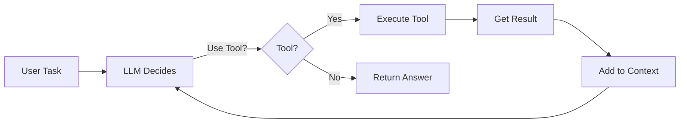

# Agents & Tool Use

An agent is an LLM that can call tools and loop until the task is done.

Without agents: LLM generates one response.
With agents: LLM decides which tools to use, executes them, gets results, decides next step, loops until goal reached.

---

## Why This Matters

**Real incident:** Company built agent that could search the web. Agent looped 100 times. Cost: $500. Accomplished: nothing.

**Real incident 2:** Support agent had access to database tool. Agent decided to delete records. Deleted customer data by accident.

Agents are powerful but dangerous. You'll learn to:
- Define tools safely
- Implement ReAct pattern (Reason → Act → Observe)
- Build multi-step workflows
- Handle failure (infinite loops, wrong tool use)
- Add memory so agent learns

---

## Conceptual Explanation

**Analogy:** You're a project manager with email and access to a spreadsheet.

Agent = you deciding what needs to happen next.
Tool = your email (send message) and spreadsheet (update data).

You get a task: "Find revenue for Q3 and email CEO."

1. **Reason:** "I need to find Q3 revenue and email CEO."
2. **Act:** Use spreadsheet tool "find_Q3_revenue()"
3. **Observe:** Got $2M
4. **Reason:** "Now I'll email CEO with this."
5. **Act:** Send email
6. **Done**

The agent (you) chose which tool to use, decided when to loop, knew when to stop.

---

## Code Examples: Complete Agent Loop

### Define Tools

```python
import json
from typing import Any

# Define what tools the LLM can use
TOOLS = [
    {
        "type": "function",
        "function": {
            "name": "web_search",
            "description": "Search the web for information",
            "parameters": {
                "type": "object",
                "properties": {
                    "query": {"type": "string", "description": "Search query"}
                },
                "required": ["query"]
            }
        }
    },
    {
        "type": "function",
        "function": {
            "name": "execute_sql",
            "description": "Execute SQL query on company database",
            "parameters": {
                "type": "object",
                "properties": {
                    "sql": {"type": "string", "description": "SQL query"}
                },
                "required": ["sql"]
            }
        }
    },
    {
        "type": "function",
        "function": {
            "name": "send_email",
            "description": "Send email to recipient",
            "parameters": {
                "type": "object",
                "properties": {
                    "to": {"type": "string"},
                    "subject": {"type": "string"},
                    "body": {"type": "string"}
                },
                "required": ["to", "subject", "body"]
            }
        }
    }
]

# Implement tool handlers
async def web_search(query: str) -> str:
    """Search web (placeholder)."""
    return f"Results for '{query}': ..."

async def execute_sql(sql: str) -> list[dict]:
    """Execute SQL (real implementation in production)."""
    db = get_database()
    return db.execute(sql).fetchall()

async def send_email(to: str, subject: str, body: str) -> dict:
    """Send email."""
    # Real email service
    return {"status": "sent", "to": to}

async def handle_tool_call(tool_name: str, tool_args: dict) -> str:
    """Execute tool and return result."""
    if tool_name == "web_search":
        return await web_search(tool_args["query"])
    elif tool_name == "execute_sql":
        result = await execute_sql(tool_args["sql"])
        return json.dumps(result)
    elif tool_name == "send_email":
        return json.dumps(await send_email(
            tool_args["to"],
            tool_args["subject"],
            tool_args["body"]
        ))
    else:
        return json.dumps({"error": f"Unknown tool: {tool_name}"})
```

### ReAct Agent Loop

```python
from openai import AsyncOpenAI

client = AsyncOpenAI()

async def react_agent(user_task: str, max_iterations: int = 10) -> str:
    """Agent that reasons, acts, observes."""
    
    messages = [
        {
            "role": "system",
            "content": """You are a helpful agent with access to tools.
            Use tools to accomplish tasks.
            Think step by step.
            When you know the answer, return it.
            If stuck, ask for clarification.
            Max iterations: 10 to avoid infinite loops."""
        },
        {"role": "user", "content": user_task}
    ]
    
    for iteration in range(max_iterations):
        print(f"\n=== Iteration {iteration + 1} ===")
        
        # LLM decides: use tool or return answer
        response = await client.chat.completions.create(
            model="gpt-4o",
            messages=messages,
            tools=TOOLS,
            tool_choice="auto"  # LLM chooses
        )
        
        # Check if LLM returned answer or wants to use tool
        if response.choices[0].finish_reason == "tool_calls":
            # LLM wants to use tool
            assistant_message = response.choices[0].message
            print(f"Agent reasoning: {assistant_message.content}")
            
            # Add assistant's message to history
            messages.append({
                "role": "assistant",
                "content": assistant_message.content or ""
            })
            
            # Handle each tool call
            for tool_call in assistant_message.tool_calls:
                tool_name = tool_call.function.name
                tool_args = json.loads(tool_call.function.arguments)
                
                print(f"Tool: {tool_name}")
                print(f"Args: {tool_args}")
                
                # Execute tool
                tool_result = await handle_tool_call(tool_name, tool_args)
                print(f"Result: {tool_result[:100]}...")  # First 100 chars
                
                # Add result back to messages for next iteration
                messages.append({
                    "role": "user",
                    "content": json.dumps({
                        "tool": tool_name,
                        "result": tool_result
                    })
                })
        
        else:
            # LLM returned final answer
            final_answer = response.choices[0].message.content
            print(f"\n=== Final Answer ===")
            print(final_answer)
            return final_answer
    
    return "Max iterations exceeded"

# Usage
task = "Find the Q3 revenue from our database and email CEO@company.com with a summary"
answer = await react_agent(task)
```

### Multi-Step Tool Chain

```python
async def calculate_roi_workflow(investment: float, returns: dict) -> dict:
    """Multi-step: calculate metrics, compare, make recommendation."""
    
    # Step 1: Calculate ROI
    roi = (returns["total"] - investment) / investment
    
    # Step 2: Compare to benchmarks
    benchmarks = await web_search("startup ROI benchmarks 2024")
    
    # Step 3: Make decision
    if roi > 0.5:
        recommendation = "STRONG BUY"
    elif roi > 0:
        recommendation = "ACCEPTABLE"
    else:
        recommendation = "DO NOT INVEST"
    
    # Step 4: Email report
    await send_email(
        "investor@company.com",
        "ROI Analysis",
        f"Investment: ${investment}\nROI: {roi:.1%}\nRecommendation: {recommendation}"
    )
    
    return {
        "roi": roi,
        "recommendation": recommendation,
        "benchmarks": benchmarks
    }
```

---

## Architecture Diagram



---

## Tools You Can Build

| Tool | Example | Risk |
|------|---------|------|
| **Web Search** | Find current info | Hallucination in LLM |
| **Calculator** | Math operations | Misformed numbers |
| **Database Query** | Read data | SQL injection |
| **External API** | Call third-party | Rate limiting |
| **File System** | Read/write files | Overwrite wrong file |
| **Email** | Send messages | Spam/wrong recipient |

**Risk management:** Sandbox tools. Require approval for destructive ops (delete, email, money).

---

## Decision Framework

**Should this be an agent?**

```
Is the task multi-step?
  ├─ NO: Just call LLM
  └─ YES: Continue...

Does the task need tool use?
  ├─ NO: Just call LLM
  └─ YES: Continue...

Can it fail silently?
  ├─ YES: Don't use agent (too risky)
  └─ NO: Agent acceptable
```

---

## Step-by-Step Tutorial: Build a Web Search Agent

### 1. Install Dependencies

```bash
pip install openai requests duckduckgo-search
```

### 2. Web Search Tool

```python
from duckduckgo_search import DDGS

async def web_search(query: str, max_results: int = 3) -> list[dict]:
    """Search web using DuckDuckGo (free)."""
    results = DDGS().text(query, max_results=max_results)
    return results
```

### 3. Agent

```python
async def search_agent(question: str) -> str:
    """Agent that searches web to answer questions."""
    
    messages = [
        {"role": "system", "content": "You are a helpful assistant that can search the web."},
        {"role": "user", "content": question}
    ]
    
    for iteration in range(5):  # Max 5 searches
        response = await client.chat.completions.create(
            model="gpt-4o",
            messages=messages,
            tools=[{
                "type": "function",
                "function": {
                    "name": "search",
                    "description": "Search the web",
                    "parameters": {
                        "type": "object",
                        "properties": {
                            "query": {"type": "string"}
                        }
                    }
                }
            }]
        )
        
        if response.choices[0].finish_reason == "tool_calls":
            # Search
            tool_call = response.choices[0].message.tool_calls[0]
            search_query = json.loads(tool_call.function.arguments)["query"]
            results = await web_search(search_query)
            
            # Add to context
            messages.append({"role": "assistant", "content": response.choices[0].message.content})
            messages.append({
                "role": "user",
                "content": f"Search results: {json.dumps(results)}"
            })
        else:
            # Answer
            return response.choices[0].message.content
    
    return "Could not find answer"

# Test
answer = await search_agent("What's the capital of France?")
print(answer)
```

---

## Practical Project: Research Agent

**Problem:** Analysts spend 4 hours researching a topic. Build AI to do it.

**Features:**
- Web search tool
- Fact verification (check multiple sources)
- Report generation
- Citation tracking

**API:**
```
POST /research
  {"topic": "AI safety", "depth": "comprehensive"}
  Response: {"report": "...", "sources": [...]}
```

---

## Debugging Playbook: Agent Failures

### 1. Infinite Loop

**Symptom:** Agent keeps calling same tool.

**Fix:**
```python
if iteration > max_iterations:
    return "Max iterations exceeded"
```

### 2. Wrong Tool

**Symptom:** Agent chooses wrong tool for task.

**Fix:** Better system prompt:
```python
"To search for current events, use web_search.
To query our database, use execute_sql.
Only use send_email for final reports."
```

### 3. Tool Error Not Handled

**Symptom:** Tool fails, loop crashes.

**Fix:**
```python
try:
    result = await handle_tool_call(tool_name, tool_args)
except Exception as e:
    result = json.dumps({"error": str(e), "suggestion": "try different approach"})
```

### 4. Token Overflow

**Symptom:** Long conversation exceeds context limit.

**Fix:** Summarize conversation periodically.

### 5. Cost Explosion

**Symptom:** Agent made 100 API calls for simple task.

**Fix:** Set max iterations, charge user per iteration.

---

## Common Mistakes

!!! danger "Mistake 1: No Guardrails"

Agent can call any tool. Calls delete tool, destroys data.

**Don't:** Give agent access to everything.
**Do:** Limit tools per agent. Review dangerous ops.

!!! danger "Mistake 2: Infinite Loops"

Agent loops forever trying same thing.

**Don't:** No max iteration limit.
**Do:** Set max = 10, fail gracefully.

!!! danger "Mistake 3: Poor Tool Design"

Tool has no error handling. Crashes, loop dies.

**Don't:** Simple tool implementation.
**Do:** Wrap tools with try-except.

!!! danger "Mistake 4: No Memory"

Agent doesn't remember past context. Repeats same mistakes.

**Don't:** Stateless agents.
**Do:** Add conversation memory.

---

## Production Realism

**Tutorial:** Simple loop call LLM, check tool_calls, execute.

**Production:**
- Tool sandboxing (run in isolated environment)
- Rate limiting per user
- Cost tracking (charge per tool call)
- Approval workflow for destructive ops
- Detailed logging
- Error recovery
- Timeout handling

---

## Cost & Performance

**Per iteration cost:**
- LLM call: $0.001
- Tool execution: varies
- 5-iteration task: $0.005

**Latency:**
- LLM call: 1-2 seconds
- Tool execution: 1-10 seconds
- 5 iterations: 10-60 seconds (user waits)

**Optimization:** Use cheaper model (gpt-4o-mini) for simpler tasks.

---

## Security

**What agent sees:** Messages are logged. Don't expose secrets.

**Tool access:** Require authentication. Scoped permissions.

**Rate limiting:** Max 5 searches per user per minute.

---

## Case Study: Perplexity AI

**Problem:** Search + synthesis. Find answer on web, synthesize into report.

**Solution:** Agent with web search tool, decides when to search, writes answer.

**Results:** Users get sourced, current answers without visiting 10 sites.

---

## Interview Cheat Sheet

**Concept 1: Agents**
*Q: What's an agent?*
*A: LLM that loops. Uses tools. Decides next step. Stops when goal reached.*

**Concept 2: ReAct**
*Q: Reason-Act-Observe pattern?*
*A: Reason about task. Act (use tool). Observe result. Loop until done.*

**Concept 3: Tool Use**
*Q: JSON tool definitions?*
*A: Define tools with name, description, parameters. LLM chooses which to call.*

**Concept 4: Looping**
*Q: How to prevent infinite loops?*
*A: Max iteration limit. Check if tool use is repeating. Fail gracefully.*

**Concept 5: Cost**
*Q: Agent costs more than static prompt?*
*A: Yes. Multiple LLM calls, tool calls, overhead. But does more complex work.*

---

## 10 Review Questions

1. ReAct = Reason + Act + Observe. How does Observe become Reason?
2. Tool definition requires name, description, parameters. Why all three?
3. Agent decides "use tool X" but tool fails. What happens?
4. How many iterations before agent gives up?
5. Agent loops 100 times. Problem?
6. Max context window 128K, agent convo is 50K. Room for 1 more tool response?
7. Agent calls web_search 5 times same question. Waste. How to prevent?
8. Cost: GPT-4o at $0.001/call, agent makes 10 calls. Total?
9. Agent emails wrong person. How to prevent?
10. Tool returns error "database unreachable." How agent responds?

---

## Flashcards

**Card 1: Agent Definition**
*Q: Agent vs LLM?*
*A: LLM generates once. Agent loops, uses tools, decides next step.*

**Card 2: Tool Call**
*Q: Can agent call multiple tools in one turn?*
*A: Yes, tool_calls is a list.*

**Card 3: Looping**
*Q: When agent stops looping?*
*A: When finish_reason != "tool_calls" (returns answer) or max_iterations reached.*

**Card 4: Error Handling**
*Q: Tool fails. Agent should?*
*A: Return error to agent. Agent decides next move (retry, different tool, give up).*

**Card 5: Cost**
*Q: Agent per-task cost higher or lower than cached response?*
*A: Higher (multiple calls). But does more work.*

**Card 6: Safety**
*Q: Dangerous tools (delete, email)?*
*A: Require approval, sandbox, logging.*

**Card 7: Memory**
*Q: Agent should remember past conversations?*
*A: Yes, add conversation summary to context.*

**Card 8: Latency**
*Q: User waits during agent loop?*
*A: Yes, 10-60 seconds depending on iterations. Use streaming for UX.*

**Card 9: Tool Design**
*Q: Good tool returns?*
*A: JSON or string. Not exception. Error as {"error": "...", "suggestion": "..."}.*

**Card 10: Limits**
*Q: Max iterations = 10. Agent uses 5. Good?*
*A: Good, means agent was efficient.*

---

## Teach-It-Back Prompt

**Explain agents to someone new:**

"Company wants AI to answer: 'What's our Q3 revenue?' Build an agent that searches databases, calculates if needed, then answers. Walk through the loop."

**Model Answer:**

"Agent gets question. LLM reads it, decides 'I need to search database.' Calls execute_sql tool with 'SELECT SUM(revenue) WHERE quarter=3'. Gets result: $2M. Agent sees result, LLM reads it, decides 'I have the answer.' Returns 'Your Q3 revenue is $2M.' Done.

If question was harder ('What's the revenue trend?'), agent might loop: first query gets data, then it calculates, then answers.

Each loop: LLM call ($X), tool call (free or cheap), result processing. 5 loops = $0.005."

---

## 1-Week Checklist

- [ ] Defined 3+ tools with proper schemas
- [ ] Built agent loop (LLM → tools → observe)
- [ ] Tested with 10 different tasks
- [ ] Verified agent stops (doesn't infinite loop)
- [ ] Added error handling to tools
- [ ] Measured cost per task (should be < $0.01)
- [ ] Measured latency (should be < 10 seconds for 3-step task)
- [ ] Added iteration limit
- [ ] Tested failing tool (agent handles gracefully)
- [ ] Built one end-to-end agent (web search, report generation)
- [ ] Logged all tool calls
- [ ] Deployed locally

---

## Resources

- [OpenAI Function Calling](https://platform.openai.com/docs/guides/function-calling)
- [LangGraph (multi-agent framework)](https://langchain-ai.github.io/langgraph/)
- [ReAct Paper](https://arxiv.org/abs/2210.03629)

---

## Next Page

Your AI can act on the world now.

Next: fine-tuning. Make your AI better at specific tasks.

→ **[Fine-Tuning →](fine-tuning.md)**
