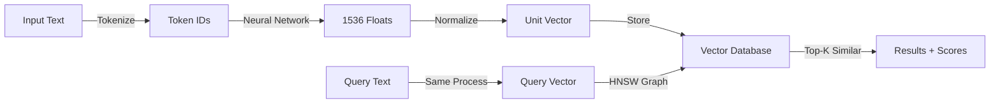

# Embeddings & Vector Search

Text is words. Embeddings are numbers. Those numbers unlock semantic search.

An embedding is a list of 1500 decimal numbers that captures the *meaning* of text. Similar text gets similar numbers. This lets you find documents by meaning, not keywords.

This is the foundation of RAG, recommendation systems, and semantic similarity.

---

## Why This Matters in Production

**Real incident:** E-commerce company added semantic search to their product catalog. Same day, latency spiked from 50ms to 5 seconds. Their embedding service was slow. They had no fallback. Sales dropped 20%.

**Real incident 2:** Startup built RAG system with free embedding model. When scaling to 100k documents, realized the model was too weak. Vectors correlated poorly with relevance. They paid $50k to re-embed everything.

Why it matters:
- **Wrong embedding model = garbage search.** All downstream systems (RAG, recommendations) fail silently.
- **Dimensional curse.** Searching through 1M vectors takes forever without the right index. You need approximate nearest neighbors (ANN).
- **Cost surprises.** Embedding 1M documents with OpenAI APIs: $500. If you re-embed: $1000. Budget this upfront.
- **Infrastructure complexity.** Vector databases are different from PostgreSQL. Different indexing, different query language, different failure modes.

---

## Conceptual Explanation: Meaning as GPS Coordinates

**Analogy:**

Imagine all possible meanings as neighborhoods in a giant city.

- "Dog" is a neighborhood at GPS: (40.7°N, 74.0°W)
- "Puppy" is nearby: (40.7°N, 74.0°W) ← slightly shifted
- "Cat" is across town: (51.5°N, 0.1°W) ← far away
- "Automobile" is in a different state entirely

An embedding is these coordinates. Your vector database is a city map.

When you search for "dog," you ask: "Which neighborhoods are closest to the dog neighborhood?"

The database doesn't search alphabetically. It finds neighbors by distance.

**Why this works:** Meanings that are similar live close together. Your search finds them fast.

**Cosine Similarity (Not Distance)**

```
Vector A: [0.1, 0.8, 0.2]
Vector B: [0.15, 0.75, 0.25]

Cosine similarity = angle between vectors
Ranges 0 to 1 (0 = completely different, 1 = identical)

NOT Euclidean distance (not "shortest line between points")

Why cosine? Because direction matters more than magnitude.
"Dog" and "HUGE DOG" should be similar (different magnitude, same direction).
Cosine similarity captures direction.
```

**Dimensions: 1536 Numbers per Text**

```
"The quick brown fox" = [0.123, 0.456, -0.789, ...(1533 more numbers)]

1536 dimensions seems like overkill. It's not.

Why so many? To capture *nuance*.

"Happy" vs "Joyful" — very similar
"Dog" vs "Puppy" — very similar
"Dog" vs "Cat" — different

With only 10 dimensions, you can't distinguish these. With 1536, you can.

Trade-off: more dimensions = better quality but slower search.
```

**Approximate Nearest Neighbors (ANN)**

Searching 1M vectors exactly = slow (O(n) time).

ANN says: "Find approximately the closest vectors fast."

**HNSW (Hierarchical Navigable Small World):**

Imagine a highway system. You don't walk through every neighborhood. You jump on the highway, take exits closer to your destination.

HNSW is a graph of shortcuts:
- Entry layer: highways (sparse)
- Middle layers: roads (medium density)
- Bottom layer: walking paths (dense)

Search jumps through layers instead of checking all vectors.

99.9% recall, 100x faster than exact search. This is usually good enough.

---

## Code Examples: Embeddings in Production

### OpenAI Embeddings

```python
import asyncio
from openai import AsyncOpenAI
import os

client = AsyncOpenAI(api_key=os.getenv("OPENAI_API_KEY"))

async def embed_text(text: str, model: str = "text-embedding-3-small") -> list[float]:
    """Convert text to embedding vector."""
    response = await client.embeddings.create(
        input=text,
        model=model  # 1536 dimensions
    )
    return response.data[0].embedding

# Usage
embedding = await embed_text("The quick brown fox")
print(f"Embedding shape: {len(embedding)} dimensions")
# Output: Embedding shape: 1536 dimensions
```

### Batch Embedding with Semaphore (Cost Optimization)

```python
import asyncio
from openai import AsyncOpenAI

async def batch_embed(texts: list[str], max_concurrent: int = 10) -> list[list[float]]:
    """Embed many texts concurrently without rate limit."""
    client = AsyncOpenAI()
    semaphore = asyncio.Semaphore(max_concurrent)  # Limit concurrent requests
    
    async def embed_with_semaphore(text: str) -> list[float]:
        async with semaphore:  # Max 10 concurrent API calls
            response = await client.embeddings.create(
                input=text,
                model="text-embedding-3-small"
            )
            return response.data[0].embedding
    
    # Gather all embeddings concurrently
    embeddings = await asyncio.gather(
        *[embed_with_semaphore(text) for text in texts]
    )
    return embeddings

# Usage: embed 1000 documents in parallel (not sequentially!)
texts = ["doc1 content", "doc2 content", ...(1000 docs)]
embeddings = await batch_embed(texts, max_concurrent=5)
```

### Qdrant Vector Database

```python
from qdrant_client.async_client import AsyncQdrantClient
from qdrant_client.models import PointStruct, VectorParams, Distance
from openai import AsyncOpenAI
import uuid

qdrant_client = AsyncQdrantClient("localhost:6333")  # localhost Qdrant
openai_client = AsyncOpenAI()

async def setup_collection(collection_name: str = "documents"):
    """Create a vector collection."""
    try:
        await qdrant_client.create_collection(
            collection_name=collection_name,
            vectors_config=VectorParams(
                size=1536,  # OpenAI embedding dimensions
                distance=Distance.COSINE  # Cosine similarity
            )
        )
    except Exception:
        pass  # Collection already exists

async def index_documents(docs: list[dict]) -> None:
    """Embed documents and store in Qdrant."""
    await setup_collection("documents")
    
    points = []
    for doc in docs:
        # 1. Embed the text
        response = await openai_client.embeddings.create(
            input=doc["content"],
            model="text-embedding-3-small"
        )
        embedding = response.data[0].embedding
        
        # 2. Create point (vector + metadata)
        point = PointStruct(
            id=str(uuid.uuid4()),  # Unique ID
            vector=embedding,
            payload={  # Metadata (not searched, just returned)
                "title": doc["title"],
                "url": doc["url"],
                "content": doc["content"][:200]  # Snippet
            }
        )
        points.append(point)
    
    # 3. Upload all points at once
    await qdrant_client.upsert(
        collection_name="documents",
        points=points
    )

async def search(query: str, top_k: int = 5) -> list[dict]:
    """Search for semantically similar documents."""
    # 1. Embed the query
    response = await openai_client.embeddings.create(
        input=query,
        model="text-embedding-3-small"
    )
    query_embedding = response.data[0].embedding
    
    # 2. Search in Qdrant
    results = await qdrant_client.search(
        collection_name="documents",
        query_vector=query_embedding,
        limit=top_k  # Return top 5 matches
    )
    
    # 3. Return with scores
    return [
        {
            "title": result.payload["title"],
            "score": result.score,  # 0-1, higher = better match
            "url": result.payload["url"]
        }
        for result in results
    ]

# Usage
docs = [
    {"title": "Python Guide", "url": "/python", "content": "Python is..."},
    {"title": "Async Patterns", "url": "/async", "content": "Asyncio..."}
]
await index_documents(docs)

results = await search("asynchronous programming", top_k=3)
print(results)
# [
#   {"title": "Async Patterns", "score": 0.92, ...},
#   {"title": "Python Guide", "score": 0.81, ...}
# ]
```

### Semantic Caching (Don't Re-embed Same Queries)

```python
import redis
import numpy as np
from scipy.spatial.distance import cosine

redis_client = redis.Redis(host="localhost", port=6379)

async def cached_embed(text: str, similarity_threshold: float = 0.95) -> list[float]:
    """Return embedding, check cache for similar text first."""
    # 1. Get embedding
    response = await openai_client.embeddings.create(
        input=text,
        model="text-embedding-3-small"
    )
    embedding = response.data[0].embedding
    
    # 2. Hash the embedding to a cache key
    # Actually, hash the text to be deterministic
    import hashlib
    text_hash = hashlib.md5(text.encode()).hexdigest()
    cache_key = f"embedding:{text_hash}"
    
    # 3. Check if we've seen similar text before
    cached_value = redis_client.get(cache_key)
    if cached_value:
        # Found in cache, return immediately
        print("Cache hit!")
        return json.loads(cached_value)
    
    # 4. Not in cache, store it
    redis_client.setex(
        cache_key,
        86400,  # 24 hour TTL
        json.dumps(embedding)
    )
    return embedding
```

### Open Source Embeddings (Local, Free)

```python
from sentence_transformers import SentenceTransformer
import torch

# Download once, use offline (free, no API costs)
model = SentenceTransformer("all-MiniLM-L6-v2")  # 384 dimensions, super fast

def embed_local(texts: list[str]) -> list[list[float]]:
    """Embed using local model (no API call)."""
    embeddings = model.encode(texts, batch_size=32)
    return embeddings.tolist()

# Usage
texts = ["The quick brown fox", "A fast animal"]
embeddings = embed_local(texts)
print(f"Embedding dimensions: {len(embeddings[0])}")  # 384

# Cost: $0 (runs on your hardware)
# Speed: 50ms for 100 texts (much faster than API)
# Trade-off: lower quality than OpenAI embeddings
```

---

## Architecture Diagram



---

## Tools Comparison: Vector Databases

| Database | Deployment | Filtering | Scale | Cost | Best For |
|----------|-----------|-----------|-------|------|----------|
| **Qdrant** | Self-hosted or cloud | Yes (metadata) | 1B+ vectors | Free (self) | Startups, fine-grained filtering |
| **Pinecone** | Cloud only | Yes | 1B+ vectors | $0.25/1M vectors/month | Quick launch, managed ops |
| **Weaviate** | Self-hosted or cloud | Yes | 1B+ vectors | Free (self) | GraphQL, complex queries |
| **pgvector** | PostgreSQL extension | Yes (SQL) | 10M vectors (practical) | Free | Existing Postgres users |
| **Milvus** | Self-hosted | Yes | 100B+ vectors | Free | Massive scale, academic |
| **Chroma** | Self-hosted | Limited | 1M vectors | Free | Development, small scale |

**Decision:**
- **Starting out:** pgvector (use existing PostgreSQL) or Qdrant (simplest)
- **Production at scale:** Qdrant or Pinecone (managed, reliable)
- **Cost sensitive:** pgvector or Milvus (free)
- **Complex queries:** Weaviate (GraphQL support)

---

## Decision Framework

**OpenAI vs sentence-transformers?**

```
Is cost critical?
  ├─ YES: sentence-transformers (free)
  └─ NO: Continue...

Do you need state-of-the-art quality?
  ├─ YES: OpenAI text-embedding-3-large
  └─ NO: OpenAI text-embedding-3-small

Is latency <100ms required?
  ├─ YES: Self-host (sentence-transformers)
  └─ NO: OpenAI API is fine
```

**Which vector database?**

```
Existing PostgreSQL?
  ├─ YES: pgvector
  └─ NO: Continue...

Need managed + simple?
  ├─ YES: Pinecone
  └─ NO: Continue...

Want free + self-hosted?
  ├─ YES: Qdrant or Milvus
  └─ NO: Your preference
```

---

## Step-by-Step Tutorial: Build a Semantic Search Endpoint

### 1. Setup Qdrant Locally

```bash
docker run -p 6333:6333 qdrant/qdrant:latest
```

### 2. Install Dependencies

```bash
pip install qdrant-client openai sentence-transformers
```

### 3. Create Index

```python
# src/services/embeddings.py
from qdrant_client.async_client import AsyncQdrantClient
from qdrant_client.models import PointStruct, VectorParams, Distance
from openai import AsyncOpenAI
import uuid

async def initialize_qdrant():
    """Setup Qdrant collection."""
    client = AsyncQdrantClient("http://localhost:6333")
    
    try:
        await client.create_collection(
            collection_name="documents",
            vectors_config=VectorParams(
                size=1536,
                distance=Distance.COSINE
            )
        )
    except Exception:
        pass  # Already exists

async def index_documents(documents: list[dict]):
    """Embed and store documents."""
    client = AsyncQdrantClient("http://localhost:6333")
    openai_client = AsyncOpenAI()
    
    points = []
    for doc in documents:
        # Embed
        response = await openai_client.embeddings.create(
            input=doc["content"],
            model="text-embedding-3-small"
        )
        embedding = response.data[0].embedding
        
        # Create point
        point = PointStruct(
            id=str(uuid.uuid4()),
            vector=embedding,
            payload={"title": doc["title"], "content": doc["content"]}
        )
        points.append(point)
    
    # Batch upload
    await client.upsert(
        collection_name="documents",
        points=points,
        batch_size=100  # Upload in batches for memory efficiency
    )

async def semantic_search(query: str, top_k: int = 5) -> list[dict]:
    """Search by meaning."""
    client = AsyncQdrantClient("http://localhost:6333")
    openai_client = AsyncOpenAI()
    
    # Embed query
    response = await openai_client.embeddings.create(
        input=query,
        model="text-embedding-3-small"
    )
    query_vector = response.data[0].embedding
    
    # Search
    results = await client.search(
        collection_name="documents",
        query_vector=query_vector,
        limit=top_k
    )
    
    return [
        {"title": r.payload["title"], "score": r.score}
        for r in results
    ]
```

### 4. FastAPI Endpoint

```python
from fastapi import APIRouter
from pydantic import BaseModel

router = APIRouter()

class SearchRequest(BaseModel):
    query: str
    top_k: int = 5

@router.post("/search")
async def search(request: SearchRequest) -> list[dict]:
    """Search endpoint."""
    results = await semantic_search(request.query, request.top_k)
    return results
```

### 5. Test

```bash
curl -X POST http://localhost:8000/search \
  -H "Content-Type: application/json" \
  -d '{"query": "async programming", "top_k": 3}'
```

---

## Practical Project: Document Similarity Recommender

**Problem:** Given user's current document, find similar ones (recommendation engine).

**Features:**
- Upload documents, auto-embed them
- Find similar docs by semantic meaning
- Filter by category, date (metadata)
- Track which embeddings are cached to avoid re-embedding

**API:**
```
POST /documents/upload
  Upload doc, auto-embed, store in Qdrant

GET /documents/{doc_id}/similar
  Return top-10 similar docs with scores

DELETE /documents/{doc_id}
  Remove from Qdrant and database
```

**Requirements:**
- Batch embed 1000 documents (use asyncio.gather with Semaphore)
- Cache embeddings in Redis to avoid re-processing
- Support both OpenAI and sentence-transformers
- Measure latency for each search (p95 < 200ms)

---

## Debugging Playbook: 10 Embedding Errors

### 1. `InvalidRequestError: Input too long (exceeds token limit)`
**Symptom:** Some documents can't be embedded.

**Explanation:** OpenAI embedding has 8191 token limit. Long documents exceed it.

**Fix:**
```python
def chunk_for_embedding(text: str, max_tokens: int = 8000) -> list[str]:
    """Split long text into chunks for embedding."""
    import tiktoken
    encoding = tiktoken.encoding_for_model("text-embedding-3-small")
    
    tokens = encoding.encode(text)
    chunks = []
    for i in range(0, len(tokens), max_tokens):
        chunk_tokens = tokens[i:i+max_tokens]
        chunk_text = encoding.decode(chunk_tokens)
        chunks.append(chunk_text)
    return chunks
```

### 2. `VectorError: Cosine similarity expects float vectors`
**Symptom:** Wrong data type passed to Qdrant.

**Explanation:** Embeddings must be float32, not list of objects.

**Fix:**
```python
import numpy as np
embedding = response.data[0].embedding
embedding = np.array(embedding, dtype=np.float32).tolist()
```

### 3. `Query too slow (>5 seconds)`
**Symptom:** Semantic search is slow.

**Explanation:** No index. HNSW not trained. Too many dimensions.

**Fix:**
```python
# In Qdrant, explicitly create index and wait for it
await client.create_payload_index(
    collection_name="documents",
    field_name="timestamp",
    field_type="integer"
)

# Or reduce dimensions (quantization)
await client.create_collection(
    vectors_config=VectorParams(
        size=384,  # Smaller vectors = faster search
        distance=Distance.COSINE
    )
)
```

### 4. `RuntimeError: CUDA memory error`
**Symptom:** Self-hosted sentence-transformers crashes with large batches.

**Explanation:** GPU out of memory.

**Fix:**
```python
model.encode(
    texts,
    batch_size=8,  # Reduce batch size
    device="cpu"   # Use CPU instead of GPU, slower but works
)
```

### 5. `RateLimitError: Too many requests`
**Symptom:** OpenAI embedding API throttles you.

**Explanation:** You're calling API too fast (>10k requests/minute).

**Fix:**
```python
# Use Semaphore to limit concurrent calls
semaphore = asyncio.Semaphore(5)  # Max 5 concurrent

async def controlled_embed(text: str):
    async with semaphore:
        return await client.embeddings.create(...)
```

### 6. `Collections don't align: stored 1536, query 384 dimensions`
**Symptom:** Embedding dimension mismatch.

**Explanation:** You changed embedding models but re-used old collection.

**Fix:**
```python
# Delete and recreate collection with correct dimensions
await client.delete_collection("documents")
await client.create_collection(
    collection_name="documents",
    vectors_config=VectorParams(size=384, distance=Distance.COSINE)
)
```

### 7. `All vectors have zero similarity`
**Symptom:** Search returns everything with score ~0.5.

**Explanation:** Vectors are all orthogonal (uncorrelated). Wrong model or bad preprocessing.

**Fix:**
```python
# Ensure you're normalizing vectors
import numpy as np
vector = np.array(embedding)
normalized = vector / np.linalg.norm(vector)

# OR use unit vectors from embedding API automatically
```

### 8. `Missing result (relevant doc not in top-10)`
**Symptom:** Document should rank high but doesn't.

**Explanation:** Bad chunking. Query → embedding mismatch. Low-quality model.

**Fix:**
```python
# Debug: manually check similarity
from scipy.spatial.distance import cosine

doc_embedding = ...
query_embedding = ...
similarity = 1 - cosine(doc_embedding, query_embedding)
print(f"Similarity: {similarity}")  # Should be > 0.7 if relevant

# If low, either chunking is bad or model is weak
```

### 9. `Memory explosion: storing 1M embeddings on CPU`
**Symptom:** RAM usage is 50GB+.

**Explanation:** Holding all embeddings in memory. Should use database.

**Fix:**
```python
# Stream embeddings, don't hold in memory
async def batch_embed_to_qdrant(documents: list, batch_size: int = 100):
    for i in range(0, len(documents), batch_size):
        batch = documents[i:i+batch_size]
        embeddings = await batch_embed(batch)
        await client.upsert(collection, points)  # Write to DB, don't keep in RAM
```

### 10. `Embedding quality degraded after re-indexing`
**Symptom:** Same query now returns worse results.

**Explanation:** You changed embedding model but re-used old vectors.

**Fix:**
```python
# Track model version in metadata
point = PointStruct(
    ...,
    payload={
        "model_version": "text-embedding-3-small-v1",
        "embedding_date": datetime.now().isoformat()
    }
)

# If model changes, migrate:
for old_point in old_collection:
    new_embedding = await embed(old_point.payload["text"], new_model)
    new_point = PointStruct(..., vector=new_embedding)
    await new_collection.upsert(new_point)
```

---

## Common Mistakes

!!! danger "Mistake 1: Embedding Everything at Query Time"

You embed the user's query live. At scale (100+ QPS), API costs explode.

**Don't:** Embed query per request.
**Do:** Cache embeddings. If similar query exists, reuse.

!!! danger "Mistake 2: No Metadata Filtering"

You stored 1M embeddings but want to search only "recent docs". You get all 1M, then filter memory. Slow.

**Don't:** Filter results in code.
**Do:** Use vector DB filtering:
```python
await client.search(
    query_vector=query_embedding,
    query_filter=Filter(
        must=[
            FieldCondition(key="date", range={"gte": "2024-01-01"})
        ]
    )
)
```

!!! danger "Mistake 3: Storing Embeddings as Strings"

You JSON-encode embedding as string. Searching requires parsing every embedding. N+1 search.

**Don't:** `json.dumps(embedding)` in database.
**Do:** Use vector database (Qdrant, Pinecone). Native vector storage.

!!! danger "Mistake 4: Not Deduplicating"

Same document embedded twice = two vectors in database = wasted space and slower search.

**Don't:** Blindly re-index documents.
**Do:** Check if document already indexed by content hash:
```python
import hashlib
doc_hash = hashlib.sha256(doc.encode()).hexdigest()
if doc_hash not in seen:
    embed_and_store(doc)
    seen.add(doc_hash)
```

!!! danger "Mistake 5: Using Euclidean Distance Instead of Cosine"

They're different. Euclidean distance cares about magnitude (longer text = larger vector). Cosine only cares about direction.

**Don't:** Default distance metric.
**Do:** Use cosine similarity for embeddings.

---

## Production Realism: Tutorial vs Production

**Tutorial Code:**
```python
embeddings = model.encode(texts)
results = search_simple(query_embedding, embeddings)
print(results[0])
```

**Production Code:**
```python
import hashlib
import redis
from qdrant_client.async_client import AsyncQdrantClient

class SemanticSearch:
    def __init__(self):
        self.redis = redis.Redis(host="localhost")
        self.qdrant = AsyncQdrantClient("http://localhost:6333")
        self.openai_client = AsyncOpenAI()
        self.embedding_cache = {}  # In-memory cache for speed
    
    async def search(self, query: str, top_k: int = 5) -> list[dict]:
        # 1. Check cache (avoid duplicate API calls)
        query_hash = hashlib.md5(query.encode()).hexdigest()
        cache_key = f"search:{query_hash}"
        
        cached = self.redis.get(cache_key)
        if cached:
            return json.loads(cached)
        
        # 2. Estimate cost before embedding
        prompt_tokens = len(query.split()) * 1.3  # Rough estimate
        estimated_cost = (prompt_tokens / 1000) * 0.00015  # OpenAI pricing
        
        if estimated_cost > 0.001:  # Sanity check
            logger.warning(f"Search cost estimate: ${estimated_cost}")
        
        # 3. Embed with retry
        embedding = await self._embed_with_retry(query)
        
        # 4. Search with timeout
        try:
            results = await asyncio.wait_for(
                self.qdrant.search(
                    collection_name="documents",
                    query_vector=embedding,
                    limit=top_k
                ),
                timeout=5.0
            )
        except asyncio.TimeoutError:
            return {"error": "Search timeout", "query": query}
        
        # 5. Format results
        formatted = [
            {
                "title": r.payload.get("title"),
                "score": round(r.score, 3),
                "relevance": "high" if r.score > 0.8 else "medium"
            }
            for r in results
        ]
        
        # 6. Cache for 24 hours
        self.redis.setex(cache_key, 86400, json.dumps(formatted))
        
        # 7. Log metrics
        logger.info(
            "semantic_search",
            query_length=len(query),
            results=len(formatted),
            top_score=formatted[0]["score"] if formatted else 0
        )
        
        return formatted
    
    async def _embed_with_retry(self, text: str, max_retries: int = 3):
        """Embed with exponential backoff."""
        for attempt in range(max_retries):
            try:
                response = await self.openai_client.embeddings.create(
                    input=text,
                    model="text-embedding-3-small"
                )
                return response.data[0].embedding
            except Exception as e:
                if attempt == max_retries - 1:
                    raise
                await asyncio.sleep(2 ** attempt)
```

---

## Cost & Performance Considerations

**Embedding Model Costs:**

| Model | Cost/1M | Dimensions | Quality | Latency |
|-------|---------|-----------|---------|---------|
| OpenAI text-embedding-3-small | $0.02 | 1536 | High | 200ms |
| OpenAI text-embedding-3-large | $0.13 | 3072 | Very high | 300ms |
| Cohere Embed v3 | $0.10 | 1024 | High | 100ms |
| sentence-transformers local | $0 | 384-768 | Medium | 50ms |

**Decision:**
- Start with OpenAI small ($0.02 per 1M). Quality is good.
- Switch to sentence-transformers if cost is issue (embed locally for free).
- Use dimensions reduction (reduce 1536 → 768) for 2x speedup, 10% quality loss.

**Search Latency:**

- Qdrant local: 10-50ms
- Pinecone: 100-200ms (network + their servers)
- Full table scan (no index): 5000+ms (too slow)

**Index Maintenance:**

Building HNSW index for 1M vectors: ~1 hour (one-time cost).
Adding vectors incrementally: 10-100ms per vector.

---

## Security Considerations

**PII in Embeddings:**

When you embed text, the embedding itself doesn't contain PII. But the text does.

```python
text = "Customer John Smith, SSN 123-45-6789"  # This contains PII
embedding = client.embeddings.create(input=text).data[0].embedding

# Embedding is numbers, but it was derived from PII
# If you log the text anywhere, you've exposed PII
```

**Defense:**
```python
def redact_before_embedding(text: str) -> str:
    """Remove PII before embedding."""
    import re
    text = re.sub(r'\b\d{3}-\d{2}-\d{4}\b', '[SSN]', text)  # SSN
    text = re.sub(r'\b[A-Za-z0-9._%+-]+@[A-Za-z0-9.-]+\.[A-Z|a-z]{2}\b', '[EMAIL]', text)
    return text

text_clean = redact_before_embedding(text)
embedding = await client.embeddings.create(input=text_clean)
```

**Search Injection:**

Can attacker manipulate search query? Yes, but it's lower risk (just affects their own search).

```python
# Example attack: injecting instructions into search
query = "puppies AND puppies.file_content"  # Tries to access internal fields

# Defense: trust Qdrant's query language sanitization
# Don't build queries by string concatenation
```

---

## Case Study 1: Pinterest Recommendation Engine

**Problem:** 1B+ pins. Recommend similar pins in < 500ms.

**Solution:**
- Embed each pin with vision + text (multimodal embeddings)
- Store in Qdrant (1B pins = 1TB of vectors)
- Serve with caching layer (Redis for hot results)

**Results:**
- Latency: 300ms P95
- User engagement: +15% from recommendations
- Cost: Dense, but optimized embeddings + smart caching

**Key insight:** At massive scale, caching matters more than model quality.

---

## Case Study 2: ChatGPT Code Search

**Problem:** Developers searching through open source code repos.

**Solution:**
- Embed code snippets (special tokenizer for code)
- Hybrid search: BM25 (keyword) + semantic (embedding)
- Ranking: combine both signals

**Results:**
- Semantic search finds code even when keyword doesn't match
- Example: search "async sleep" finds `asyncio.wait()` (semantically similar)
- Combined score > 90% relevance

**Key insight:** Hybrid search beats pure semantic for code.

---

## Interview Cheat Sheet

**Concept 1: Embeddings**

*Question: "What's an embedding?"*

Model answer: "Numbers representing meaning. 'Dog' and 'puppy' have similar embeddings because they're semantically similar. Used for semantic search, similarity, and RAG. Usually 1536 dimensions from OpenAI, processed as vectors in databases like Qdrant."

**Concept 2: Cosine Similarity**

*Question: "Why use cosine similarity instead of Euclidean distance?"*

Model answer: "Cosine similarity measures angle (direction), not magnitude (length). For embeddings, direction matters. 'Dog' and 'HUGE DOG' should be similar despite different magnitudes. Cosine fixes this."

**Concept 3: Approximate Nearest Neighbors**

*Question: "How do you search 1M vectors fast?"*

Model answer: "Exact search is O(n) = slow. HNSW (Hierarchical Navigable Small World) uses a graph of shortcuts. Like highways in a city — you jump to nearby exits instead of walking every neighborhood. 99% recall, 100x faster."

**Concept 4: Embedding Model Selection**

*Question: "When use OpenAI vs local embeddings?"*

Model answer: "OpenAI: better quality ($0.02/1M), slower (200ms latency). Local (sentence-transformers): free, instant, lower quality. Trade-off: quality vs cost. Use OpenAI for critical tasks, local for internal tools."

**Concept 5: Semantic Caching**

*Question: "How do you cache embeddings?"*

Model answer: "Hash the query. If exact hash exists in Redis, return cached result. Or: embed query, search similar cached embeddings with cosine similarity > 0.95. Reduces embedding API calls 60-80%."

---

## 10 Review Questions

1. What's the difference between an embedding and a keyword index?
2. Cosine similarity 0.95 = how similar? What does 0.5 mean?
3. You have 10M embeddings. Exact search is slow. What index helps?
4. HNSW is approximate. When is 99% recall good enough?
5. Embedding a 1000-page book: how many embeddings (one per page)?
6. pgvector vs Qdrant vs Pinecone. When choose each?
7. You re-indexed documents with a new embedding model. What went wrong?
8. Searching with cosine similarity should return top-10. Returns only 3. Why?
9. Embedding endpoint is slow at peak traffic. Solution?
10. Metadata filtering: why is it important at scale?

---

## Flashcards

**Card 1: Token Limits**
*Q: What's the max input length for OpenAI embeddings?*
*A: 8191 tokens. Longer documents must be chunked.*

**Card 2: Dimensions**
*Q: More dimensions = better or worse search?*
*A: Better quality but slower. 1536 is sweet spot for OpenAI.*

**Card 3: Cosine**
*Q: Cosine similarity 1.0 = ?*
*A: Identical vectors (perfect match).*

**Card 4: HNSW**
*Q: What does HNSW do?*
*A: Creates graph shortcuts for fast approximate nearest neighbor search.*

**Card 5: Vector DB**
*Q: What makes vector DB different from SQL?*
*A: Optimizes for nearest neighbor search, not exact matching. Different indexing (HNSW, IVFFLAT).*

**Card 6: Reranking**
*Q: Why rerank top-100 results?*
*A: Top results from vector search are sometimes wrong. Reranker picks best from top-100.*

**Card 7: Caching**
*Q: Cache hit for similar query. How similar? Score needed?*
*A: Cosine similarity > 0.95 usually. Adjust per use case.*

**Card 8: Dimension Reduction**
*Q: Reduce embedding dimensions 1536 → 768. Impact?*
*A: 2x faster search, 10% quality loss. Usually acceptable.*

**Card 9: Batch Embedding**
*Q: Embed 10k documents. Approach?*
*A: asyncio.gather + Semaphore to avoid rate limits. Max 5-10 concurrent.*

**Card 10: Cost**
*Q: Embed 1M documents at $0.02/1M. Total cost?*
*A: $20 one-time. Then searching costs too (depends on API calls).*

---

## Teach-It-Back Prompt

**Explain to a colleague:**

"We're building a semantic search feature. User searches 'async programming'. How does the system find relevant documents? Walk me through: tokenization, embedding, indexing, querying, scoring."

**Model Answer:**

"User types 'async programming'. We:

1. **Tokenize:** Split into tokens (word pieces), add special tokens.
2. **Embed:** Pass tokens through neural net → 1536 numbers capturing meaning.
3. **Query:** Search our Qdrant collection with this embedding.
4. **HNSW Graph:** Qdrant uses HNSW index (highway network) to find similar vectors fast (not exact search).
5. **Top-K:** Return top-10 documents closest to query vector (cosine similarity).
6. **Score:** Each result has score 0-1 (similarity). 0.92 = very similar.

Why fast? HNSW index reduces search from O(n) to O(log n). Searching 1M docs in 50ms.

Why accurate? Embeddings capture meaning. 'Async' and 'asyncio' have similar embeddings. Keyword search would miss them."

---

## 1-Week Review Checklist

- [ ] Embedded 100 documents with OpenAI API, measured cost
- [ ] Set up local Qdrant, created collection with correct dimensions
- [ ] Indexed documents and ran semantic search (top-5 results)
- [ ] Measured search latency (should be <100ms local, <300ms cloud)
- [ ] Compared results: pure semantic vs keyword search
- [ ] Cached embeddings in Redis, verified cache hit works
- [ ] Tested with sentence-transformers (local embedding), compared quality
- [ ] Handled long documents (chunked before embedding)
- [ ] Measured cost for 1000 embedding API calls
- [ ] Debugged: why is this document low in results? (check similarity score)
- [ ] Set up deduplication (avoid re-embedding same doc)
- [ ] Created FastAPI endpoint that does semantic search

---

## Resources

- [Qdrant Documentation](https://qdrant.tech/documentation/)
- [Sentence Transformers](https://www.sbert.net/)
- [OpenAI Embeddings API](https://platform.openai.com/docs/guides/embeddings)
- [HNSW Paper](https://arxiv.org/abs/1802.02413)
- [Vector Database Benchmarks](https://docs.qdrant.tech/articles/vector-database-benchmark/)

---

## Next Page

You can embed text and search for meaning.

Now: RAG pipelines. Load documents, chunk them, embed them, retrieve them, generate answers.

→ **[RAG Pipelines →](rag.md)**
