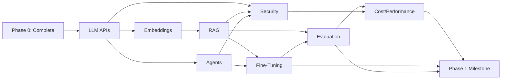

# Phase 1: AI Systems & LLM Integration

You've built a production backend. Now you'll integrate AI into it.

Phase 1 is where software engineers become AI engineers. You'll stop treating LLMs as black boxes and learn how to productionize them. This means understanding token costs, handling hallucinations, building RAG pipelines, fine-tuning models, and deploying them reliably.

---

## What Phase 1 Covers

**Week 1-2: LLM APIs & Prompt Engineering**
- Call OpenAI and Anthropic APIs from Python
- Structured outputs with function calling
- Streaming for real-time UX
- Prompt patterns that actually work
- Token counting and cost estimation

**Week 3-4: Embeddings & Vector Search**
- Embedding models (OpenAI vs open source)
- Vector databases (pgvector, Qdrant, Pinecone)
- HNSW indexes and approximate nearest neighbor search
- Semantic similarity at scale

**Week 5-6: RAG (Retrieval-Augmented Generation)**
- Building production RAG pipelines
- Document chunking strategies
- Hybrid search (keyword + semantic)
- Reranking to fix low-quality retrieval
- Evaluation with RAGAS

**Week 7-8: Agents & Tool Use**
- Multi-step LLM workflows
- Tool/function calling
- Building tools (search, database, calculators)
- ReAct reasoning pattern
- Memory management

**Week 9-10: Fine-Tuning**
- When to fine-tune vs RAG vs prompt engineering
- LoRA (Low-Rank Adaptation)
- QLoRA on consumer GPUs
- Training pipelines with HuggingFace
- Open source models (LLaMA 3, Mistral)

**Week 11-12: Evaluation & Production Hardening**
- Measuring quality (RAGAS, LLM-as-judge)
- Cost and performance optimization
- Security (prompt injection, PII, rate limiting)
- Monitoring in production

---

## Topic Dependencies

---

## Skills You'll Gain

After Phase 1, you can:

- **Design RAG systems** that retrieve relevant context and generate accurate answers
- **Call LLM APIs** efficiently, managing costs and handling failures
- **Build agents** that use tools to accomplish multi-step goals
- **Fine-tune models** on custom data for domain-specific behavior
- **Evaluate AI systems** rigorously (not just "it seems good")
- **Deploy AI safely** with security controls, monitoring, and cost limits
- **Optimize for production** — latency, accuracy, cost, hallucination rate

---

## Why Order Matters

You learn LLM APIs first because everything else depends on calling models.

You learn embeddings before RAG because RAG uses embeddings.

You learn evaluation before fine-tuning because you need to measure if fine-tuning helped.

You learn security near the end because you need to understand the attack surface first.

---

## Time Commitment

- **6-8 weeks** of full-time learning
- **2-3 hours daily** minimum
- **1 capstone project** (2-3 weeks)
- **Expect to be frustrated** — LLMs are non-deterministic, evaluation is hard, edge cases hide

---

## What You'll Have Built by the End

A **Production AI System** featuring:
- RAG pipeline with document ingestion, chunking, embedding, retrieval, ranking
- LLM API integration with streaming and function calling
- Agent system with tools and step-by-step reasoning
- Fine-tuned model for domain-specific tasks
- Evaluation framework measuring quality
- Security controls preventing injection attacks
- Cost tracking and performance optimization

Deployed on your Linux server from Phase 0.

---

## Honest Assessment: Why This Is Hard

- **LLMs are non-deterministic.** Same input, slightly different output every time. This breaks traditional testing.
- **Evaluation is subjective.** "Good answer" is not always obvious. Metrics are proxies.
- **Hallucination is the #1 killer.** Models confidently generate false information. You'll spend weeks on this.
- **Token math is unintuitive.** 1000 tokens ≠ 1000 words. Budget wrong? Bill shock.
- **Latency adds up.** API call + embedding + vector search + LLM generation = user wait 3 seconds. Users hate 3 seconds.

This is why this phase is 8 weeks and not 2.

---

## Let's Begin

Pick a problem: customer support, document analysis, code review bot, research assistant.

You're about to build the AI that solves it.

→ **[LLM APIs & Prompt Engineering →](llm-apis.md)**
