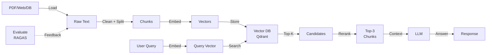

# RAG: Retrieval-Augmented Generation

RAG is how you give LLMs knowledge they weren't trained on.

Without RAG: LLM generates from its training data (can hallucinate, outdated).
With RAG: LLM retrieves relevant documents first, then generates based on what's retrieved (accurate, current).

---

## Why This Matters in Production

**Real incident:** Company deployed a chatbot without RAG. Customer asked "What's your latest pricing?" Model made up prices. Customer was quoted wrong. Lost deal.

**Real incident 2:** Support bot with RAG. Retrieval failed silently. Sent empty context to LLM. Model hallucinated. Customer got garbage answer. Angry tweet, 1000 retweets, PR team involved.

RAG systems fail in production because:
- **Bad retrieval:** Wrong documents retrieved = garbage context = garbage answer
- **Lost context:** All documents ranked low. Empty context sent to LLM.
- **Stale knowledge:** Database hasn't been updated in months. Info is outdated.
- **Hallucination on bad context:** LLM fills gaps when context is confusing

You'll learn to:
- Load documents (PDFs, web pages, databases)
- Chunk them intelligently
- Retrieve relevant chunks efficiently
- Rerank to fix retrieval mistakes
- Evaluate quality (RAGAS)
- Fix failure modes

---

## Conceptual Explanation: The Three Stages

**Stage 1: Indexing (Offline)**
```
Documents → Clean → Chunk → Embed → Store in Vector DB
(happens once or weekly)
```

**Stage 2: Retrieval (Online)**
```
User Query → Embed → Search Vector DB → Get Top-K chunks
(happens per request)
```

**Stage 3: Generation (Online)**
```
Query + Retrieved Chunks → LLM → Answer
(happens per request)
```

**Analogy:**

You're a researcher with access to a library.
- Indexing: Librarian reads all books, creates index cards with summaries, organizes by topic.
- Retrieval: You ask librarian "What's quantum computing?" Librarian returns 5 relevant books.
- Generation: You read those 5 books, write a summary. Your summary is the answer.

Without the librarian (RAG), you're writing from memory (can make stuff up).

---

## Code Examples: Production RAG Pipeline

### Document Loader (Multi-Format)

```python
import PyPDF2
from pathlib import Path
from docx import Document

async def load_document(file_path: str) -> str:
    """Load text from PDF, Word, or plain text."""
    path = Path(file_path)
    
    if path.suffix == ".pdf":
        # PDF extraction
        text = ""
        with open(file_path, "rb") as f:
            reader = PyPDF2.PdfReader(f)
            for page in reader.pages:
                text += page.extract_text()
        return text
    
    elif path.suffix == ".docx":
        # Word document
        doc = Document(file_path)
        return "\n".join([para.text for para in doc.paragraphs])
    
    else:
        # Plain text
        with open(file_path, "r") as f:
            return f.read()

async def load_from_web(url: str) -> str:
    """Load text from webpage (requires library)."""
    import httpx
    from bs4 import BeautifulSoup
    
    response = await httpx.AsyncClient().get(url)
    soup = BeautifulSoup(response.text, "html.parser")
    
    # Remove script and style tags
    for tag in soup(["script", "style"]):
        tag.decompose()
    
    # Get text, normalize whitespace
    text = soup.get_text()
    text = "\n".join([line.strip() for line in text.split("\n") if line.strip()])
    return text
```

### Chunking Strategy: Recursive with Overlap

```python
def chunk_text(text: str, chunk_size: int = 512, overlap: int = 50) -> list[str]:
    """Split text into overlapping chunks."""
    # Remove extra whitespace
    text = " ".join(text.split())
    
    chunks = []
    start = 0
    
    while start < len(text):
        # Get chunk
        end = min(start + chunk_size, len(text))
        chunk = text[start:end]
        chunks.append(chunk)
        
        # Move start, but overlap with previous
        start = end - overlap
    
    return chunks

# Smarter: split on sentence boundaries (preserve context)
import re

def smart_chunk_text(text: str, chunk_size: int = 512, overlap: int = 50) -> list[str]:
    """Split on sentence boundaries (don't split mid-sentence)."""
    # Split into sentences
    sentences = re.split(r'(?<=[.!?])\s+', text)
    
    chunks = []
    current_chunk = []
    current_length = 0
    
    for sentence in sentences:
        sentence_length = len(sentence)
        
        # If adding this sentence exceeds limit, save chunk
        if current_length + sentence_length > chunk_size and current_chunk:
            chunks.append(" ".join(current_chunk))
            # Overlap: keep last sentence
            current_chunk = [current_chunk[-1], sentence] if current_chunk else [sentence]
            current_length = sum(len(s) for s in current_chunk)
        else:
            current_chunk.append(sentence)
            current_length += sentence_length
    
    if current_chunk:
        chunks.append(" ".join(current_chunk))
    
    return chunks
```

### Hybrid Search (Dense + Sparse)

```python
from qdrant_client.async_client import AsyncQdrantClient
from openai import AsyncOpenAI
import asyncio

async def hybrid_search(
    query: str,
    top_k: int = 5
) -> list[dict]:
    """Combine BM25 (keyword) + semantic (embedding) search."""
    
    qdrant = AsyncQdrantClient("http://localhost:6333")
    openai_client = AsyncOpenAI()
    
    # 1. Dense search (semantic)
    response = await openai_client.embeddings.create(
        input=query,
        model="text-embedding-3-small"
    )
    query_embedding = response.data[0].embedding
    
    dense_results = await qdrant.search(
        collection_name="documents",
        query_vector=query_embedding,
        limit=top_k * 2  # Get more, will combine with sparse
    )
    
    # 2. Sparse search (keyword matching)
    # This is simplified; in production use BM25 library
    keywords = query.lower().split()
    sparse_results = []
    
    for doc in all_documents:  # This would be from DB
        match_count = sum(1 for kw in keywords if kw in doc["content"].lower())
        if match_count > 0:
            sparse_results.append({
                "id": doc["id"],
                "score": match_count / len(keywords)
            })
    
    sparse_results = sorted(sparse_results, key=lambda x: x["score"], reverse=True)[:top_k*2]
    
    # 3. Combine scores (Reciprocal Rank Fusion)
    def rrf_combined_score(dense_rank: float, sparse_rank: float) -> float:
        """RRF formula: combines rankings without requiring same scale."""
        k = 60  # Standard RRF parameter
        return 1/(k+dense_rank) + 1/(k+sparse_rank)
    
    combined = {}
    for i, result in enumerate(dense_results):
        combined[result.id] = combined.get(result.id, {"score": 0})
        combined[result.id]["score"] += 1/(60+i)
    
    for i, result in enumerate(sparse_results):
        combined[result["id"]]["score"] = combined.get(result["id"], {"score": 0})["score"]
        combined[result["id"]]["score"] += 1/(60+i)
    
    # 4. Rank by combined score
    final_results = sorted(
        combined.items(),
        key=lambda x: x[1]["score"],
        reverse=True
    )[:top_k]
    
    return [{"doc_id": doc_id, "score": data["score"]} for doc_id, data in final_results]
```

### Reranking (Fix Bad Retrieval)

```python
import cohere

cohere_client = cohere.AsyncClientV2(api_key="YOUR_KEY")

async def rerank_results(
    query: str,
    candidates: list[str],
    top_k: int = 3
) -> list[dict]:
    """Use Cohere Rerank to improve retrieval quality."""
    
    # Rerank top-100 candidates using cross-encoder
    response = await cohere_client.rerank(
        model="rerank-english-v2.0",
        query=query,
        documents=candidates,
        top_n=top_k
    )
    
    return [
        {
            "index": result.index,
            "relevance_score": result.relevance_score,
            "document": candidates[result.index]
        }
        for result in response.results
    ]
```

### Complete RAG Endpoint

```python
from fastapi import APIRouter, HTTPException
from pydantic import BaseModel
from openai import AsyncOpenAI

router = APIRouter()
openai_client = AsyncOpenAI()

class RAGRequest(BaseModel):
    query: str
    top_k: int = 5

@router.post("/ask")
async def rag_pipeline(request: RAGRequest) -> dict:
    """Full RAG: retrieve + generate."""
    
    # 1. Retrieve relevant chunks
    try:
        retrieved = await hybrid_search(request.query, request.top_k)
    except Exception as e:
        raise HTTPException(status_code=500, detail=f"Retrieval failed: {str(e)}")
    
    if not retrieved:
        return {"answer": "No relevant documents found", "sources": []}
    
    # 2. Rerank for quality (optional but recommended)
    ranked = await rerank_results(
        request.query,
        [r["content"] for r in retrieved],
        top_k=3
    )
    
    # 3. Build context
    context = "\n\n".join([
        f"[Source {i+1}]\n{r['document']}"
        for i, r in enumerate(ranked)
    ])
    
    # 4. Generate answer with context
    prompt = f"""Use the provided context to answer the user's question.
If the context doesn't contain relevant information, say so.

Context:
{context}

Question: {request.query}

Answer:"""
    
    response = await openai_client.chat.completions.create(
        model="gpt-4o",
        messages=[
            {
                "role": "system",
                "content": "You are a helpful assistant. Answer based ONLY on provided context."
            },
            {"role": "user", "content": prompt}
        ],
        max_tokens=500
    )
    
    return {
        "answer": response.choices[0].message.content,
        "sources": [
            {"rank": i+1, "score": r.relevance_score}
            for i, r in enumerate(ranked)
        ]
    }
```

---

## Architecture Diagram



---

## Tools Comparison: RAG Frameworks

| Framework | Abstraction | Flexibility | Debug | Best For |
|-----------|-----------|-----------|-------|----------|
| **LangChain** | High | Low | Hard (magic) | Quick prototypes |
| **LlamaIndex** | High | Medium | Medium | Document indexing |
| **From Scratch** | None | Very High | Easy | Production systems |
| **Haystack** | Medium | High | Good | Complex pipelines |

**Decision:** Start with LangChain for prototyping. Build from scratch for production (you'll understand failure modes better).

---

## Decision Framework: Chunking Strategy

```
Is document structure important (headings, lists)?
  ├─ YES: Semantic chunking (preserve structure)
  └─ NO: Fixed-size with overlap

Do documents have code?
  ├─ YES: Code-aware splitting (preserve functions)
  └─ NO: Sentence-level splitting

Max chunk size?
  ├─ < 256 (cheap): Use gpt-3.5
  ├─ 256-1024 (balanced): Use gpt-4o or Claude
  └─ > 1024 (expensive but thorough): Use Claude 3 Opus
```

---

## Step-by-Step Tutorial: Build RAG from Scratch

### 1. Create Document Index

```python
async def index_documents(document_paths: list[str]) -> None:
    """Full indexing pipeline."""
    all_chunks = []
    
    for path in document_paths:
        # Load
        text = await load_document(path)
        
        # Clean (remove headers, encoding issues)
        text = text.encode('utf-8', errors='ignore').decode('utf-8')
        
        # Chunk
        chunks = smart_chunk_text(text, chunk_size=512)
        
        all_chunks.extend(chunks)
    
    # Embed in batches
    embeddings = await batch_embed(all_chunks, batch_size=32)
    
    # Store in Qdrant
    points = [
        PointStruct(
            id=i,
            vector=embedding,
            payload={"text": chunk}
        )
        for i, (chunk, embedding) in enumerate(zip(all_chunks, embeddings))
    ]
    
    await qdrant_client.upsert("documents", points=points)

# Usage
await index_documents(["/docs/guide.pdf", "/docs/faq.txt"])
```

### 2. Query and Retrieve

```python
async def query_rag(question: str) -> dict:
    """Retrieve relevant chunks."""
    # Embed question
    q_embedding = await embed_text(question)
    
    # Search
    results = await qdrant_client.search(
        collection_name="documents",
        query_vector=q_embedding,
        limit=10
    )
    
    return {
        "chunks": [
            {
                "text": r.payload["text"],
                "score": r.score
            }
            for r in results
        ]
    }
```

### 3. Test Quality

```python
# Manually test:
results = await query_rag("How do I deploy this?")
print(results)

# Expected: Chunks contain deployment instructions
# If not: Retrieval is broken
```

---

## Practical Project: Internal Knowledge Base RAG

**Problem:** Company has 500 internal documents (PDFs, docs, wiki). Employees ask questions, get no answer because info is scattered. Build AI Q&A over all knowledge.

**Features:**
- Ingest documents (PDFs, Word, web)
- Full-text + semantic search (hybrid)
- Reranking for quality
- Track which documents were used as evidence
- Feedback loop (workers flag incorrect answers)

**API:**
```
POST /ask
  {"question": "...", "top_k": 5}
  Response: {"answer": "...", "sources": [...]}

GET /documents
  List indexed documents

POST /documents/{id}/flag
  Mark answer as incorrect (for eval)
```

**Requirements:**
- RAGAS faithfulness > 0.80
- Latency < 2 seconds P95
- Cost < $0.01 per query

---

## Debugging Playbook: RAG Failure Modes

### 1. Wrong Documents Retrieved

**Symptom:** Search for "async patterns" returns "synchronous code".

**Root cause:** Embedding model is weak OR chunks are bad.

**Debug:**
```python
# Check similarity score
results = await qdrant_client.search(...)
print(results[0].score)  # If < 0.7, retrieval is weak

# Check the actual chunk
print(results[0].payload["text"])  # Is it relevant?
```

**Fix:**
- Better chunking: preserve context, don't split mid-concept
- Better embedding model: upgrade to text-embedding-3-large
- Reranking: filter out bad results

### 2. Empty Results (No Chunks Match)

**Symptom:** All results score < 0.5. Essentially no match.

**Root cause:** Query embedding space ≠ document embedding space.

**Debug:**
```python
# Manually embed and check
q_embedding = await embed_text("my question")
doc_embedding = await embed_text(doc_content)

# Calculate similarity
import numpy as np
similarity = np.dot(q_embedding, doc_embedding)
print(f"Similarity: {similarity}")  # Should be > 0.5
```

**Fix:**
- Train custom embedding model on your domain
- Re-chunk documents (better context)
- Use query expansion (generate similar queries, combine results)

### 3. Hallucination on Retrieved Context

**Symptom:** LLM says "Based on the documents, X is true" but documents don't say that.

**Root cause:** LLM filling gaps. Context is confusing or incomplete.

**Fix:**
```python
system_prompt = """You are a helpful assistant.
IMPORTANT: Only answer based on provided context.
If information is missing from context, say "The documents don't contain information about that."
Never make up information."""
```

### 4. Stale/Outdated Information

**Symptom:** User asks "What's your latest pricing?" LLM returns 2021 prices.

**Root cause:** Knowledge base hasn't been updated.

**Fix:**
```python
# Add timestamp to metadata
payload = {
    "text": chunk,
    "document_date": "2024-03-01",
    "last_updated": "2024-03-01"
}

# Filter by date in search
filter = Filter(
    must=[
        FieldCondition(
            key="document_date",
            range={"gte": "2024-01-01"}  # Only recent docs
        )
    ]
)
```

### 5. Context Overflow (Too Many Tokens)

**Symptom:** Sending 10 chunks to LLM. Model hits token limit.

**Root cause:** Context size sum > context window.

**Fix:**
```python
def estimate_tokens(chunks: list[str]) -> int:
    """Estimate total tokens."""
    import tiktoken
    encoding = tiktoken.encoding_for_model("gpt-4o")
    return sum(len(encoding.encode(c)) for c in chunks)

chunks = top_results[:10]
total_tokens = estimate_tokens([c["text"] for c in chunks])

if total_tokens > 100000:
    # Reduce to top-3
    chunks = chunks[:3]
```

### 6. Retrieval Latency Too High

**Symptom:** Search takes 5+ seconds.

**Root cause:** Large collection without index. Or slow reranking.

**Fix:**
```python
# Disable reranking if slow
if latency > 3000:  # ms
    skip_reranking = True

# Use smaller vectors
vector_size = 384  # Smaller, faster (was 1536)
```

### 7. Deduplication: Same Chunk Multiple Times

**Symptom:** Top-10 results are all the same chunk repeated.

**Root cause:** Document indexed multiple times.

**Fix:**
```python
import hashlib

def chunk_hash(chunk: str) -> str:
    """Deduplicate by content hash."""
    return hashlib.sha256(chunk.encode()).hexdigest()

seen = set()
for chunk in chunks:
    h = chunk_hash(chunk)
    if h not in seen:
        seen.add(h)
        # Store chunk
```

### 8. Cost Explosion

**Symptom:** Monthly embedding bill is $1000 (expected $100).

**Root cause:** Re-embedding all docs daily. Or embedding long documents inefficiently.

**Fix:**
```python
# Only embed new documents
def delta_index(new_docs: list[str]):
    """Only embed docs not already in database."""
    existing_hashes = {doc["hash"] for doc in database.get_all()}
    
    for doc in new_docs:
        doc_hash = hashlib.sha256(doc.encode()).hexdigest()
        if doc_hash not in existing_hashes:
            embed_and_store(doc)
```

---

## Common Mistakes

!!! danger "Mistake 1: Not Testing Retrieval Separately"

You build RAG end-to-end, it doesn't work. Is retrieval bad? Is generation bad? You don't know.

**Don't:** Test the full pipeline.
**Do:** Test retrieval alone. Call search(), check if relevant docs are returned.

!!! danger "Mistake 2: Fixed-size Chunks Everywhere"

You chunk every document the same way. Some documents have structure (headings, lists). Chunks destroy the structure.

**Don't:** Split everything 512-character blocks.
**Do:** Use smart chunking that respects document structure.

!!! danger "Mistake 3: Not Using Metadata"

You embed 1M documents, search returns 1M results. Then you filter by date in code. Slow.

**Don't:** Filter results after search.
**Do:** Filter during search (pass filter to vector DB).

!!! danger "Mistake 4: Hallucination Not Addressed"

You test RAG with 10 documents. Works great. Deploy to 100k documents. Suddenly, hallucinates more.

**Don't:** Skip evaluation.
**Do:** Use RAGAS to measure faithfulness. Set threshold (> 0.80). Monitor in production.

!!! danger "Mistake 5: Ignoring Context Weight"

Your LLM sees 20 chunks. Most are irrelevant. LLM gets confused, hallucinates.

**Don't:** Send all retrieved chunks.
**Do:** Rerank, send only top-3 relevant.

---

## Production Realism: Tutorial vs Production

**Tutorial RAG:**
```python
from langchain.embeddings import OpenAIEmbeddings
from langchain.vectorstores import Qdrant

embeddings = OpenAIEmbeddings()
db = Qdrant.from_documents(docs, embeddings, "localhost:6333")
results = db.similarity_search(query)
```

**Production RAG:**
```python
class RAGPipeline:
    def __init__(self):
        self.qdrant = AsyncQdrantClient("http://localhost:6333")
        self.openai = AsyncOpenAI()
        self.cohere = AsyncCohere()
        self.redis = redis.Redis()  # Cache
        self.logger = setup_logging()
    
    async def index(self, documents: list[dict]):
        """Index with dedup, error handling, progress tracking."""
        total = len(documents)
        seen = set()
        points = []
        
        for i, doc in enumerate(documents):
            # Dedup
            h = hashlib.sha256(doc["content"].encode()).hexdigest()
            if h in seen:
                continue
            seen.add(h)
            
            # Clean
            text = await clean_text(doc["content"])
            
            # Chunk smartly
            chunks = smart_chunk(text, doc.get("type"))
            
            # Embed with retry
            try:
                embedding = await retry_embed(chunks[0])
            except Exception as e:
                self.logger.error(f"Failed to embed doc {i}: {e}")
                continue
            
            # Create point
            point = PointStruct(
                id=hashlib.md5(h.encode()).hexdigest(),
                vector=embedding,
                payload={
                    "content": chunks[0],
                    "doc_id": doc["id"],
                    "indexed_at": datetime.now().isoformat()
                }
            )
            points.append(point)
            
            if i % 100 == 0:
                self.logger.info(f"Indexed {i}/{total}")
        
        # Upload
        await self.qdrant.upsert("documents", points=points, batch_size=500)
    
    async def search(self, query: str, top_k: int = 5) -> list[dict]:
        """Search with caching, reranking, timeout."""
        # Check cache
        cache_key = hashlib.md5(query.encode()).hexdigest()
        cached = self.redis.get(cache_key)
        if cached:
            self.logger.info("Cache hit")
            return json.loads(cached)
        
        # Search with timeout
        try:
            results = await asyncio.wait_for(
                self._search_impl(query, top_k),
                timeout=5.0
            )
        except asyncio.TimeoutError:
            self.logger.error("Search timeout")
            return []
        
        # Cache
        self.redis.setex(cache_key, 3600, json.dumps(results))
        return results
    
    async def _search_impl(self, query: str, top_k: int):
        """Internal search with hybrid + rerank."""
        # Hybrid search
        dense = await self._dense_search(query, top_k * 2)
        sparse = await self._sparse_search(query, top_k * 2)
        combined = self._combine_rankings(dense, sparse)[:top_k*2]
        
        # Rerank
        reranked = await self.cohere.rerank(
            query=query,
            documents=[r["content"] for r in combined],
            top_n=top_k
        )
        
        return [
            {
                "content": reranked[i]["text"],
                "score": reranked[i]["score"]
            }
            for i in range(len(reranked))
        ]
```

**Differences:**
- Tutorial: 5 lines, zero error handling
- Production: 100+ lines, deduplication, caching, timeouts, reranking, logging

---

## Cost & Performance

**Embedding cost:**
- 1M documents × $0.00015 (embedding cost) = $150

**Search latency:**
- Vector search (Qdrant): 50ms
- Reranking (Cohere): 200ms
- LLM generation: 2000ms (mostly waiting for API)
- Total P95: 2.5 seconds

**Optimization:**
- Cache searches (80% of users ask same questions)
- Reduce reranking to top-3 (faster, same quality)
- Use streaming LLM generation (feels faster)

---

## Security: RAGAS Evaluation

**RAGAS measures quality:**

```python
from ragas import evaluate
from datasets import Dataset

def evaluate_rag(query: str, answer: str, context: list[str], ground_truth: str):
    """Measure if RAG is working."""
    data = {
        "question": [query],
        "answer": [answer],
        "contexts": [context],
        "ground_truth": [ground_truth]
    }
    
    dataset = Dataset.from_dict(data)
    score = evaluate(dataset)
    
    # Metrics:
    # - faithfulness: answer comes from context (0-1)
    # - answer_relevancy: answer addresses question (0-1)
    # - context_recall: relevant context was retrieved (0-1)
    # - context_precision: all retrieved context is useful (0-1)
    
    print(f"Faithfulness: {score['faithfulness']}")  # Should be > 0.85
    print(f"Answer Relevancy: {score['answer_relevancy']}")  # Should be > 0.80
    
    return score
```

---

## Case Study 1: Stripe RAG

**Problem:** Huge API documentation. Support team can't answer questions. Users frustrated.

**Solution:**
- Index all documentation
- Hybrid search (BM25 + semantic)
- GPT-4 generation with context
- RAGAS to measure quality

**Results:**
- First response time: 2-3 seconds
- User satisfaction: +40%
- Support team efficiency: +60%

**Key:** Reranking was critical. Initial retrieval brought back wrong sections.

---

## Case Study 2: Healthcare RAG

**Problem:** Medical startup needs AI to answer patient questions about treatments. Must be accurate (liability).

**Solution:**
- RAG with only peer-reviewed sources
- Reranking with custom model trained on medical data
- RAGAS evaluation with human review loop
- Threshold: reject answers with faithfulness < 0.95

**Results:**
- 92% of answers reviewed favorably by doctors
- Confidence to show to patients
- NO hallucinated medical advice

**Key:** Strict evaluation. Better to say "ask your doctor" than hallucinate.

---

## Interview Cheat Sheet

**Concept 1: RAG vs Fine-tuning**

*Question: "When use RAG vs fine-tuning?"*

Model answer: "RAG for knowledge (documents, facts, current info). Fine-tuning for behavior (how to respond, style, task-specific patterns). RAG is cheaper, updates instantly. Fine-tuning is slower, permanent. Most systems use both."

**Concept 2: Chunking**

*Question: "How big should chunks be?"*

Model answer: "Trade-off: larger chunks have more context but take more tokens. Smaller chunks fit in context window but lose context. Usually 256-512 tokens. Depends on query complexity."

**Concept 3: RAGAS**

*Question: "What does RAGAS faithfulness measure?"*

Model answer: "Does the answer come from the context? If context doesn't mention something but LLM says it, faithfulness is low. High faithfulness = answer is grounded in evidence."

**Concept 4: Reranking**

*Question: "Why rerank?"*

Model answer: "Vector search is approximate. Top-10 results might have garbage. Reranker uses a stronger model (cross-encoder) to pick best from top-100. Trades 200ms latency for 15% better relevance."

**Concept 5: Hybrid Search**

*Question: "BM25 + semantic = better?"*

Model answer: "BM25 finds exact keywords. Semantic finds similar meanings. Together, they cover both. Example: 'async await' (keyword match) + 'concurrent programming' (semantic match). Combine with RRF."

---

## 10 Review Questions

1. RAG indexing is offline. Generation is online. What's the latency budget for each?
2. Your chunks are 300 characters. LLM doesn't see context. Why?
3. Semantic search scores 0.5. Reranking scores 0.8. Why the difference?
4. You embed with model A, 6 months later switch to model B. What happens?
5. RAGAS score is good but user says answer is wrong. What's the issue?
6. Chunk size 100 vs 1000. Pros/cons?
7. Query: "latest pricing". Retrieval returns old docs. How to fix?
8. You retrieve 50 documents but send all to LLM. Problem?
9. Hybrid search: why use both BM25 and semantic?
10. RAGAS faithfulness < 0.70. What went wrong?

---

## Flashcards

**Card 1: RAG Definition**
*Q: What is RAG?*
*A: Retrieval-Augmented Generation. Retrieve relevant documents, then generate answer based on them. Reduces hallucination.*

**Card 2: Chunking**
*Q: Why overlap chunks?*
*A: Prevents losing context at chunk boundaries. Word at end of chunk 1 is beginning of chunk 2.*

**Card 3: Hybrid Search**
*Q: BM25 finds keywords. Semantic finds meanings. Combine how?*
*A: RRF (Reciprocal Rank Fusion). Convert both scores to rankings, then average them.*

**Card 4: Reranking**
*Q: When rerank?*
*A: If top-10 results are mediocre (no clear winner). Reranker picks best from top-50/100.*

**Card 5: RAGAS**
*Q: Faithfulness vs Answer Relevancy?*
*A: Faithfulness = answer comes from context. Relevancy = answer addresses question.*

**Card 6: Context Overflow**
*Q: What if chunks exceed context window?*
*A: Use smaller chunks or rerank to top-3 instead of top-10.*

**Card 7: Hallucination**
*Q: How to reduce hallucination?*
*A: Better prompt (say refuse if context doesn't know), better retrieval, better reranking.*

**Card 8: Metadata**
*Q: Why store metadata in vector DB?*
*A: Filter by date, source, category during search. Faster than filtering after.*

**Card 9: Caching**
*Q: Cache RAG search by exact query?*
*A: Poor hit rate. Better: semantic cache (similar queries hit cache).*

**Card 10: Evaluation**
*Q: How often evaluate RAG in production?*
*A: Continuously. Sample user queries, run RAGAS, alert if score drops.*

---

## Teach-It-Back Prompt

**Explain RAG architecture to someone new:**

"A user asks 'What features does our product have?' Walk through: how documents are indexed, how the query finds them, why the answer is correct or hallucinated, how you'd measure quality."

**Model Answer:**

"Documents are indexed offline: loaded → cleaned → chunked (512 characters each) → embedded (1536 dims) → stored in Qdrant. User query comes in, we: embed it the same way, search Qdrant for similar vectors (top-10), optionally rerank with Cohere to pick best 3, send those as context to GPT-4 along with the query. GPT-4 reads context and answers.

Why correct? Context has the real answers. LLM just rewrites them.

Why hallucinate? If context is weak (wrong documents) or confusing (contradictory), LLM fills gaps.

How measure? RAGAS has 4 metrics. Key one: faithfulness. Feed the Q+A+context to an evaluator LLM. Does the answer come from context? If yes, score 0.9. If no (hallucinated), score 0.2. Measure across 100 Q&A pairs. Should average > 0.85."

---

## 1-Week Checklist

- [ ] Loaded documents (PDFs, web pages, database)
- [ ] Chunked documents with overlap
- [ ] Embedded all chunks (measured cost)
- [ ] Retrieved by query (manual testing)
- [ ] Found relevant chunks? If not, debugged why
- [ ] Added reranking (measured latency improvement)
- [ ] Built full RAG endpoint (query → context → answer)
- [ ] Evaluated with RAGAS (measured faithfulness > 0.80)
- [ ] Cached searches (measured hit rate)
- [ ] Handled edge cases (empty results, timeout, overflow)
- [ ] Deployed RAG service locally
- [ ] Tested with 100 diverse queries

---

## Resources

- [LlamaIndex Documentation](https://docs.llamaindex.ai/)
- [RAGAS Framework](https://github.com/explodinggradients/ragas)
- [Cohere Rerank API](https://cohere.com/rerank)
- [Qdrant Hybrid Search](https://qdrant.tech/documentation/concepts/hybrid-queries/)

---

## Next Page

You can build RAG systems now. Your AI has knowledge.

Next: agents. Your AI can take actions (search web, run code, call APIs).

→ **[Agents & Tool Use →](agents.md)**
