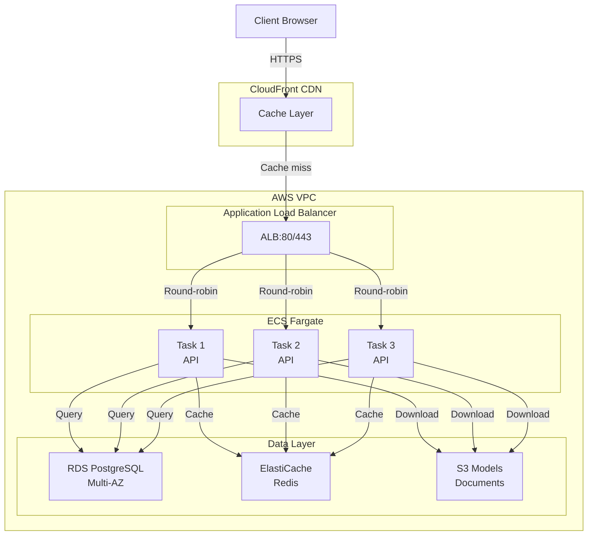

# AWS Deployment for AI Workloads

Deploying to AWS is how you make your system available to the world.

Without AWS: Your AI system runs on your laptop.
With AWS: Your AI system handles 1000 requests per second, scales automatically, and makes money while you sleep.

---

## Why This Matters

**Real incident:** Company's local RAG works great. 10 users try to use it simultaneously. Laptop locks up. Server dies. Customers angry.

AWS: 10 users, 100 users, 1000 users → AWS scales automatically.

---

## Conceptual Explanation

**Analogy: Restaurant Scaling**

Without cloud: You run a restaurant from your apartment kitchen. Max 10 customers per night.

With cloud: You use AWS. Lunch rush = AWS scales kitchen size. Dinner = scales back. You pay only for what you use.

---

## AWS Services Primer

| Service | Does What | Used For |
|---------|-----------|----------|
| **EC2** | Virtual machines (cheapest) | Running code directly on servers |
| **ECS Fargate** | Managed containers (recommended) | Running Docker containers without managing servers |
| **RDS** | Managed PostgreSQL | Database without admin headaches |
| **S3** | Object storage | Storing models, documents, files |
| **ElastiCache** | Managed Redis | Caching without managing Redis |
| **ALB** | Load balancer | Distributing traffic across instances |
| **CloudWatch** | Monitoring and logging | See what's happening, alerts |
| **Secrets Manager** | Secure secret storage | API keys, passwords (not in code) |

---

## EC2 Instance Types for AI

| Type | vCPU | RAM | GPU | $/hr | Best For |
|------|------|-----|-----|------|----------|
| **t3.medium** | 2 | 4GB | None | $0.04 | Dev/testing, small API |
| **t3.xlarge** | 4 | 16GB | None | $0.17 | Medium API traffic |
| **t3.2xlarge** | 8 | 32GB | None | $0.33 | Large API traffic |
| **g4dn.xlarge** | 4 | 16GB | 1×T4 | $0.52 | GPU inference |
| **p3.2xlarge** | 8 | 61GB | 8×V100 | $3.06 | GPU training |

---

## Code Example 1: Launch EC2 Instance with User Data

```bash
#!/bin/bash
# user_data.sh - Runs on EC2 startup

set -e

# Update system
apt-get update
apt-get install -y curl git

# Install Docker
curl -fsSL https://get.docker.com -o get-docker.sh
sh get-docker.sh
usermod -aG docker ec2-user

# Install Docker Compose
curl -L "https://github.com/docker/compose/releases/latest/download/docker-compose-$(uname -s)-$(uname -m)" -o /usr/local/bin/docker-compose
chmod +x /usr/local/bin/docker-compose

# Clone repository
git clone https://github.com/yourname/ai-service.git /app

cd /app

# Pull latest code
git pull origin main

# Start services
docker compose up -d

# Log completion
echo "Services started at $(date)" >> /var/log/startup.log
```

**Deploy:**
```bash
aws ec2 run-instances \
  --image-id ami-0c55b159cbfafe1f0 \
  --instance-type t3.xlarge \
  --key-name my-key-pair \
  --security-groups default \
  --user-data file://user_data.sh \
  --tag-specifications 'ResourceType=instance,Tags=[{Key=Name,Value=ai-api}]'
```

---

## Code Example 2: S3 for Model Storage

```python
import boto3
import os

s3 = boto3.client('s3')

async def download_model_from_s3():
    """Download model artifacts from S3 at startup."""
    
    bucket = "ai-models-prod"
    model_key = "adapters/lora-v2/adapter_model.safetensors"
    local_path = "models/adapter_model.safetensors"
    
    try:
        s3.download_file(bucket, model_key, local_path)
        print(f"Downloaded {model_key}")
    except Exception as e:
        print(f"Error downloading from S3: {e}")
        raise

async def upload_evaluation_report(report: dict):
    """Upload evaluation results to S3."""
    
    import json
    from datetime import datetime
    
    report_key = f"evaluations/{datetime.now().isoformat()}.json"
    
    s3.put_object(
        Bucket="ai-models-prod",
        Key=report_key,
        Body=json.dumps(report),
        ContentType="application/json"
    )

# Presigned URL for document access
def generate_presigned_url(s3_key: str, expiration_seconds: int = 3600):
    """Generate time-limited URL for downloading S3 file."""
    
    url = s3.generate_presigned_url(
        'get_object',
        Params={'Bucket': 'ai-documents', 'Key': s3_key},
        ExpiresIn=expiration_seconds
    )
    return url
```

---

## Code Example 3: ECS Fargate Task Definition

```json
{
  "family": "ai-api-task",
  "networkMode": "awsvpc",
  "requiresCompatibilities": ["FARGATE"],
  "cpu": "1024",
  "memory": "2048",
  "containerDefinitions": [
    {
      "name": "api",
      "image": "123456789.dkr.ecr.us-east-1.amazonaws.com/ai-service:latest",
      "portMappings": [
        {
          "containerPort": 8000,
          "protocol": "tcp"
        }
      ],
      "environment": [
        {
          "name": "ENVIRONMENT",
          "value": "production"
        },
        {
          "name": "LOG_LEVEL",
          "value": "info"
        }
      ],
      "secrets": [
        {
          "name": "OPENAI_API_KEY",
          "valueFrom": "arn:aws:secretsmanager:us-east-1:123456789:secret:openai-key"
        },
        {
          "name": "DATABASE_URL",
          "valueFrom": "arn:aws:secretsmanager:us-east-1:123456789:secret:db-url"
        }
      ],
      "logConfiguration": {
        "logDriver": "awslogs",
        "options": {
          "awslogs-group": "/ecs/ai-api",
          "awslogs-region": "us-east-1",
          "awslogs-stream-prefix": "ecs"
        }
      },
      "healthCheck": {
        "command": [
          "CMD-SHELL",
          "curl -f http://localhost:8000/health || exit 1"
        ],
        "interval": 30,
        "timeout": 10,
        "retries": 3,
        "startPeriod": 60
      }
    }
  ],
  "executionRoleArn": "arn:aws:iam::123456789:role/ecsTaskExecutionRole",
  "taskRoleArn": "arn:aws:iam::123456789:role/ecsTaskRole"
}
```

---

## Code Example 4: IAM Policy for ECS Task Role

```json
{
  "Version": "2012-10-17",
  "Statement": [
    {
      "Effect": "Allow",
      "Action": [
        "s3:GetObject",
        "s3:ListBucket"
      ],
      "Resource": [
        "arn:aws:s3:::ai-models-prod",
        "arn:aws:s3:::ai-models-prod/*"
      ]
    },
    {
      "Effect": "Allow",
      "Action": [
        "secretsmanager:GetSecretValue"
      ],
      "Resource": [
        "arn:aws:secretsmanager:us-east-1:123456789:secret:openai-key"
      ]
    },
    {
      "Effect": "Allow",
      "Action": [
        "rds-db:connect"
      ],
      "Resource": [
        "arn:aws:rds:us-east-1:123456789:dbuser:resource-id/iamuser"
      ]
    }
  ]
}
```

---

## Code Example 5: Auto-scaling Configuration

```python
# AWS Console or boto3

import boto3

autoscaling = boto3.client('application-autoscaling')

# Register ECS service for auto-scaling
autoscaling.register_scalable_target(
    ServiceNamespace='ecs',
    ResourceId='service/ai-cluster/ai-service',
    ScalableDimension='ecs:service:DesiredCount',
    MinCapacity=2,
    MaxCapacity=10
)

# Scale on CPU
autoscaling.put_scaling_policy(
    PolicyName='cpu-scaling',
    ServiceNamespace='ecs',
    ResourceId='service/ai-cluster/ai-service',
    ScalableDimension='ecs:service:DesiredCount',
    PolicyType='TargetTrackingScaling',
    TargetTrackingScalingPolicyConfiguration={
        'TargetValue': 70.0,
        'PredefinedMetricSpecification': {
            'PredefinedMetricType': 'ECSServiceAverageCPUUtilization'
        },
        'ScaleOutCooldown': 60,
        'ScaleInCooldown': 300
    }
)

# Scale on request count
autoscaling.put_scaling_policy(
    PolicyName='request-scaling',
    ServiceNamespace='ecs',
    ResourceId='service/ai-cluster/ai-service',
    ScalableDimension='ecs:service:DesiredCount',
    PolicyType='TargetTrackingScaling',
    TargetTrackingScalingPolicyConfiguration={
        'TargetValue': 100.0,
        'PredefinedMetricSpecification': {
            'PredefinedMetricType': 'ALBRequestCountPerTarget'
        }
    }
)
```

---

## Architecture: AI Service on AWS



---

## Step-by-Step: Deploy to ECS Fargate

### 1. Create ECR Repository

```bash
aws ecr create-repository --repository-name ai-service --region us-east-1
```

### 2. Build and Push Image

```bash
# Get login token
aws ecr get-login-password --region us-east-1 | \
  docker login --username AWS --password-stdin \
  123456789.dkr.ecr.us-east-1.amazonaws.com

# Build and tag
docker build -t ai-service:latest .
docker tag ai-service:latest \
  123456789.dkr.ecr.us-east-1.amazonaws.com/ai-service:latest

# Push
docker push 123456789.dkr.ecr.us-east-1.amazonaws.com/ai-service:latest
```

### 3. Create ECS Cluster

```bash
aws ecs create-cluster --cluster-name ai-cluster
```

### 4. Register Task Definition

```bash
aws ecs register-task-definition --cli-input-json file://task-definition.json
```

### 5. Create Service

```bash
aws ecs create-service \
  --cluster ai-cluster \
  --service-name ai-service \
  --task-definition ai-api-task:1 \
  --desired-count 3 \
  --launch-type FARGATE \
  --network-configuration awsvpcConfiguration="{subnets=[subnet-12345],securityGroups=[sg-12345]}" \
  --load-balancers "targetGroupArn=arn:aws:elasticloadbalancing:...,containerName=api,containerPort=8000"
```

---

## Practical Project: Deploy Phase 1 to ECS

**Build:** Production-ready deployment on AWS.

Requirements:
- ECR dockerfile image
- ECS task definition with secrets injection
- RDS PostgreSQL instance
- ElastiCache Redis cluster
- ALB with health checks
- Auto-scaling policy
- CloudWatch monitoring
- Cost estimation

---

## Debugging: 10 Common AWS Deployment Errors

### 1. Task Fails Immediately (Health Check)

**Symptom:** Task starts, then immediately stops. Status = "FAILED"

**Fix:**
```bash
# Check logs
aws logs get-log-events --log-group-name /ecs/ai-api --log-stream-name ecs/api/...

# Common causes:
# 1. Health check endpoint doesn't exist
# 2. Port mapping wrong
# 3. Environment variables missing
```

### 2. Can't Pull Image from ECR

**Symptom:** "AccessDenied pulling image from ECR"

**Fix:** Task execution role needs ECR permissions:
```json
{
  "Effect": "Allow",
  "Action": "ecr:*",
  "Resource": "arn:aws:ecr:us-east-1:123456789:repository/ai-service"
}
```

### 3. Task Can't Access RDS

**Symptom:** "Connection refused: postgres:5432"

**Fix:**
```bash
# 1. Security group allows ECS task
# 2. RDS is in same VPC

# Test from ECS task
aws ecs execute-command --cluster ai-cluster --task <task-id> \
  --container api --interactive \
  --command "/bin/bash"

# Inside container
psql -h rds-endpoint.amazonaws.com -U aiuser -d aidb
```

### 4. High Memory Usage (OOMKill)

**Symptom:** Task memory 2048MB, never enough. Tasks constantly killed.

**Fix:**
```bash
# Increase task memory
aws ecs update-service --cluster ai-cluster --service ai-service \
  --task-definition ai-api-task:2 \
  --force-new-deployment

# Or reduce memory usage in code
```

### 5. Can't Read Secrets from Secrets Manager

**Symptom:** Environment variable empty despite valueFrom

**Fix:**
```json
{
  "secrets": [
    {
      "name": "OPENAI_API_KEY",
      "valueFrom": "arn:aws:secretsmanager:us-east-1:123456789:secret:openai-key:OPENAI_API_KEY::"
    }
  ]
}
```

Note the extra `:OPENAI_API_KEY::` at the end for JSON secret key.

### 6. Load Balancer Returns 503

**Symptom:** Browser gets 503 Service Unavailable

**Fix:**
```bash
# Check target health
aws elbv2 describe-target-health --target-group-arn arn:aws:...

# If all targets are down: check ECS task status
aws ecs describe-tasks --cluster ai-cluster --tasks <task-ids>

# If tasks are dying: check logs
aws logs get-log-events --log-group-name /ecs/ai-api
```

### 7. RDS Connection Pool Exhausted

**Symptom:** After 100 requests, new requests hang waiting for connection.

**Fix:**
```python
# Use connection pool with limits
from sqlalchemy import create_engine

engine = create_engine(
    database_url,
    pool_size=20,
    max_overflow=10,  # Max temp connections
    pool_pre_ping=True  # Test connection before use
)
```

### 8. CloudWatch Logs Not Appearing

**Symptom:** Task running, but no logs in CloudWatch.

**Fix:**
```json
{
  "logConfiguration": {
    "logDriver": "awslogs",
    "options": {
      "awslogs-group": "/ecs/ai-api",
      "awslogs-region": "us-east-1",
      "awslogs-stream-prefix": "ecs"
    }
  }
}
```

Ensure log group exists:
```bash
aws logs create-log-group --log-group-name /ecs/ai-api
```

### 9. Auto-scaling Not Triggering

**Symptom:** CPU at 90%, still only 1 task running.

**Fix:**
```bash
# Check scaling policy
aws application-autoscaling describe-scaling-policies \
  --service-namespace ecs

# Verify policy target
aws cloudwatch describe-alarms --alarm-names TargetTracking-ecs...
```

### 10. Cost Explosion

**Symptom:** AWS bill is $2000/month (unexpected).

**Fix:**
```bash
# Find expensive services
aws ce get-cost-and-usage \
  --time-period Start=2024-03-01,End=2024-03-31 \
  --granularity MONTHLY \
  --filter file://filter.json \
  --metrics "UnblendedCost"

# Likely causes:
# - RDS too large, scale down
# - Transfer costs, use S3 Edge
# - Running too many ECS tasks, scale to 1 off-hours
```

---

## Case Study: Netflix on AWS

**Challenge:** Run AI recommendation models serving 10M requests/day.

**Solution:**
- ECS Fargate (no server management)
- RDS Aurora (auto-scaling read replicas)
- S3 for model versions (versioning enabled)
- CLoudFront caching (CDN in front of ALB)
- Auto-scaling trigger on p99 latency (scale before it matters)

**Result:** 99.9% uptime, 50ms p99 latency

---

## 1-Week AWS Checklist

- [ ] Day 1: Create AWS account, set up IAM user, build ECR repo
- [ ] Day 2: Push Docker image to ECR
- [ ] Day 3: Create RDS PostgreSQL instance
- [ ] Day 4: Create ECS cluster and task definition
- [ ] Day 5: Set up ALB and service
- [ ] Day 6: Configure auto-scaling
- [ ] Day 7: Test full deployment, monitor costs

---

## Resources

- [AWS ECS Documentation](https://docs.aws.amazon.com/ecs/)
- [ECS Fargate Pricing](https://aws.amazon.com/fargate/pricing/)
- [AWS RDS Best Practices](https://docs.aws.amazon.com/AmazonRDS/latest/UserGuide/CHAP_BestPractices.html)

→ **[Secrets & Monitoring →](secrets-monitoring.md)**
