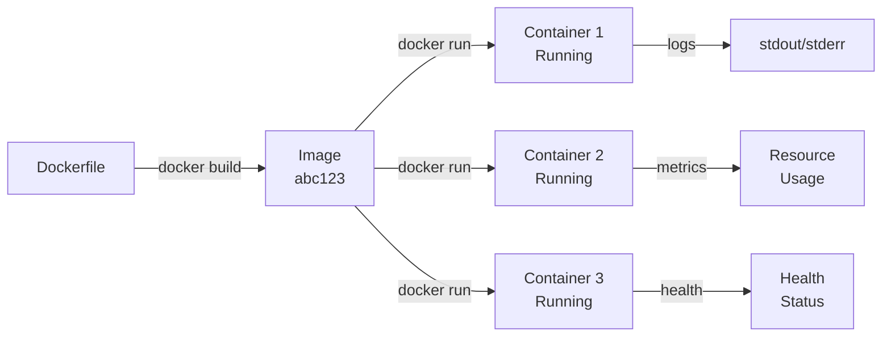

# Docker for AI Applications

Docker is how you make your code run the same way on your laptop, in staging, and in production.

Without Docker: "It works on my machine" → goes to prod → dies.
With Docker: "It works in a container" → works everywhere.

---

## Why This Matters

**Real incident:** Company deploys RAG API. Works perfectly on developer laptop (Python 3.11, OpenAI key in .env, model files in /data).

Production: System image has Python 3.9. Keys are in different location. Models aren't there.

8am: 500 errors. CEO asked "why isn't it working?"

Docker solves this. **Exactly same environment everywhere.**

---

## Conceptual Explanation

**Analogy: Pizza Delivery**

Without Docker:
- Restaurant has ingredients scattered in kitchen
- Chef memorizes where everything is
- Driver tries to rebuild kitchen in their truck
- Pizza arrives broken

With Docker:
- All ingredients pre-measured in a box
- Instructions included in the box
- Oven at destination just runs the instructions
- Pizza arrives perfect

Docker = sealed box + instructions.

---

## Base Image Selection

You need a starting point. Every Docker image is built FROM another image.

| Base Image | Size | Pros | Cons | Best For |
|-----------|------|------|------|----------|
| **python:3.11-slim** | 140MB | Small, fast builds, essential only | Limited tools (no git, no build-essential) | Production AI services, small images |
| **python:3.11** | 880MB | All build tools, dependencies | Large, slow to push | Development, complex builds |
| **ubuntu:22.04 + python** | 1000MB+ | Complete OS, apt packages | Large, need manual python install | Special requirements |
| **nvidia/cuda:12.4-runtime** | 2500MB | GPU support built in | Massive, slow builds | GPU inference (must use) |
| **pytorch:2.1-cuda12.1-devel** | 7000MB+ | PyTorch + GPU pre-installed | Huge, complex | ML training images |
| **python:3.11-alpine** | 50MB | Tiny, fast | Missing glibc, some packages fail | Minimal services, lambda |

---

## Production Dockerfile for AI Service

```dockerfile
# Stage 1: Builder (compile dependencies, run tests)
FROM python:3.11-slim AS builder

WORKDIR /app

# Copy requirements early (layer caching)
# If requirements.txt doesn't change, this layer gets cached
COPY requirements.txt .

# Install build dependencies (only needed for compiling wheels)
RUN apt-get update && apt-get install -y --no-install-recommends \
    build-essential \
    git \
    && rm -rf /var/lib/apt/lists/*

# Compile wheels (faster than pip install in final stage)
RUN pip install --user --no-cache-dir -r requirements.txt

# Stage 2: Runtime (only what you need to run)
FROM python:3.11-slim

WORKDIR /app

# Create non-root user (security: never run as root)
RUN useradd -m -u 1000 aiuser && \
    mkdir -p /app && \
    chown -R aiuser:aiuser /app

# Copy compiled dependencies from builder
COPY --from=builder --chown=aiuser:aiuser /root/.local /home/aiuser/.local

# Copy application code
COPY --chown=aiuser:aiuser . .

# Set PATH to use user-installed packages
ENV PATH=/home/aiuser/.local/bin:$PATH \
    PYTHONUNBUFFERED=1 \
    PYTHONDONTWRITEBYTECODE=1

# Switch to non-root user
USER aiuser

# Health check (tells Docker if service is alive)
HEALTHCHECK --interval=30s --timeout=10s --start-period=40s --retries=3 \
    CMD python -c "import requests; requests.get('http://localhost:8000/health', timeout=5)" || exit 1

# Expose port
EXPOSE 8000

# Run the service
CMD ["uvicorn", "main:app", "--host", "0.0.0.0", "--port", "8000"]
```

---

## Layer Caching Explained

```dockerfile
# BAD: Every code change rebuilds everything
FROM python:3.11-slim
WORKDIR /app
COPY . .                          # Big layer, changes often
RUN pip install -r requirements.txt  # Runs again on every code change

# GOOD: Separate concerns
FROM python:3.11-slim
WORKDIR /app
COPY requirements.txt .            # Small layer, rarely changes
RUN pip install -r requirements.txt # Cached if requirements.txt unchanged
COPY . .                          # Code changes don't affect pip layer
```

**Time saved:** 100s code changes = 100s × (5-minute pip install) saved by caching.

---

## Code Example 1: Build Arguments for Environment

```dockerfile
# Dockerfile
ARG ENVIRONMENT=production
ARG PYTHON_VERSION=3.11

FROM python:${PYTHON_VERSION}-slim

ENV ENVIRONMENT=${ENVIRONMENT} \
    DEBUG=False

# Install different packages based on environment
RUN if [ "$ENVIRONMENT" = "development" ]; then \
    pip install --no-cache-dir pytest pytest-cov black flake8; \
    fi

# ... rest of Dockerfile
```

```bash
# Build for production (smaller, no debug tools)
docker build --build-arg ENVIRONMENT=production -t ai-service:prod .

# Build for development (includes test tools)
docker build --build-arg ENVIRONMENT=development -t ai-service:dev .
```

---

## Code Example 2: Model Download at Build Time

```dockerfile
# download_models.sh
#!/bin/bash
python -c "
from sentence_transformers import SentenceTransformer
model = SentenceTransformer('all-MiniLM-L6-v2')
model.save('models/embeddings-model')
"

# Dockerfile
FROM python:3.11-slim

WORKDIR /app

COPY requirements.txt .
RUN pip install --no-cache-dir -r requirements.txt

COPY download_models.sh .
RUN bash download_models.sh  # Downloaded at build time

COPY . .

# At runtime, model is already in image
# No network call, instant startup
```

**Tradeoff:**
- ✅ Fast startup (model already there)
- ❌ Larger image (2GB+ with models)
- ❌ Rebuild image to update model

---

## Code Example 3: GPU Dockerfile

```dockerfile
# For GPU inference (CUDA acceleration)
FROM nvidia/cuda:12.4-runtime-ubuntu22.04

RUN apt-get update && apt-get install -y \
    python3.11 \
    python3-pip \
    && rm -rf /var/lib/apt/lists/*

WORKDIR /app

COPY requirements.txt .
RUN pip install --no-cache-dir -r requirements.txt

COPY . .

# Test GPU access
RUN python -c "import torch; print(f'CUDA available: {torch.cuda.is_available()}')"

EXPOSE 8000
CMD ["python", "server.py"]
```

**Build:**
```bash
docker build -t ai-gpu:latest .
```

**Run with GPU:**
```bash
docker run --gpus all -p 8000:8000 ai-gpu:latest
```

---

## Code Example 4: .dockerignore

```
# Don't include these in Docker image

# Python
__pycache__/
*.pyc
*.pyo
env/
venv/
.env

# Models (too large, download at runtime)
models/
data/
*.bin
*.pt
*.safetensors

# Git
.git/
.gitignore

# Development
.vscode/
.idea/
*.swp

# Tests (run in CI, not in image)
tests/
pytest.ini

# Documentation
docs/
README.md
```

**Benefit:** Image 50% smaller, faster builds, no accidental secrets.

---

## Code Example 5: Multi-stage Build Optimization

```dockerfile
# Stage 1: Build dependencies
FROM python:3.11-slim AS dependencies

WORKDIR /build

COPY requirements.txt .

# Create virtual environment
RUN python -m venv /opt/venv

# Install wheels
ENV PATH="/opt/venv/bin:$PATH"

RUN pip install --no-cache-dir -r requirements.txt

# Stage 2: Runtime (only venv, no build tools)
FROM python:3.11-slim

WORKDIR /app

# Copy pre-built venv from stage 1
COPY --from=dependencies /opt/venv /opt/venv

ENV PATH="/opt/venv/bin:$PATH"

COPY . .

EXPOSE 8000

CMD ["uvicorn", "main:app", "--host", "0.0.0.0", "--port", "8000"]
```

**Result:** Image 60% smaller (no build tools, gcc, git in final image).

---

## Building and Running

```bash
# Build image (tags it with name:version)
docker build -t ai-service:1.0 .

# Run container (interactive terminal)
docker run -it -p 8000:8000 ai-service:1.0

# Run in background
docker run -d -p 8000:8000 --name my-api ai-service:1.0

# View logs
docker logs my-api
docker logs -f my-api  # Follow mode (like tail -f)

# Execute command in running container
docker exec -it my-api bash

# Stop and remove
docker stop my-api
docker rm my-api

# Check running containers
docker ps
docker ps -a  # Include stopped containers

# Cleanup (remove unused images/containers/volumes)
docker system prune
```

---

## BuildKit for Faster Builds

BuildKit enables layer caching and secret mounting.

```bash
# Enable BuildKit
export DOCKER_BUILDKIT=1

# Now build (will cache layers more aggressively)
docker build -t ai-service:latest .

# Check BuildKit output
docker build -t ai-service:latest --progress=plain .
```

---

## Health Checks

```dockerfile
HEALTHCHECK --interval=30s --timeout=10s --start-period=5s --retries=3 \
    CMD curl -f http://localhost:8000/health || exit 1
```

In your FastAPI:
```python
from fastapi import FastAPI

app = FastAPI()

@app.get("/health")
async def health_check():
    return {"status": "healthy"}
```

Docker uses this to:
- Restart unhealthy containers
- Remove from load balancer if unhealthy
- Prevent traffic to broken instances

---

## Architecture: Docker Build & Run Flow



---

## Tools Comparison

| Tool | Purpose | Pros | Cons | Best For |
|------|---------|------|------|----------|
| **Docker Desktop** | Local container dev | Simple, GUI, Docker Compose | Uses VM on Mac/Windows | Development |
| **Podman** | Docker alternative | Rootless, no daemon | Less ecosystem | Kubernetes prep, rootless |
| **Kaniko** | Container build (CI) | No Docker daemon needed | Limited features | CI/CD pipelines |
| **BuildKit** | Fast builds | Layer caching, parallelization | Extra config | Large images, slow builds |

---

## Decision Framework

```
Is this for local development?
  ├─ YES: Docker Desktop + Compose
  └─ NO: Go to production decision

Testing locally before AWS?
  ├─ YES: Docker Desktop
  └─ NO: Docker on Linux VM

Using GPU (NVIDIA)?
  ├─ YES: nvidia/cuda base image
  └─ NO: python base image

Image > 1GB?
  ├─ YES: Multi-stage build
  └─ NO: Single stage fine

Need rootless?
  ├─ YES: Podman
  └─ NO: Docker fine
```

---

## Step-by-Step: Create Production Docker Image

### 1. Write Dockerfile

```dockerfile
FROM python:3.11-slim

WORKDIR /app

# Non-root user
RUN useradd -m aiuser

COPY requirements.txt .
RUN pip install --no-cache-dir -r requirements.txt

COPY . .

USER aiuser

HEALTHCHECK --interval=30s CMD curl -f http://localhost:8000/health || exit 1

EXPOSE 8000
CMD ["uvicorn", "main:app", "--host", "0.0.0.0"]
```

### 2. Create .dockerignore

```
__pycache__
.env
models/
data/
.git
venv
```

### 3. Build

```bash
docker build -t my-ai-service:1.0 .
```

### 4. Test Locally

```bash
docker run -p 8000:8000 my-ai-service:1.0
curl http://localhost:8000/health
```

### 5. Push to Registry (AWS ECR)

```bash
# Login to ECR
aws ecr get-login-password --region us-east-1 | \
  docker login --username AWS --password-stdin 123456789.dkr.ecr.us-east-1.amazonaws.com

# Tag image
docker tag my-ai-service:1.0 \
  123456789.dkr.ecr.us-east-1.amazonaws.com/my-ai-service:1.0

# Push
docker push 123456789.dkr.ecr.us-east-1.amazonaws.com/my-ai-service:1.0
```

---

## Practical Project: Production-Ready Container

**Build:** Docker image for Phase 1 RAG system.

Requirements:
- Multi-stage build (builder + runtime)
- Non-root user (security)
- Health check endpoint
- Layer caching optimized
- .dockerignore configured
- Tested locally
- Model download strategy defined
- Environment variable examples documented

**Deliverables:**
- Dockerfile (clean, commented)
- .dockerignore
- Local test (docker run, curl /health)
- Image size < 500MB (challenge!)

---

## Debugging: 10 Common Docker Errors

### 1. OOMKilled

**Symptom:** Container exits immediately, `docker logs` shows nothing.

**Cause:** Container went out of memory. Random process dies.

**Fix:**
```bash
# Check memory limit
docker stats my-api  # See MEMORY usage and limit

# Run with more memory
docker run -m 2g my-api  # 2GB limit instead of 512MB default

# Or increase system memory if on VM
```

### 2. Image Too Large

**Symptom:** `docker push` takes 10+ minutes.

**Cause:** Including unnecessary files (models, __pycache__, .git).

**Fix:**
```bash
# Check image layers
docker history my-api:latest

# Add to .dockerignore
echo "models/" >> .dockerignore
echo "__pycache__/" >> .dockerignore

# Rebuild
docker build -t my-api:latest .
```

### 3. Permission Denied on Model Files

**Symptom:** `PermissionError: [Errno 13] Permission denied: '/app/models/model.bin'`

**Cause:** Running as root, then switch to non-root user without chown.

**Fix:**
```dockerfile
COPY --chown=aiuser:aiuser models/ ./models/

USER aiuser
```

### 4. Port Already in Use

**Symptom:** `docker run` fails with "bind: address already in use"

**Cause:** Another container (or service) using port 8000.

**Fix:**
```bash
# Find what's running on port 8000
lsof -i :8000

# Use different port
docker run -p 9000:8000 my-api
```

### 5. Container Exits Immediately

**Symptom:** `docker run` starts then immediately stops.

**Cause:** CMD or entrypoint crashes.

**Fix:**
```bash
# Check logs
docker logs <container_id>

# If no logs, run with interactive shell
docker run -it my-api bash
# Then manually run: python app.py to see error
```

### 6. HEALTHCHECK Keeps Failing

**Symptom:** `docker ps` shows container is "unhealthy" (red).

**Cause:** Health check endpoint doesn't exist or returns wrong status.

**Fix:**
```python
# Add to FastAPI
@app.get("/health")
async def health():
    return {"status": "ok"}

# Update Dockerfile
HEALTHCHECK CMD curl -f http://localhost:8000/health || exit 1

# Test manually
curl http://localhost:8000/health
```

### 7. Build Fails: "pip install" Hangs

**Symptom:** Build stops at "pip install -r requirements.txt" with no output for minutes.

**Cause:** Slow network or building from wheels.

**Fix:**
```dockerfile
# Add timeout, increase verbosity
RUN pip install --default-timeout=1000 -vvv -r requirements.txt

# Or use index-url for faster mirror
RUN pip install -i https://mirrors.aliyun.com/pypi/simple/ -r requirements.txt
```

### 8. Multi-stage Build: File Not Found in Runtime Stage

**Symptom:** `COPY --from=builder /opt/venv /opt/venv` fails, venv not found.

**Cause:** Built venv in /root/.local, not /opt/venv.

**Fix:**
```dockerfile
# In builder stage
ENV VIRTUAL_ENV=/opt/venv
RUN python -m venv $VIRTUAL_ENV
ENV PATH="$VIRTUAL_ENV/bin:$PATH"

# Then in runtime, copy correctly
COPY --from=builder /opt/venv /opt/venv
```

### 9. .env File Not Loaded

**Symptom:** Environment variables missing in container.

**Cause:** .env not COPYd into image, or using `--env-file` wrong.

**Fix:**
```dockerfile
# Option 1: Set in Dockerfile
ENV OPENAI_API_KEY=${OPENAI_API_KEY}

# Option 2: Use --env-file at runtime
docker run --env-file .env my-api

# Option 3: Individual vars
docker run -e OPENAI_API_KEY=sk-... my-api
```

### 10. GPU Not Available in Container

**Symptom:** `torch.cuda.is_available()` returns False in container.

**Cause:** Using CPU base image, or not passing --gpus flag.

**Fix:**
```bash
# Use nvidia base image
FROM nvidia/cuda:12.4-runtime

# Run with GPU access
docker run --gpus all my-gpu-api

# Verify
docker run --gpus all nvidia/cuda:12.4-runtime nvidia-smi
```

---

## Case Study 1: Stripe Docker at Scale

**Challenge:** 200+ microservices, all containerized.

**Solution:**
- Multi-stage builds (builders 2GB, runtime 200MB)
- BuildKit for parallelized builds (5x faster)
- Security scanners in build pipeline
- Image layer caching strategy

**Result:** 5-minute deploys, zero production Docker issues

---

## Case Study 2: Netflix Docker Optimization

**Challenge:** AI ML services need GPU, but images were 8GB.

**Solution:**
- Multi-stage: build with PyTorch dev (8GB) → runtime with only inference libs (2GB)
- Separate model image (just models, versioned separately)
- Base image updated monthly (security patches)

**Result:** 15-minute deployment time → 3 minutes

---

## Production Checklist

- [ ] Dockerfile follows multi-stage pattern
- [ ] Running as non-root user
- [ ] HEALTHCHECK endpoint exists
- [ ] .dockerignore includes models, __pycache__, .env, .git
- [ ] ARG/ENV properly configured
- [ ] Image < 1GB (if possible < 500MB)
- [ ] Layer caching optimized (requirements first)
- [ ] No hardcoded secrets
- [ ] Tested locally (docker run, curl endpoints)
- [ ] Image can start in < 60 seconds

---

## Interview Cheat Sheet

1. **Multi-stage builds**: Separate compile stage from runtime. Smaller final image, no build tools in prod.

2. **Layer caching**: Change requirements → rebuild from that step. Change code → only rebuild code layer. Save 10s of minutes.

3. **Non-root user**: Never run as root in container. Attack surface, file ownership issues.

4. **Health checks**: Docker uses HTTP calls to /health to know if container is alive. Enables auto-restart.

5. **.dockerignore**: Exclude large files (data/, models/) and secrets (.env). Image optimization.

---

## 10 Review Questions

1. Why is multi-stage build better than single-stage?
2. What does COPY --chown do?
3. How does layer caching work? What's the best order?
4. What's the difference between ARG and ENV?
5. Why should you never run as root?
6. What does HEALTHCHECK tell Kubernetes?
7. Why is .dockerignore important?
8. What happens if CMD fails?
9. How do you pass secrets into a container (safely)?
10. Why should models be downloaded at runtime, not build time?

---

## 10 Flashcards

**Q1:** Best base image for AI service?
**A:** python:X-slim (small, no bloat, essentials included)

**Q2:** Container takes 10 min to build. How to speed up?
**A:** Multi-stage build, move COPY . . near end, add to .dockerignore

**Q3:** Health check keeps failing. Why?
**A:** Endpoint doesn't exist, wrong port, response is 500

**Q4:** ARG used for?
**A:** Build-time arguments (--build-arg). Change how image is built.

**Q5:** ENV used for?
**A:** Runtime environment variables. Available inside container.

**Q6:** Why multi-stage?
**A:** Dev deps (build tools) not in final image. Smaller, more secure.

**Q7:** How does --chown work?
**A:** COPY --chown=user:group file . Changes file owner after copy.

**Q8:** Running as root risk?
**A:** Attacker gets root access to host. Security vulnerability.

**Q9:** .dockerignore does?
**A:** Excludes files from COPY . . Smaller image, no secrets.

**Q10:** docker run -m 2g does?
**A:** Allocates 2GB max memory to container. Prevents OOMKill.

---

## Teach-It-Back Prompt

**Explain to a colleague:**

"Here's why you use multi-stage builds. Your app needs NumPy. NumPy needs GCC to compile. So in stage 1, you install GCC, build NumPy wheels, then in stage 2, you take ONLY the wheels and throw away GCC. Your final image is 1GB instead of 3GB because GCC is gone. The app still works because all the compiled code is in the wheels."

---

## 1-Week Docker Checklist

- [ ] Day 1: Write Dockerfile for your Phase 1 app, test locally
- [ ] Day 2: Optimize image size (multi-stage, .dockerignore)
- [ ] Day 3: Add health check endpoint and HEALTHCHECK
- [ ] Day 4: Test with environment variables, secrets strategy
- [ ] Day 5: Create user, verify non-root works
- [ ] Day 6: Push to ECR (AWS container registry)
- [ ] Day 7: Document Dockerfile decisions, create docker-compose for local stack

---

## Resources

- [Docker Best Practices](https://docs.docker.com/develop/dev-best-practices/)
- [Docker Compose Networking](https://docs.docker.com/compose/networking/)
- [BuildKit Documentation](https://docs.docker.com/build/buildkit/)

→ **[Docker Compose for Local Stack →](compose.md)**
