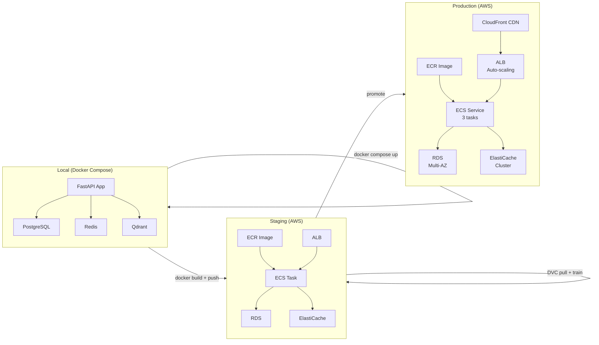

# Phase 2: Docker, Kubernetes & Production Infrastructure

You built an AI system.

Now it needs to actually run reliably without catching fire.

Phase 2 is about **containerization and cloud deployment**. You'll learn to package your AI service, run it on AWS, and survive the 3am page when something breaks.

---

## What You'll Learn

**Core Skills:**

- **Docker**: Package your AI app so it runs the same on your laptop as in production
- **Docker Compose**: Run the full stack locally (FastAPI + PostgreSQL + Redis + Qdrant)
- **AWS EC2**: Cheapest way to run containers on real servers
- **AWS ECS Fargate**: Managed containers (AWS handles the servers)
- **CloudWatch**: Monitoring, logging, alerts when things go wrong
- **Secrets Management**: How to not hardcode your API keys
- **Load Balancing**: Distribute traffic across multiple AI services

---

## Why This Matters

**Real incident:** Company deployed AI RAG system with 100 users. It worked locally.

Day 1 in production:
- Container ran out of memory (OOMKill)
- Environment variables didn't load
- Docker image was 5GB, took 15 min to deploy
- API key leaked in CloudWatch logs

Fixing it took 10 hours.

Phase 2 prevents this.

---

## Architecture: From Local to Production

---

## Phase 2 Timeline

**Week 1: Docker Mastery**
- Write production Dockerfiles
- Multi-stage builds
- Docker Compose local stack
- Your service runs identically local vs AWS

**Week 2: AWS Fundamentals**
- EC2 instance setup
- ECS Fargate task deployment
- S3 for model artifacts
- Basic monitoring

**Week 3: Production Hardening**
- Secrets management (Secrets Manager)
- CloudWatch monitoring and alarms
- Load balancing
- Auto-scaling

**Week 4 (Optional): Advanced**
- Kubernetes basics (if you want)
- Infrastructure as Code (Terraform)
- Zero-downtime deployments

---

## What You Need Before Phase 2

✅ Phase 1 complete (AI systems working locally)
✅ FastAPI service with endpoints
✅ PostgreSQL/Qdrant running
✅ Docker installed on your machine
✅ AWS account (free tier works)

---

## Files in This Phase

1. **docker.md** - Master containerization
2. **compose.md** - Local full stack
3. **aws.md** - Deploy to cloud
4. **secrets-monitoring.md** - Security and observability
5. **milestone.md** - Capstone project

---

## Key Concepts

| Concept | What | Why |
|---------|------|-----|
| **Container** | Packaged app + dependencies | Runs same everywhere |
| **Image** | Template for containers | Like a class; container is an instance |
| **Registry** | Docker image storage (ECR, Docker Hub) | Where images live |
| **Dockerfile** | Build recipe | How to make image from source code |
| **ECS** | AWS container orchestrator | Manages running containers on servers |
| **RDS** | AWS database | PostgreSQL without managing servers |
| **ElastiCache** | AWS Redis | Redis without managing servers |
| **ALB** | Load balancer | Distributes traffic across multiple containers |
| **CloudWatch** | AWS monitoring | See logs, metrics, set alarms |

---

## Common Mistakes in Phase 2

- ❌ Running as root in container (security risk)
- ❌ Importing large models at startup (container startup = 10 min timeout)
- ❌ Logging full API keys to CloudWatch
- ❌ Not setting memory limits (container OOMKills)
- ❌ Hardcoding environment variables
- ❌ No health checks (containers fail silently)

---

## Honest Assessment

Phase 2 is **less conceptually hard** than Phase 1, but **more operationally complex**.

In Phase 1, you learned ideas.
In Phase 2, you learn **how to not break things**.

Expect:
- Docker layer caching troubles
- AWS credential issues
- "It works locally but not on AWS" (always)
- Mysterious port conflicts
- Slow container builds (15+ minutes)

This is normal. Debugging is the job.

---

→ **[Docker Fundamentals →](docker.md)**
