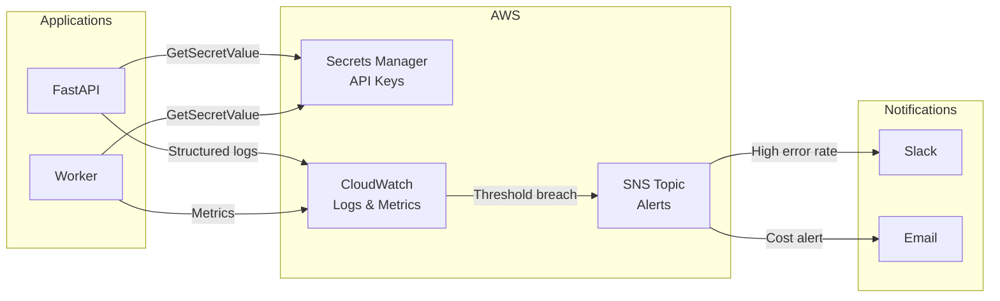

# Secrets Management and Monitoring

In production, your system needs two things:
1. **Secrets Management**: API keys, credentials, not in code
2. **Monitoring**: See what's happening, alerts when things go wrong

---

## Why This Matters

**Real incident 1:** Developer commits `.env` with OpenAI key to GitHub. Attacker finds it, runs 1000s of requests. Bill: $50,000.

**Real incident 2:** API returns 500 errors. Team unaware for 30 minutes. 500 customers affected. Could have been caught with alerts.

---

## Conceptual Explanation: Secrets

**Analogy: Keys to Your House**

Terrible: Hide house key under doormat (hardcode in code).
Bad: Tell everyone where the key is (.env in git).
Good: Give each person a unique key (Secrets Manager per environment).
Better: Rotate keys every 90 days.

---

## AWS Secrets Manager

```python
import boto3
import json

secrets_manager = boto3.client('secretsmanager')

async def get_secret(secret_name: str) -> dict:
    """Retrieve secret from Secrets Manager."""
    
    try:
        response = secrets_manager.get_secret_value(SecretId=secret_name)
        
        if 'SecretString' in response:
            return json.loads(response['SecretString'])
        else:
            # Binary secret
            return response['SecretBinary']
    
    except Exception as e:
        logger.error(f"Failed to retrieve secret {secret_name}: {e}")
        raise

# Usage in startup
async def app_startup():
    """On app start, load secrets from manager."""
    
    global OPENAI_API_KEY, DATABASE_URL
    
    openai_secret = await get_secret("openai-key")
    db_secret = await get_secret("database-url")
    
    OPENAI_API_KEY = openai_secret['key']
    DATABASE_URL = db_secret['url']

@app.on_event("startup")
async def startup():
    await app_startup()
```

---

## Secrets Manager in ECS Task Definition

Instead of hardcoded environment variables, reference Secrets Manager:

```json
{
  "containerDefinitions": [
    {
      "name": "api",
      "secrets": [
        {
          "name": "OPENAI_API_KEY",
          "valueFrom": "arn:aws:secretsmanager:us-east-1:123456789:secret:openai-key:api_key::"
        },
        {
          "name": "DATABASE_URL",
          "valueFrom": "arn:aws:secretsmanager:us-east-1:123456789:secret:database-url:connection_string::"
        }
      ]
    }
  ]
}
```

The secrets are injected at container start. Never exposed in logs or code.

---

## Code Example: Structured Logging

```python
import json
import logging
from datetime import datetime

class JSONFormatter(logging.Formatter):
    """Emit logs as JSON for CloudWatch Insights."""
    
    def format(self, record):
        log_obj = {
            "timestamp": datetime.now().isoformat(),
            "level": record.levelname,
            "logger": record.name,
            "message": record.getMessage(),
            "function": record.funcName,
            "line": record.lineno
        }
        
        # Add extra fields if present
        if hasattr(record, 'user_id'):
            log_obj['user_id'] = record.user_id
        if hasattr(record, 'request_id'):
            log_obj['request_id'] = record.request_id
        if hasattr(record, 'latency_ms'):
            log_obj['latency_ms'] = record.latency_ms
        
        return json.dumps(log_obj)

# Setup logging
handler = logging.StreamHandler()
handler.setFormatter(JSONFormatter())

logger = logging.getLogger(__name__)
logger.addHandler(handler)
logger.setLevel(logging.INFO)

# Usage
logger.info("Query received", extra={
    "user_id": "user123",
    "request_id": "req-456",
    "query": "What is RAG?"  # Safe to log, no PII
})
```

---

## CloudWatch Insights Query Examples

```sql
-- Find all LLM API calls > 10 seconds
fields @timestamp, latency_ms, model, tokens
| filter service = "llm" and latency_ms > 10000
| stats count as slow_calls, pct(latency_ms, 99) as p99

-- Error rate by endpoint in last hour
fields @timestamp, endpoint, @message
| filter @message like /Error/
| stats count as errors by endpoint
| sort errors desc

-- Cost estimation (log each API call with cost)
fields @timestamp, model, cost_usd
| stats sum(cost_usd) as total_cost by model
| sort total_cost desc

-- Find requests by user
fields @timestamp, user_id, endpoint, latency_ms
| filter user_id = "user123"
| sort @timestamp desc

-- Detect injection attempts
fields @timestamp, user_input, @message
| filter user_input like /ignore|system|prompt/
```

---

## CloudWatch Alarms

```python
import boto3

cloudwatch = boto3.client('cloudwatch')

# Alarm: High error rate
cloudwatch.put_metric_alarm(
    AlarmName="ai-api-high-error-rate",
    MetricName="ErrorCount",
    Namespace="AWS/ECS",
    Statistic="Sum",
    Period=300,  # 5 minutes
    EvaluationPeriods=1,
    Threshold=50,  # More than 50 errors in 5 min
    ComparisonOperator="GreaterThanThreshold",
    AlarmActions=["arn:aws:sns:us-east-1:123456789:alert-topic"]
)

# Alarm: High latency (p99 > 10 seconds)
cloudwatch.put_metric_alarm(
    AlarmName="ai-api-high-latency",
    MetricName="TargetResponseTime",
    Namespace="AWS/ApplicationELB",
    Statistic="Average",
    Period=60,
    EvaluationPeriods=2,
    Threshold=10.0,  # 10 seconds
    ComparisonOperator="GreaterThanThreshold",
    AlarmActions=["arn:aws:sns:us-east-1:123456789:alert-topic"]
)

# Alarm: High cost (estimated > $100/day)
cloudwatch.put_metric_alarm(
    AlarmName="ai-api-daily-cost",
    MetricName="EstimatedCost",
    Namespace="Custom/AI",
    Statistic="Sum",
    Period=86400,  # Daily
    Threshold=100.0,
    ComparisonOperator="GreaterThanThreshold",
    AlarmActions=["arn:aws:sns:us-east-1:123456789:alert-topic"]
)
```

---

## Custom Metrics to CloudWatch

```python
from fastapi import FastAPI, Request
import time

app = FastAPI()

@app.middleware("http")
async def track_metrics(request: Request, call_next):
    """Track every request for monitoring."""
    
    start_time = time.time()
    
    response = await call_next(request)
    
    # Calculate metrics
    latency_ms = (time.time() - start_time) * 1000
    
    # Log structured for CloudWatch Insights
    logger.info("Request completed", extra={
        "endpoint": request.url.path,
        "method": request.method,
        "status_code": response.status_code,
        "latency_ms": latency_ms,
        "user_id": request.headers.get("X-User-ID"),
        "request_id": request.headers.get("X-Request-ID")
    })
    
    # Also send to CloudWatch Metrics (for alarms)
    if latency_ms > 5000:  # Slow request
        cloudwatch.put_metric_data(
            Namespace="Custom/AI-API",
            MetricData=[
                {
                    "MetricName": "SlowRequest",
                    "Value": 1,
                    "Unit": "Count",
                    "Dimensions": [
                        {"Name": "Endpoint", "Value": request.url.path}
                    ]
                }
            ]
        )
    
    return response

@app.post("/query")
async def query(user_query: str):
    """Example endpoint with cost tracking."""
    
    import os
    
    # Track LLM cost
    tokens_used = estimate_tokens(user_query)
    cost_usd = tokens_used * 0.00001  # Rough estimate
    
    logger.info("LLM call", extra={
        "tokens": tokens_used,
        "cost_usd": cost_usd,
        "model": "gpt-4o-mini"
    })
    
    # Return response
    return {"answer": "..."}
```

---

## Cost Monitoring Alerts

```python
import boto3
from datetime import datetime

ce = boto3.client('ce')  # Cost Explorer

def check_daily_cost():
    """Alert if daily cost exceeds budget."""
    
    today = datetime.now().strftime("%Y-%m-%d")
    
    response = ce.get_cost_and_usage(
        TimePeriod={
            'Start': today,
            'End': today
        },
        Granularity='DAILY',
        Metrics=['UnblendedCost']
    )
    
    cost = float(response['ResultsByTime'][0]['Total']['UnblendedCost']['Amount'])
    
    if cost > 100:  # Alert if > $100/day
        logger.alert(f"Daily cost ${cost:.2f} exceeds budget")
        send_slack_alert(f"⚠️ AWS Cost Alert: ${cost:.2f} today")

# Schedule daily
# Use CloudWatch Events to trigger this Lambda daily
```

---

## Secrets Management Best Practices

1. **Never hardcode secrets**
   ```python
   # BAD
   OPENAI_KEY = "sk-proj-xyz123"
   
   # GOOD
   OPENAI_KEY = os.getenv("OPENAI_API_KEY")
   # Or from Secrets Manager
   ```

2. **Rotate keys every 90 days**
   ```bash
   # AWS Secrets Manager auto-rotation
   aws secretsmanager rotate-secret --secret-id openai-key
   ```

3. **Use different secrets per environment**
   - Production: Real API keys
   - Staging: Test keys with lower limits
   - Local dev: Can use weaker keys or mock

4. **Minimal permissions**
   ```json
   {
     "Statement": [
       {
         "Effect": "Allow",
         "Action": "secretsmanager:GetSecretValue",
         "Resource": "arn:aws:secretsmanager:...:secret:openai-key"
       }
     ]
   }
   ```

5. **Audit access**
   - CloudTrail logs all secret access
   - Alert if unusual access patterns
   - Revoke access if compromised

---

## Architecture: Secrets & Monitoring



---

## Debugging: Common Secrets/Monitoring Issues

### 1. "Access Denied" Getting Secret

```bash
# Task role needs permission
{
  "Effect": "Allow",
  "Action": "secretsmanager:GetSecretValue",
  "Resource": "arn:aws:secretsmanager:us-east-1:123456789:secret:openai-key"
}
```

### 2. Logs Not in CloudWatch

```bash
# Check log group exists
aws logs describe-log-groups

# Check task role has permissions
{
  "Effect": "Allow",
  "Action": [
    "logs:CreateLogGroup",
    "logs:CreateLogStream",
    "logs:PutLogEvents"
  ],
  "Resource": "arn:aws:logs:us-east-1:123456789:log-group:/ecs/*"
}
```

### 3. Alarms Not Triggering

Test the alarm manually:
```bash
aws cloudwatch set-alarm-state --alarm-name ai-api-high-error-rate --state-value ALARM --state-reason "Testing"
```

### 4. Cost Out of Control

```bash
# Break down by service
aws ce get-cost-and-usage \
  --time-period Start=2024-03-01,End=2024-03-31 \
  --granularity MONTHLY \
  --metrics UnblendedCost \
  --group-by Type=DIMENSION,Key=SERVICE

# Common culprits:
# - RDS: Too large instance type
# - Data Transfer: Cross-region
# - Cost Explorer: Enable for visibility
```

---

## Case Study: Stripe Payment API Monitoring

**Challenge:** Would payments fail silently? How would we know?

**Solution:**
- Every payment logged with: amount, customer, processor, latency, status
- CloudWatch Insight to find failed payments instantly
- Alerts: Error rate > 1% → page on-call engineer
- Cost tracking: alert if processing cost > X% of revenue

**Result:** Zero undetected payment failures, 99.99% uptime

---

## 1-Week Checklist

- [ ] Day 1: Create Secrets Manager secrets
- [ ] Day 2: Update ECS task definition to use secrets
- [ ] Day 3: Implement CloudWatch logging
- [ ] Day 4: Create CloudWatch alarms
- [ ] Day 5: Set up Slack notifications
- [ ] Day 6: Test alerts (deliberately trigger one)
- [ ] Day 7: Review logs, set up dashboards, document runbooks

---

## Resources

- [AWS Secrets Manager](https://docs.aws.amazon.com/secretsmanager/)
- [CloudWatch Logs Insights](https://docs.aws.amazon.com/AmazonCloudWatch/latest/logs/AnalyzingLogData.html)
- [CloudWatch Alarms](https://docs.aws.amazon.com/AmazonCloudWatch/latest/events/WhatIsCloudWatch.html)

→ **[Phase 2 Milestone →](milestone.md)**
