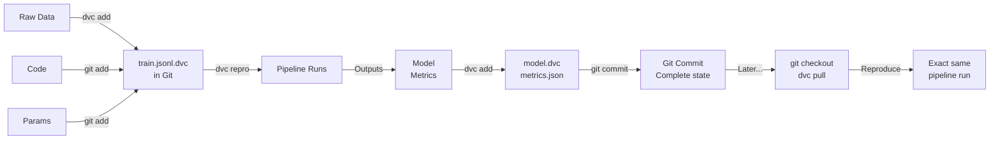

# DVC: Data and Model Versioning

Git is great for code. But not for data.

Try committing a 500MB model to Git. It gets slow. Storage bloats. Disaster.

DVC is "Git for data". It tracks large files by storing only metadata in Git, actual files in S3 or another remote.

---

## Why This Matters

**Without DVC:** You need to train a model from 3 months ago to compare. But:
- Data files were deleted (storage full)
- You can't remember which exactly data was used
- You rebuild from scratch (6 hours)

**With DVC:** 
1. `dvc pull` → downloads exact data from 3 months ago
2. `git checkout` to old commit
3. Run training (with DVC tracking)
4. Compare with current model in 20 minutes

---

## Conceptual Explanation

**Analogy: Cloud Storage**

Without DVC: Copy 500MB file locally twice. Your laptop dies. Both copies gone.

With DVC: Commit pointer to Git (0.1KB). Actual file in S3 (500MB). Laptop dies. Just clone and `dvc pull`. File back.

---

## DVC Concepts

| Term | What | Example |
|------|------|---------|
| **Repository** | Git repo + DVC initialized | Your project directory |
| **.dvc file** | Metadata pointer (stored in Git) | train.jsonl.dvc |
| **Remote** | Where actual files live | S3 bucket, Azure, local |
| **dag** | Directed acyclic graph | Pipeline: raw_data → clean → train |
| **Stage** | Step in pipeline | "preprocess" or "train" |
| **Metrics** | Tracked values for comparison | params.yaml, metrics.json |

---

## Code Example 1: Basic DVC Setup

```bash
# Initialize DVC in git repo
cd my-ai-project
git init
dvc init

# Configure remote (S3)
dvc remote add -d myremote s3://my-bucket/dvc-storage

# Check config
dvc remote list
```

### 2. Adding Data Files

```bash
# Add large dataset to DVC
dvc add data/train.jsonl

# Creates: data/train.jsonl.dvc (pointer file)
# Updates: .gitignore (adds train.jsonl)

# Commit pointer
git add data/train.jsonl.dvc
git commit -m "Add training data v1.0"

# Push to remote
dvc push
```

### 3. Later: Retrieve Data

```bash
# On new machine
git clone my-repo
dvc pull  # Downloads actual train.jsonl

# Data is there, ready to use
```

---

## Code Example 2: DVC Pipeline

```yaml
# dvc.yaml
stages:
  prepare:
    cmd: python src/prepare.py
    deps:
      - src/prepare.py
      - data/raw.csv
    outs:
      - data/prepared.csv
    params:
      - prepare.chunk_size
  
  train:
    cmd: python src/train.py
    deps:
      - src/train.py
      - data/prepared.csv
    params:
      - train.lr
      - train.epochs
    outs:
      - models/model.safetensors
    metrics:
      - metrics.json:
          cache: false
  
  evaluate:
    cmd: python src/evaluate.py
    deps:
      - src/evaluate.py
      - models/model.safetensors
    metrics:
      - eval_metrics.json:
          cache: false
```

```yaml
# params.yaml
prepare:
  chunk_size: 512
  
train:
  lr: 0.0001
  epochs: 3
  batch_size: 32
```

**Run pipeline:**
```bash
# One command, runs all stages in dependency order
dvc repro

# If data changed: rerun all stages that depend on it
# If code unchanged: use cached results
```

---

## Code Example 3: Version Control Everything

```python
# train.py
import dvc.api
import mlflow

# Get params from params.yaml
params = dvc.api.params.read("params.yaml")

lr = params["train"]["lr"]
epochs = params["train"]["epochs"]

with mlflow.start_run():
    mlflow.log_params(params)
    
    # Train model...
    
    # Metrics
    mlflow.log_metric("loss", final_loss)
    mlflow.log_metric("eval_loss", eval_loss)
```

**Track everything:**
```bash
# Code
git add train.py

# Data
dvc add data/train.jsonl

# Parameters
git add params.yaml

# Model
dvc add models/model.safetensors

# Metrics (lightweight, can be in git)
git add metrics.json

# Commit all
git commit -m "Run 5: lr=1e-4, epochs=3, loss=0.15"
```

---

## Code Example 4: Reproduce Experiments

```bash
# Time travel: reproduce 3 months ago
git log --oneline

# 3 months ago:
git checkout abc123

# Get data from that time
dvc pull

# Rerun pipeline from that state
dvc repro

# Metrics from 3 months ago are now in metrics.json
# Can compare: then vs now
```

---

## Code Example 5: Parameter Sweeping with DVC

```bash
# Run multiple parameter combinations
dvc exp run -S train.lr=0.00001
dvc exp run -S train.lr=0.0001
dvc exp run -S train.lr=0.001

# List all experiments
dvc exp show

# Compare
dvc plots show metrics.json
```

---

## DVC Workflow



---

## Step-by-Step: Set Up DVC

### 1. Initialize

```bash
git init
dvc init
git add .dvc .gitignore
git commit -m "Initialize DVC"
```

### 2. Configure Remote

```bash
# S3
dvc remote add -d myremote s3://my-bucket/dvc
aws s3 ls s3://my-bucket/dvc  # Verify permissions

# Or local directory
dvc remote add -d local /mnt/dvc-storage
```

### 3. Add Data

```bash
dvc add data/raw.csv
git add data/raw.csv.dvc .gitignore
git commit -m "Add raw data"
dvc push
```

### 4. Create Pipeline

```yaml
# dvc.yaml (created manually)
stages:
  train:
    cmd: python train.py
    deps: [train.py, data/raw.csv]
    params: [train.lr, train.epochs]
    outs: [models/model.pt]
    metrics: [metrics.json]
```

### 5. Run

```bash
dvc repro
git add dvc.yaml dvc.lock models/model.pt metrics.json
git commit -m "Train model with new params"
dvc push
```

---

## Practical Project: Reproducible Fine-Tuning Pipeline

**Build:** End-to-end pipeline with DVC versioning.

Requirements:
- Raw training data (tracked with DVC)
- Prepare stage (clean, format)
- Train stage (fine-tuning with parameters)
- Evaluate stage (RAGAS metrics)
- All tracked in dvc.yaml
- Model and metrics version-controlled
- Can reproduce any experiment with 2 commands (`git checkout` + `dvc repro`)

---

## Debugging: 10 Common DVC Issues

### 1. "data.csv not found"

```bash
# File is tracked by DVC but not downloaded
dvc pull
```

### 2. Remote Authentication Failed

```bash
# S3 credentials missing
export AWS_ACCESS_KEY_ID=...
export AWS_SECRET_ACCESS_KEY=...
dvc push
```

### 3. Large File Corruption

```bash
# Check file integrity
dvc status

# If corrupted, redownload
dvc checkout --force
```

### 4. Cache Disk Full

```bash
# DVC caches locally
# Clean cache if disk is full
dvc cache prune  # Remove unused cache

# Or increase cache location
dvc cache dir /mnt/larger-disk/dvc-cache
```

### 5. Pipeline Fails Partway

```bash
# Some stage failed
dvc repro  # Retries from failure point

# Fix issue, rerun
dvc repro
```

### 6. Metrics Not Updated

```bash
# Metrics file creation failed in pipeline
# Check pipeline logs
dvc repro --verbose

# Ensure metrics.json is created
# In dvc.yaml: metrics: [metrics.json]
```

### 7. Experiment Not Reproducible

```bash
# dvc.lock not committed
# Commit the lock file to reproduce exactly
git add dvc.lock
git commit -m "Lock dependencies"
```

### 8. Remote Storage Cost

```bash
# DVC stores every version
# Can explode storage costs

# Check remote size
du -sh s3://bucket/dvc

# Remove old versions
dvc gc -w -r  # GC, keep workspace
```

### 9. Merge Conflict in dvc.yaml

```bash
# Two branches modified different stages
# Resolve manually in dvc.yaml
# Then run: dvc reconcile
```

### 10. Can't Pull from Different Region

```bash
# S3 bucket in us-west-2, but pulling from us-east-1
dvc remote modify myremote endpoint_url https://s3.us-west-2.amazonaws.com
```

---

## Case Study: Kaggle Competition MLOps

**Challenge:** Team of 10 people, 500+ experiments daily. Which preprocess best? Which loss function?

**Solution:**
- DVC for data versioning (same dataset for all)
- params.yaml for hyperparameters
- dvc.yaml for preprocessing → training → evaluation
- Each run tracked in Git with dvc.lock
- Can replay any run, compare results

**Result:** 3 weeks to competition, 1st place. All reproducible.

---

## 1-Week DVC Checklist

- [ ] Day 1: DVC init, configure remote
- [ ] Day 2: Add large file, push to remote
- [ ] Day 3: Pull data on new machine
- [ ] Day 4: Create dvc.yaml pipeline
- [ ] Day 5: Run pipeline, commit dvc.lock
- [ ] Day 6: Modify parameters, re-run
- [ ] Day 7: Checkout old commit, reproduce

---

## Resources

- [DVC Documentation](https://dvc.org/doc)
- [DVC Pipelines](https://dvc.org/doc/user-guide/pipelines)
- [DVC Remote Storage](https://dvc.org/doc/user-guide/data-management/remote)

→ **[Weights & Biases →](wandb.md)**
