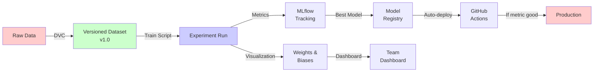
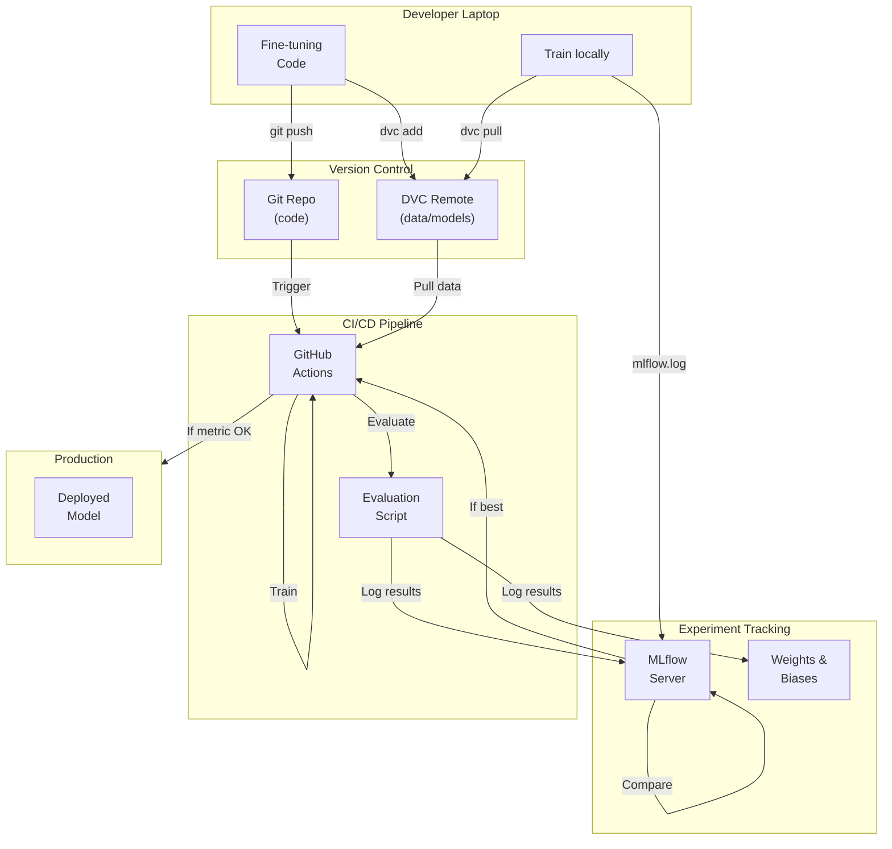

# Phase 3: MLOps Pipelines & Experiment Tracking

In Phase 1, you built AI systems. In Phase 2, you deployed them.

Now comes the hard part: **managing iterations**.

How do you know if a new fine-tuning run is actually better? How do you track 50 experiments across your team? How do you automatically deploy the best model?

Phase 3 teaches you **MLOps**: the discipline of managing AI models in production.

---

## What You'll Learn

**Core Skills:**

- **MLflow**: Experiment tracking (log parameters, metrics, artifacts)
- **DVC**: Data versioning (Git for datasets and models)
- **Weights & Biases**: Rich visualization and collaboration
- **GitHub Actions**: CI/CD that trains and deploys
- **Metrics & Monitoring**: Know which model is best, cost per experiment

---

## Why This Matters

**Real incident:** Data scientist fine-tunes model 50 times. Which version is best? Nobody knows. Files are named "model_v1", "model_final", "model_final_REAL", "model_final_FOR_REAL_THIS_TIME".

**Real incident 2:** Company deploys new model. Performance drops 5%. Nobody realizes for 1 week. 100 customers affected.

---

## MLOps vs ML Engineering

```
ML Engineering (Phase 1-2): How do I build an AI system?
MLOps (Phase 3): How do I manage iterations of that system?
```

ML Engineer: "Here's a RAG system"
MLOps Engineer: "Here's a RAG system that automatically improves itself"

---

## The MLOps Toolchain



---

## Phase 3 Timeline

**Week 1: Experiment Tracking (MLflow)**
- Understand MLflow concepts (runs, parameters, metrics)
- Log a fine-tuning experiment
- Compare multiple runs
- Register best model

**Week 2: Data Versioning (DVC)**
- Version datasets (Git + DVC)
- Create reproducible pipelines
- Version models alongside code
- Reproduce any experiment from history

**Week 3: Visualization (Weights & Biases)**
- Replace MLflow with W&B if preferred
- Rich visualization of training
- Hyperparameter sweeps
- Collaboration with team

**Week 4: Automation (GitHub Actions)**
- Trigger training on specific events
- Auto-evaluate (RAGAS)
- Auto-deploy if metric improves
- Full CI/CD for ML

---

## What You Need Before Phase 3

✅ Phase 2 complete (Docker, AWS deployment)
✅ Phase 1 service running in production
✅ Have fine-tuning code from Phase 1
✅ Baseline evaluation (RAGAS scores) established
✅ Can manually run training → evaluation → deployment

---

## Key Concepts

| Term | Meaning | Example |
|------|---------|----------|
| **Experiment** | A training run with specific parameters | lr=0.0001, r=8, epochs=3 |
| **Run** | Single execution of an experiment | Run #47 on 2024-03-15 |
| **Metric** | Measured value (evaluated) | RAGAS faithfulness = 0.87 |
| **Parameter** | Configuration value (fixed) | batch_size = 32 |
| **Artifact** | Saved file from run | model.safetensors, evaluation.json |
| **Model Registry** | Central repository of models | "best_model" version 5 |
| **Pipeline** | Sequence of steps | data → clean → train → evaluate |
| **DVC** | Version control for data/models | Like Git, but for large files |

---

## Files in This Phase

1. **mlflow.md** - Experiment tracking
2. **dvc.md** - Data and model versioning
3. **wandb.md** - Rich visualization
4. **cicd.md** - Automation and deployment
5. **milestone.md** - Capstone and exit criteria

---

## Architecture: Full MLOps Stack



---

## Version Control vs MLOps

**Git (Version Control):**
- Tracks code changes
- Lightweight
- Perfect for Python files

**DVC (MLOps):**
- Tracks data/model changes
- Handles large files (GB+)
- Integrates with Git
- Uses remote storage (S3, Azure)

**You use both together:**
```bash
git add fine_tuning.py          # Code → Git
dvc add train.jsonl              # Data → DVC (Git tracks pointer)
git add fine_tuning.py.dvc       # Pointer → Git

# Later: reproduce
git clone repo
dvc pull                          # Downloads actual data/models
```

---

## Common Workflows in Phase 3

**Workflow 1: Manual Experiment**
1. Modify fine_tuning.py
2. Run locally: python train.py
3. MLflow logs metrics
4. Compare with previous runs in MLflow UI
5. If better: register as new model version

**Workflow 2: Hyperparameter Sweep**
1. Define parameter ranges (r: [4, 8, 16], lr: [1e-4, 1e-3])
2. W&B or MLflow runs 12 combinations
3. View results on dashboard
4. Best is automatically selected

**Workflow 3: Auto-Deploy**
1. Push code to main branch
2. GitHub Actions triggered
3. Pulls data via DVC
4. Runs training (logged to MLflow)
5. Runs evaluation (RAGAS)
6. If metric > baseline: deploy to staging
7. If metric holds for 1 week: deploy to production

---

## Cost Considerations

- **MLflow Server**: $0 (open source) or $50-500/month (managed)
- **DVC Storage**: Pay for S3 storage (usually < $10/month)
- **W&B**: Free tier, $30+/month for team features
- **GitHub Actions**: Free tier, $0.008/min for compute after free hours
- **Training compute**: EC2 GPU instance, $0.5-3/hour depending on instance
- **Monitoring**: CloudWatch $5/GB for logs

**Example monthly cost:**
- 10 fine-tuning experiments × 30 min = 5 hours compute = $2.50
- DVC storage (10GB) = $0.23
- MLflow tracking = $0
- W&B = free
- Deployment = $150 (Phase 2 infrastructure)
- **Total: ~$150/month**

---

## Common Mistakes in Phase 3

- ❌ No baseline (can't know if improvement is real)
- ❌ Not versioning data (can't reproduce)
- ❌ Experiments not logged (can't compare)
- ❌ Auto-deploy without evaluation (bad models in prod)
- ❌ Ignoring cost (10 GPU experiments = $25)

---

## Honest Assessment

Phase 3 is **not conceptually hard**, but **operationally intricate**.

Expect:
- DVC path issues ("file not found")
- GitHub Actions timeout on large models
- Metric variations that seem random (they're not)
- "Which model did I actually deploy?" confusion

---

→ **[MLflow Experiment Tracking →](mlflow.md)**
