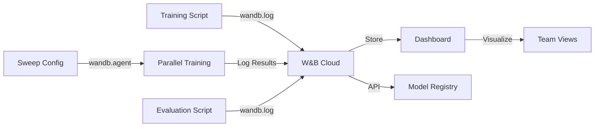

# Weights & Biases: Rich Visualization & Collaboration

MLflow logs numbers. Weights & Biases visualizes stories.

MLflow: "accuracy = 0.95"
W&B: Beautiful charts showing training curve, gradient flow, confusion matrix, sample quality, cost over time.

---

## Why This Matters

**Real incident:** Two data scientists argue about which model is better. 

MLflow: Run A: loss 0.12, accuracy 0.94. Run B: loss 0.15, accuracy 0.92. It's unclear.

W&B: Interactive dashboard showing Run A's training was unstable (wild loss swings). Run B smooth but slower. Discussion changes.

---

## Conceptual Explanation

**Analogy: Data Exploration**

MLflow: Numbers in a spreadsheet (accurate, minimal)
W&B: Dashboard with charts, tables, images (rich picture, story)

Both log the same data. W&B just visualizes better.

---

## W&B vs MLflow

| Feature | MLflow | W&B | Winner |
|---------|--------|-----|--------|
| Basic tracking | ✅ | ✅ | Tie |
| Visualization | Basic | Excellent | W&B |
| Sweeps | ❌ | ✅ | W&B |
| Team collaboration | ❌ | ✅ | W&B |
| Self-hosted | ✅ | Limited | MLflow |
| Cost | Free | Free+ | MLflow |
| Ease | Simple | Medium | MLflow |

**Choose W&B if:** Team, rich visualization, hyperparameter sweeps needed
**Choose MLflow if:** Self-hosted, simple tracking, cost-conscious

---

## Code Example 1: Basic W&B Integration

```python
import wandb
import torch
from transformers import Trainer, TrainingArguments

# Initialize W&B
wandb.init(
    project="lora-finetuning",
    name="lr-1e4-r8",
    config={
        "learning_rate": 1e-4,
        "lora_r": 8,
        "lora_alpha": 16,
        "batch_size": 32,
        "epochs": 3
    }
)

# Training args (W&B integrates automatically with Trainer)
training_args = TrainingArguments(
    output_dir="./results",
    num_train_epochs=3,
    learning_rate=1e-4,
    per_device_train_batch_size=32,
    report_to="wandb",  # Enable W&B logging
    logging_steps=10,
)

trainer = Trainer(
    model=model,
    args=training_args,
    train_dataset=train_dataset,
    eval_dataset=eval_dataset,
)

trainer.train()

# Finish run
wandb.finish()

# View at: wandb.ai/workspace/project-name
```

---

## Code Example 2: Rich Logging

```python
import wandb
import matplotlib.pyplot as plt
from sklearn.metrics import confusion_matrix
import numpy as np

wandb.init(project="evaluation")

# Log metrics
wandb.log({
    "accuracy": 0.95,
    "ragas_faithfulness": 0.88,
    "ragas_relevancy": 0.85,
})

# Log time-series (training curve)
for step in range(100):
    wandb.log({"loss": np.random.random(), "epoch": step})

# Log images
fig, ax = plt.subplots()
ax.plot([1, 2, 3], [1, 4, 9])
ax.set_title("Loss Curve")
wandb.log({"loss_curve": wandb.Image(fig)})

# Log confusion matrix
preds = np.array([0, 1, 1, 0, 1])
labels = np.array([0, 1, 0, 0, 1])
cm = confusion_matrix(labels, preds)

wandb.log({"confusion_matrix": wandb.plot.confusion_matrix(probs=None, y_true=labels, preds=preds)})

# Log table (sample results)
table = wandb.Table(columns=["input", "output", "label", "correct"])
results = [
    ("What is RAG?", "Retrieval-Augmented...", "RAG", True),
    ("Who is Elon?", "Elon Musk is...", "Person", True),
]
for input_text, output, label, correct in results:
    table.add_data(input_text, output, label, correct)

wandb.log({"results": table})

# Log file (model, report)
wandb.save("./model.safetensors")
wandb.save("./evaluation_report.json")
```

---

## Code Example 3: Hyperparameter Sweeps

```python
import wandb
import random

# Define sweep configuration
sweep_config = {
    "method": "bayes",  # or "grid", "random"
    "metric": {
        "name": "ragas_faithfulness",
        "goal": "maximize"
    },
    "parameters": {
        "learning_rate": {
            "min": 1e-5,
            "max": 1e-3
        },
        "lora_r": {
            "values": [4, 8, 16, 32]
        },
        "lora_alpha": {
            "values": [8, 16, 32]
        },
        "batch_size": {
            "values": [8, 16, 32]
        }
    }
}

# Create sweep
sweep_id = wandb.sweep(
    sweep_config,
    project="lora-hyperparameter-search"
)

# Define training function
def train():
    # Initialize W&B (automatically gets sweep config)
    wandb.init()
    
    config = wandb.config
    
    # Train with these hyperparameters
    # (same training code, just with wandb.config values)
    
    model = train_with_hparams(
        learning_rate=config.learning_rate,
        lora_r=config.lora_r,
        lora_alpha=config.lora_alpha,
        batch_size=config.batch_size
    )
    
    # Evaluate
    score = evaluate(model)
    
    # Log result (metric name from sweep_config)
    wandb.log({"ragas_faithfulness": score})
    
    wandb.finish()

# Start sweep (runs 12 combinations in parallel if you have multiple GPUs)
wandb.agent(sweep_id, function=train, count=12)
```

---

## Code Example 4: LLM Evaluation Logging

```python
import wandb
from ragas import evaluate
from ragas.metrics import faithfulness, answer_relevancy

wandb.init(project="rag-evaluation")

# Run evaluation
dataset = Dataset.from_dict(test_questions)
scores = evaluate(dataset, metrics=[faithfulness, answer_relevancy])

# Log metrics
wandb.log({
    "faithfulness": scores["faithfulness"].mean(),
    "answer_relevancy": scores["answer_relevancy"].mean()
})

# Log detailed results table
table = wandb.Table(columns=["question", "answer", "context", "faithfulness_score"])

for q, a, c, score in zip(
    scores["question"],
    scores["answer"],
    scores["context"],
    scores["faithfulness"]
):
    table.add_data(q, a, c, score.score if hasattr(score, 'score') else score)

wandb.log({"evaluation_results": table})

# Log threshold (for monitoring)
wandb.log({"faithfulness_model_threshold": 0.80})
```

---

## Code Example 5: Alerts

```python
import wandb

wandb.init(project="monitoring")

# Alert if metric drops
wandb.alert(
    title="Faithfulness Drop",
    text="Faithfulness degraded from 0.88 to 0.76",
    level="error"  # critical, error, warn, info
)

# Can be in training loop
for epoch in range(num_epochs):
    # ...train...
    
    score = evaluate()
    wandb.log({"score": score})
    
    if score < 0.75:
        wandb.alert(
            title="Low Score Alert",
            text=f"Score dropped to {score:.2f} at epoch {epoch}",
            level="warn"
        )
```

---

## Architecture: W&B Workflow



---

## Practical Project: W&B Dashboard

**Build:** Fine-tuning with rich W&B tracking.

Requirements:
- Training logged (loss, learning curves, gradients)
- Evaluation logged (RAGAS metrics, confusion matrix)
- Hyperparameter sweep (12 experiments, automatic)
- Interactive dashboard showing best runs
- Alerts for poor performance
- Team member can view results (shared project)

---

## Debugging: Common W&B Issues

### 1. Login Failed

```bash
wandb login
# Paste API key from wandb.ai/settings/profile
```

### 2. Metrics Not Appearing

```python
# Check: are you inside wandb.init context?
wandb.init()
wandb.log({"loss": 0.5})  # Should appear
```

### 3. Sweep Not Starting

```python
# Missing required fields
sweep_config = {
    "method": "bayes",  # Required
    "metric": {
        "name": "accuracy", # Required
        "goal": "maximize"
    },
    "parameters": {...}
}
```

### 4. Large File Upload Slow

```python
# W&B has limits on file size
# Split large artifacts

wandb.log({"chunk_1": wandb.File("model_1.pt")})
wandb.log({"chunk_2": wandb.File("model_2.pt")})
```

### 5. Sensitive Data Leak

```python
# Never log secrets
wandb.log({"api_key": secret})  # BAD

# Log only metrics
wandb.log({"accuracy": 0.95})   # Good
```

---

## Case Study: OpenAI GPT Fine-Tuning

**Challenge:** Team of 20 experimenting with different fine-tuning configs.

**Solution:**
- W&B sweep: 100 hyperparameter combinations
- All logged with metrics, loss curves, eval results
- Dashboard showing top 10 runs
- Automatic alerts if performance drops
- Integration with model registry

**Result:** Best config found in 3 days, performance +8%

---

## 1-Week W&B Checklist

- [ ] Day 1: Create W&B account, login, first project
- [ ] Day 2: Log training run with W&B
- [ ] Day 3: Add rich logging (images, tables, plots)
- [ ] Day 4: Create hyperparameter sweep
- [ ] Day 5: Define metrics, set alerts
- [ ] Day 6: Share project with team member
- [ ] Day 7: Analyze results, export for report

---

## Resources

- [W&B Documentation](https://docs.wandb.ai/)
- [W&B Sweeps](https://docs.wandb.ai/guides/sweeps/)
- [W&B Alerts](https://docs.wandb.ai/guides/feature/alerts)

→ **[GitHub Actions CI/CD →](cicd.md)**
